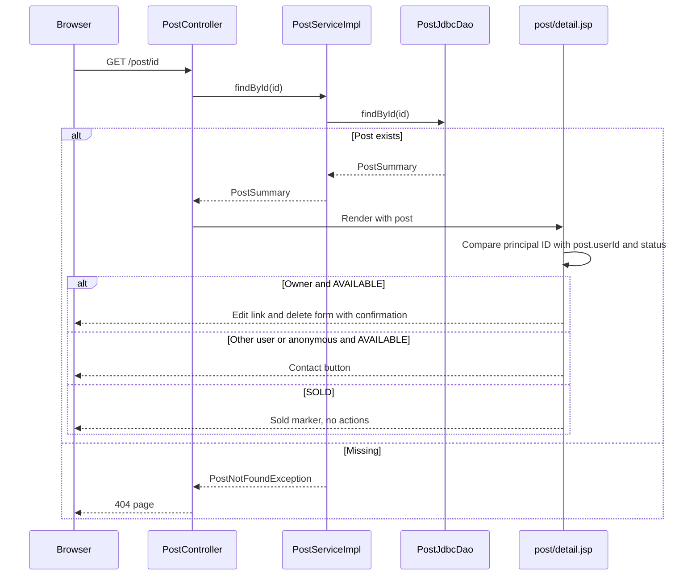

# Post detail flow

GET /post/{id} is the public page of one publication. It exists for every stored post, including SOLD ones, and is the target of catalog cards, inbox group headers, the publish/edit success redirects and the contact form's cancel button. Anonymous visitors can open it; acting on it still requires a session.

## Flow diagram

The sequence follows the controller, service and DAO calls at `f12af08`. It is a source trace, not a runtime test.



## Behavior and limits

[[PostController]] only loads the summary through [[PostService]].findById, a read-only transaction over the same joined query that feeds catalog cards. The route pattern accepts decimal digits only. A missing ID maps to error/404 in the controller.

post/detail.jsp shows the cover or placeholder, title with a state marker, artist, formatted price, release year, condition, zone, genre, pressing year and description. It reads the principal ID through the Spring Security taglib and computes whether the viewer owns an AVAILABLE post. Owners get an edit link and a delete form marked with `data-confirm-message`, which [[Edit and delete flow]] handles. A non-owner or anonymous visitor sees a contact button while the post is AVAILABLE; an anonymous click goes through login before the protected contact form.

Flash notices `postCreated` and `postUpdated` confirm publishing and editing. A back link returns to the catalog. The page itself enforces nothing: hiding buttons is presentation, and every action repeats ownership and status checks in the service.

The page reveals no seller identity, not even the display name; contact happens through [[Contact flow]]. Sold posts remain reachable by URL as the record of a completed sale.

[[Landing flow]] · [[Publish flow]] · [[Views and assets]]

## Code snippets

### Public detail route

The controller is deliberately thin; all data comes from one summary lookup. See [[PostController]] for the complete class.

[webapp/src/main/java/ar/edu/itba/paw/webapp/controller/PostController.java, lines 26–31](<file:///Users/bautistapessagno/Desktop/ITBA/PAW/paw2026b/webapp/src/main/java/ar/edu/itba/paw/webapp/controller/PostController.java>)

```java
    @RequestMapping(value = "/post/{postId:[0-9]+}", method = RequestMethod.GET)
    public ModelAndView detail(@PathVariable("postId") final long postId) {
        final ModelAndView modelAndView = new ModelAndView("post/detail");
        modelAndView.addObject("post", postService.findById(postId));
        return modelAndView;
    }
```

### Owner check in the view

The ownership flag decides which actions render. It is not an authorization check. See [[Views and assets]] for the complete JSP.

[webapp/src/main/webapp/WEB-INF/views/post/detail.jsp, lines 39–42](<file:///Users/bautistapessagno/Desktop/ITBA/PAW/paw2026b/webapp/src/main/webapp/WEB-INF/views/post/detail.jsp>)

```jsp
    <sec:authorize access="isAuthenticated()">
        <sec:authentication property="principal.id" var="currentUserId" scope="page"/>
    </sec:authorize>
    <c:set var="ownsAvailablePost" value="${not empty currentUserId and currentUserId eq post.userId and post.status eq 'AVAILABLE'}"/>
```
