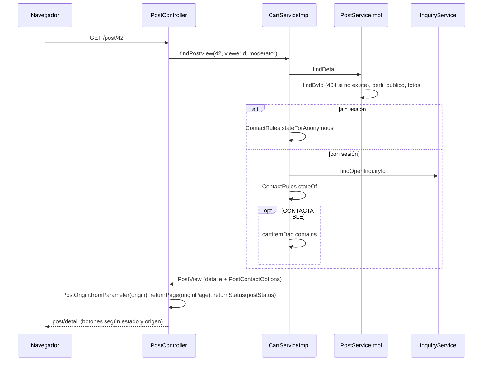

# Post detail flow

> [!summary] En una frase
> `/post/{id}` es la ficha pública de una publicación: datos, fotos, vendedor y las acciones que le corresponden a quien mira: editar, consultar, sumar al carrito o seguir su consulta abierta.

## Herramientas

| Herramienta | Para qué se usa acá |
|---|---|
| `@AuthenticationPrincipal` opcional | La ruta es pública: el principal puede ser `null` |
| [[PostDetail]] | La ficha y si quien mira puede editarla |
| [[PostView]] + [[PostContactOptions]] | La ficha más lo que se le ofrece para consultarla, ya resuelto por `CartService` |
| [[ContactRules]] | La misma regla de contactabilidad que usan el contacto y el carrito |
| `PostOrigin.fromParameter` | `origin` llega como texto y se traduce a [[PostOrigin]]; un valor desconocido da `null` en vez de un error |
| `user-byline.tag` | Foto y nombre del publicante con enlace a su perfil público |
| `URLEncoder` en el listado | Pasar la búsqueda de origen como un parámetro |

## Recorrido paso a paso

1. `GET /post/{id}` no exige sesión.
2. El controller llama a `CartService.findPostView(postId, viewerId, moderator)`, que primero pide `PostService.findDetail`:
   - `findById` trae el resumen por `JOIN` (post, publicante, álbum, artista). Si no existe, 404. No filtra por estado: una publicación reservada o vendida también tiene ficha.
   - Busca el perfil público del publicante; es `null` si no está verificado.
   - Arma la lista de fotos.
   - `ownedByViewer` y `moderator` (este último lo calcula el controller a partir del rol).
3. Después calcula [[PostContactOptions]]:
   - Sin sesión: solo cuenta el estado del post (`ContactRules.stateForAnonymous`); nunca está en un carrito.
   - Con sesión: busca la Consulta abierta de quien mira y pregunta a `ContactRules.stateOf`. Si se puede consultar, además mira si ya está en su carrito.
4. La vista decide con eso:
   - `detail.editable` (disponible y, además, propio o moderador): botones de editar y eliminar.
   - Anónimo y contactable: botón de consultar (lo lleva al login).
   - Post propio: un texto que lo dice.
   - Consulta abierta: botón que lleva a esa conversación.
   - Contactable: "Consultar" y, al lado, "Agregar al carrito" (un POST con CSRF) o "En el carrito".
5. **Volver.** Tres orígenes posibles:
   - Desde el catálogo: `from` trae la query string del listado, codificada. La ficha arma el enlace solo detrás de `/?`.
   - Desde un perfil público: `origin=PUBLIC_PROFILE` (o `public-profile`) y `originPage`.
   - Desde el perfil propio: `origin=PRIVATE_PROFILE` (o `private-profile`), aceptado solo si quien mira es el publicante. Si "Mis publicaciones" estaba filtrada, llega también `postStatus` y el enlace de volver (`back-link.tag`) lo repite, así se vuelve a la misma página del mismo filtro (PR #61, [[Status filters flow]]).
   - `origin`, `originPage` y `postStatus` llegan como `String`. `PostOrigin.fromParameter` devuelve `null` ante un valor desconocido, `returnPage` convierte la página con `Math.max(1, ...)`, o 1 si no es un número, y `returnStatus` devuelve `null` si el estado no existe. Son contexto de navegación: un valor viejo o mal formado solo pierde el enlace de regreso, nunca impide abrir la ficha (PR #50).


```mermaid
sequenceDiagram
    participant B as Navegador
    participant C as PostController
    participant K as CartServiceImpl
    participant P as PostServiceImpl
    participant I as InquiryService
    B->>C: GET /post/42
    C->>K: findPostView(42, viewerId, moderator)
    K->>P: findDetail
    P->>P: findById (404 si no existe), perfil público, fotos
    alt sin sesión
        K->>K: ContactRules.stateForAnonymous
    else con sesión
        K->>I: findOpenInquiryId
        K->>K: ContactRules.stateOf
        opt CONTACTABLE
            K->>K: cartItemDao.contains
        end
    end
    K-->>C: PostView (detalle + PostContactOptions)
    C->>C: PostOrigin.fromParameter(origin), returnPage(originPage), returnStatus(postStatus)
    C-->>B: post/detail (botones según estado y origen)
```

## Decisiones y por qué

| Decisión | Motivo | Fuente |
|---|---|---|
| La ficha es pública y el contacto no | Mirar no requiere Cuenta; comprar sí | Comentario en [[PostController]] |
| Las reglas de botones viven en el modelo | La vista no repite lógica y el service usa la misma regla de estado | Comentario en [[PostDetail]] |
| Lo que se ofrece para consultar lo resuelve `CartService`, con o sin sesión | "La vista solo lo muestra"; el contacto anónimo se resolvía en la vista hasta el commit `412f61ab`. Alternativa descartada: que la JSP combine estado, dueño y carrito | Comentario en `detail.jsp` y en [[CartService]] |
| El rol de moderador lo resuelve la capa web | `services` no conoce Spring Security | Comentario en [[PostDetail]] |
| `origin` se traduce a un enum | Un texto libre abriría una redirección a cualquier ruta | Comentario en [[PostController]] |
| Parámetros de regreso tolerantes | Hasta `8929aea` Spring los convertía y un valor inválido daba 400: se perdía una ficha válida por un dato opcional | Comentario en [[PostController]]; commit `ca06676c` |
| `from` solo se usa detrás de `/?` | No puede sacar al usuario de la aplicación | Comentario en [[PostController]] |
| El perfil del vendedor puede faltar | Una Cuenta sin verificar no tiene perfil público | Comentario en [[PostDetail]] |

## Casos borde

- `origin` con un valor desconocido u `originPage` no numérico: la ficha abre igual, sin enlace de regreso o con página 1. Hasta `8929aea` daban 400 por [[ErrorResponseAdvice]].
- `postStatus` desconocido: la ficha abre y el regreso va al perfil sin filtro. En cambio, el mismo valor en `/profile?postStatus=` da 400, porque ahí es el filtro del listado y no contexto de regreso.
- Publicación vendida: se ve, con su marca de estado y sin acciones.
- Cuenta sin verificar: ve el botón de consultar; al tocarlo llega a `/verify/required`.

## Preguntas de defensa

**¿Por qué los botones se deciden en el modelo y no en la JSP?**
Para que la regla esté en un solo lugar testeable. La JSP solo pregunta `detail.editable` y `contact.contactable`, `contact.ownPost`, `contact.inCart`.

**¿Por qué la ficha pasa por `CartService`?**
Porque lo que se ofrece depende del carrito y de las consultas de quien mira. `CartService` compone la ficha de `PostService` con esas opciones y usa [[ContactRules]], la misma regla del contacto.

**¿Cómo vuelve la ficha al listado con los mismos filtros?**
El catálogo le pasa su query string codificada en `from` y la ficha la reusa en el enlace de volver.

**¿Qué pasa si esconden el botón pero llamo a la URL de editar?**
`@PreAuthorize` y el service lo impiden igual. Ocultar el botón es comodidad, no seguridad.

## Evidencia de código

Fuente exacta en `c3e2a4c`: [webapp/src/main/java/ar/edu/itba/paw/webapp/controller/PostController.java](</Users/bautistapessagno/Desktop/proyectos_itba/PAW/paw2026b/webapp/src/main/java/ar/edu/itba/paw/webapp/controller/PostController.java>), líneas 17–82.

```java
// La ficha de la publicacion es publica: el contacto sigue pidiendo sesion en su propio controller.
@Controller
public class PostController {

    private final CartService cartService;

    @Autowired
    public PostController(final CartService cartService) {
        this.cartService = cartService;
    }

    @RequestMapping(value = "/post/{postId:[0-9]+}", method = RequestMethod.GET)
    public ModelAndView detail(@PathVariable("postId") final long postId,
                               @RequestParam(value = "from", required = false) final String returnQuery,
                               @RequestParam(value = "origin", required = false) final String origin,
                               @RequestParam(value = "originPage", defaultValue = "1") final String originPage,
                               @RequestParam(value = "postStatus", required = false) final String originStatus,
                               @AuthenticationPrincipal final AuthenticatedUser currentUser) {
        final ModelAndView modelAndView = new ModelAndView("post/detail");
        final PostView view = cartService.findPostView(postId, currentUser == null ? null : currentUser.getId(),
                currentUser != null && currentUser.isAdmin());
        final PostDetail detail = view.getDetail();
        modelAndView.addObject("detail", detail);
        modelAndView.addObject("contact", view.getContact());
        modelAndView.addObject("post", detail.getPost());
        final String profilePath = returnProfilePath(PostOrigin.fromParameter(origin), detail);
        if (profilePath != null) {
            modelAndView.addObject("returnProfilePath", profilePath);
            modelAndView.addObject("returnProfilePage", returnPage(originPage));
            modelAndView.addObject("returnPostStatus", returnStatus(originStatus));
        }
        // Query string del listado de origen. Solo se usa detras de "/?", asi que no puede
        // sacar al usuario de la aplicacion.
        modelAndView.addObject("returnQuery", returnQuery);
        return modelAndView;
    }

    // Es contexto de navegacion opcional, no el parametro page del listado: un valor
    // viejo o mal formado no debe impedir abrir una publicacion valida.
    private static int returnPage(final String value) {
        try {
            return Math.max(1, Integer.parseInt(value));
        } catch (final NumberFormatException e) {
            return 1;
        }
    }

    // Mismo criterio que returnPage: un filtro desconocido vuelve al listado sin filtrar.
    private static PostStatus returnStatus(final String value) {
        if (value == null) {
            return null;
        }
        try {
            return PostStatus.valueOf(value);
        } catch (final IllegalArgumentException e) {
            return null;
        }
    }

    // Solo se vuelve a un perfil conocido: el publico del Publicante, o el propio si el mismo Publicante abre su Post.
    private static String returnProfilePath(final PostOrigin origin, final PostDetail detail) {
        if (origin == PostOrigin.PUBLIC_PROFILE) {
            return "/users/" + detail.getPost().getUserId();
        }
        return origin == PostOrigin.PRIVATE_PROFILE && detail.isOwnedByViewer() ? "/profile" : null;
    }
```

Fuente exacta en `c3e2a4c`: [services/src/main/java/ar/edu/itba/paw/services/PostServiceImpl.java](</Users/bautistapessagno/Desktop/proyectos_itba/PAW/paw2026b/services/src/main/java/ar/edu/itba/paw/services/PostServiceImpl.java>), líneas 114–122.

```java
    @Override
    @Transactional(readOnly = true)
    public PostDetail findDetail(final long postId, final Long viewerId, final boolean moderator) {
        final PostSummary post = findById(postId);
        final PublicUserProfile seller = userService.findPublicProfileById(post.getUserId()).orElse(null);
        final boolean ownedByViewer = viewerId != null && viewerId == post.getUserId();
        return new PostDetail(post, seller, leadImageThenGallery(post.getCoverImageId(), postId), ownedByViewer,
                moderator);
    }
```

Fuente exacta en `c3e2a4c`: [models/src/main/java/ar/edu/itba/paw/models/PostDetail.java](</Users/bautistapessagno/Desktop/proyectos_itba/PAW/paw2026b/models/src/main/java/ar/edu/itba/paw/models/PostDetail.java>), líneas 5–41.

```java
/*
 * La ficha de una publicacion vista por alguien, con o sin sesion. Decide si quien mira puede
 * editarla: PostService usa la misma regla de estado antes de editar o eliminar, y el rol de
 * moderador lo resuelve la capa web. Si puede consultarla lo decide CartService (PostView).
 */
public final class PostDetail {

    private final PostSummary post;
    private final PublicUserProfile seller;
    private final List<Long> galleryImageIds;
    private final boolean ownedByViewer;
    private final boolean moderator;

    // seller es null si el Publicante ya no tiene perfil publico.
    public PostDetail(final PostSummary post, final PublicUserProfile seller, final List<Long> galleryImageIds,
                      final boolean ownedByViewer, final boolean moderator) {
        this.post = post;
        this.seller = seller;
        this.galleryImageIds = List.copyOf(galleryImageIds);
        this.ownedByViewer = ownedByViewer;
        this.moderator = moderator;
    }

    public PostSummary getPost() { return post; }

    public PublicUserProfile getSeller() { return seller; }

    // La portada primero y despues las fotos adicionales, en orden.
    public List<Long> getGalleryImageIds() { return galleryImageIds; }

    public boolean isOwnedByViewer() { return ownedByViewer; }

    // Solo se edita o elimina lo que sigue a la venta, y solo su Publicante o un moderador.
    public boolean isEditable() {
        return post.getStatus() == PostStatus.AVAILABLE && (ownedByViewer || moderator);
    }
}
```

Qué se le ofrece a quien mira:

Fuente exacta en `c3e2a4c`: [services/src/main/java/ar/edu/itba/paw/services/CartServiceImpl.java](</Users/bautistapessagno/Desktop/proyectos_itba/PAW/paw2026b/services/src/main/java/ar/edu/itba/paw/services/CartServiceImpl.java>), líneas 118–132.

```java
    @Override
    @Transactional(readOnly = true)
    public PostView findPostView(final long postId, final Long viewerId, final boolean moderator) {
        final PostDetail detail = postService.findDetail(postId, viewerId, moderator);
        final PostSummary post = detail.getPost();
        if (viewerId == null) {
            return new PostView(detail,
                    new PostContactOptions(ContactRules.stateForAnonymous(post.getStatus()), null, false));
        }
        final Optional<Long> openInquiryId = inquiryService.findOpenInquiryId(postId, viewerId);
        final ContactState state = ContactRules.stateOf(post.getStatus(), post.getUserId(), viewerId,
                openInquiryId.isPresent());
        final boolean inCart = state == ContactState.CONTACTABLE && cartItemDao.contains(viewerId, postId);
        return new PostView(detail, new PostContactOptions(state, openInquiryId.orElse(null), inCart));
    }
```

Fuente exacta en `c3e2a4c`: [models/src/main/java/ar/edu/itba/paw/models/PostContactOptions.java](</Users/bautistapessagno/Desktop/proyectos_itba/PAW/paw2026b/models/src/main/java/ar/edu/itba/paw/models/PostContactOptions.java>), líneas 5–23.

```java
// Lo que la ficha de un Post le ofrece a quien la mira, ya resuelto por CartService.
public final class PostContactOptions {
    private final ContactState state;
    private final Long openInquiryId;
    private final boolean inCart;

    public PostContactOptions(final ContactState state, final Long openInquiryId, final boolean inCart) {
        this.state = state;
        this.openInquiryId = openInquiryId;
        this.inCart = inCart;
    }

    public ContactState getState() { return state; }
    public boolean isContactable() { return state == ContactState.CONTACTABLE; }
    public boolean isOwnPost() { return state == ContactState.OWN_POST; }
    // Solo presente con OPEN_INQUIRY.
    public Optional<Long> getOpenInquiryId() { return Optional.ofNullable(openInquiryId); }
    public boolean isInCart() { return inCart; }
}
```

## Archivos para seguir el flujo

- [webapp/src/main/java/ar/edu/itba/paw/webapp/controller/PostController.java](</Users/bautistapessagno/Desktop/proyectos_itba/PAW/paw2026b/webapp/src/main/java/ar/edu/itba/paw/webapp/controller/PostController.java>) · [[PostController]]
- [webapp/src/main/java/ar/edu/itba/paw/webapp/controller/PostOrigin.java](</Users/bautistapessagno/Desktop/proyectos_itba/PAW/paw2026b/webapp/src/main/java/ar/edu/itba/paw/webapp/controller/PostOrigin.java>) · [[PostOrigin]]
- [services/src/main/java/ar/edu/itba/paw/services/PostServiceImpl.java](</Users/bautistapessagno/Desktop/proyectos_itba/PAW/paw2026b/services/src/main/java/ar/edu/itba/paw/services/PostServiceImpl.java>) · [[PostServiceImpl]]
- [models/src/main/java/ar/edu/itba/paw/models/PostDetail.java](</Users/bautistapessagno/Desktop/proyectos_itba/PAW/paw2026b/models/src/main/java/ar/edu/itba/paw/models/PostDetail.java>) · [[PostDetail]]
- [models/src/main/java/ar/edu/itba/paw/models/PostView.java](</Users/bautistapessagno/Desktop/proyectos_itba/PAW/paw2026b/models/src/main/java/ar/edu/itba/paw/models/PostView.java>) · [[PostView]]
- [models/src/main/java/ar/edu/itba/paw/models/PostContactOptions.java](</Users/bautistapessagno/Desktop/proyectos_itba/PAW/paw2026b/models/src/main/java/ar/edu/itba/paw/models/PostContactOptions.java>) · [[PostContactOptions]]
- [models/src/main/java/ar/edu/itba/paw/models/ContactState.java](</Users/bautistapessagno/Desktop/proyectos_itba/PAW/paw2026b/models/src/main/java/ar/edu/itba/paw/models/ContactState.java>) · [[ContactState]]
- [services/src/main/java/ar/edu/itba/paw/services/CartServiceImpl.java](</Users/bautistapessagno/Desktop/proyectos_itba/PAW/paw2026b/services/src/main/java/ar/edu/itba/paw/services/CartServiceImpl.java>) · [[CartServiceImpl]]
- [services/src/main/java/ar/edu/itba/paw/services/ContactRules.java](</Users/bautistapessagno/Desktop/proyectos_itba/PAW/paw2026b/services/src/main/java/ar/edu/itba/paw/services/ContactRules.java>) · [[ContactRules]]
- [models/src/main/java/ar/edu/itba/paw/models/PostSummary.java](</Users/bautistapessagno/Desktop/proyectos_itba/PAW/paw2026b/models/src/main/java/ar/edu/itba/paw/models/PostSummary.java>) · [[PostSummary]]
- [models/src/main/java/ar/edu/itba/paw/models/PublicUserProfile.java](</Users/bautistapessagno/Desktop/proyectos_itba/PAW/paw2026b/models/src/main/java/ar/edu/itba/paw/models/PublicUserProfile.java>) · [[PublicUserProfile]]
- [persistence/src/main/java/ar/edu/itba/paw/persistence/PostJdbcDao.java](</Users/bautistapessagno/Desktop/proyectos_itba/PAW/paw2026b/persistence/src/main/java/ar/edu/itba/paw/persistence/PostJdbcDao.java>) · [[PostJdbcDao]]
- [webapp/src/main/webapp/WEB-INF/views/post/detail.jsp](</Users/bautistapessagno/Desktop/proyectos_itba/PAW/paw2026b/webapp/src/main/webapp/WEB-INF/views/post/detail.jsp>)
- [webapp/src/main/webapp/WEB-INF/tags/back-link.tag](</Users/bautistapessagno/Desktop/proyectos_itba/PAW/paw2026b/webapp/src/main/webapp/WEB-INF/tags/back-link.tag>)

Fuente inspeccionada: `c3e2a4c`, 2026-10-05. Es evidencia estática; no implica ejecución de la aplicación. [[Source inventory]] · [[Roadmap de lectura]]
