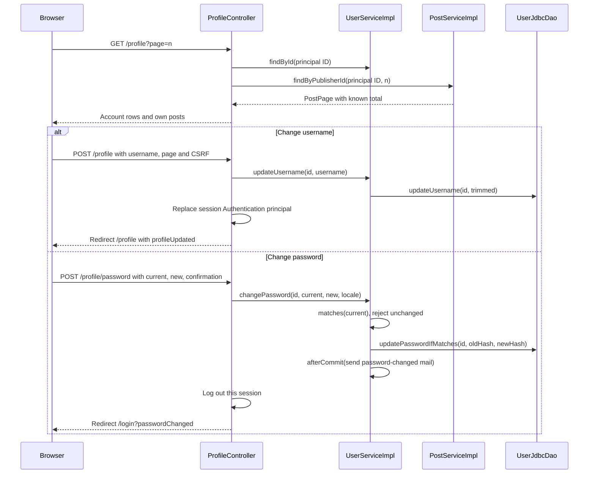

# Profile flow

/profile is the authenticated account page, reached from the identity link at the end of the site header. It shows the account data as three rows (username, email, masked password), a logout button and the owner's publications paged by twelve. Username and password are edited inline; email cannot change. This route is unrelated to the removed /profile/{id} scaffold described in [[Legacy user flow]].

## Flow diagram

The sequence follows the controller, service and DAO calls at `f12af08`. Error handling and transaction limits are explained below; this is a source trace, not a runtime test.



## Account rows

Each editable row is a `details` element. Its summary shows label, value and a pencil icon; opening it reveals a small form in the same grid cell. account-edit.js focuses the first field when a row opens and makes Cancel reset and close the row without reloading. Without JavaScript, Cancel is a link back to /profile at the same listing page. Every form carries a hidden `page` value, so a validation error rerenders the same page of publications with the failing row open and autofocused.

The username form uses [[ProfileForm]] (required, at most 100 characters). [[UserServiceImpl]] trims and saves it, and [[ProfileController]] rebuilds an [[AuthenticatedUser]] from the updated account and stores a new authentication token in the security context, so the header shows the new name immediately. Usernames are not unique.

The password form uses [[ChangePasswordForm]]: the current password, a new one under [[ValidPassword]] and a matching confirmation. The service checks the current password with [[PasswordHasher]].matches, rejects a new password equal to the current one, and writes with updatePasswordIfMatches, whose WHERE clause includes the hash it read. A concurrent change therefore surfaces as InvalidCurrentPasswordException. Wrong current and unchanged passwords become field errors. On success the controller logs out this session through SecurityContextLogoutHandler and redirects to /login?passwordChanged; a password-changed email is sent after commit.

Only the session that changed the password is closed. Sessions in other browsers stay valid until they expire; TODO.md records this as known debt with a proposed SessionRegistry fix.

## Own publications

[[PostServiceImpl]].findByPublisherId counts the owner's posts, converts the page through [[Pagination]] and lists twelve per page, newest first, including SOLD posts. Unlike the catalog, the total is known, so ui:pagination draws numbered links with ellipses and an anchor to `#posts`. Cards show an Available or Sold chip and link to the detail page, where the owner can edit or delete. A page past the total returns 404. A `postDeleted` notice appears here after a deletion.

[[Edit and delete flow]] · [[Password recovery flow]] · [[Authentication flow]] · [[Paginated listings]]

## Code snippets

### Password change controller

Business failures become field errors; success logs out only the current session. See [[ProfileController]] for the complete class.

[webapp/src/main/java/ar/edu/itba/paw/webapp/controller/ProfileController.java, lines 77–101](<file:///Users/bautistapessagno/Desktop/ITBA/PAW/paw2026b/webapp/src/main/java/ar/edu/itba/paw/webapp/controller/ProfileController.java>)

```java
    @RequestMapping(value = "/password", method = RequestMethod.POST)
    public ModelAndView changePassword(@AuthenticationPrincipal final AuthenticatedUser currentUser,
                                       @Valid @ModelAttribute("changePasswordForm") final ChangePasswordForm form,
                                       final BindingResult bindingResult,
                                       @ModelAttribute("profileForm") final ProfileForm profileForm,
                                       final HttpServletRequest request, final HttpServletResponse response,
                                       final Locale locale,
                                       @RequestParam(name = "page", defaultValue = "1") final int pageNumber) {
        profileForm.setUsername(currentUser.getDisplayName());
        if (bindingResult.hasErrors()) {
            return profileView(currentUser.getId(), OpenSection.PASSWORD, pageNumber);
        }
        try {
            userService.changePassword(currentUser.getId(), form.getCurrentPassword(),
                    form.getPassword(), locale);
        } catch (final InvalidCurrentPasswordException e) {
            bindingResult.rejectValue("currentPassword", "profile.password.current.invalid");
            return profileView(currentUser.getId(), OpenSection.PASSWORD, pageNumber);
        } catch (final UnchangedPasswordException e) {
            bindingResult.rejectValue("password", "profile.password.unchanged");
            return profileView(currentUser.getId(), OpenSection.PASSWORD, pageNumber);
        }
        LOGOUT_HANDLER.logout(request, response, SecurityContextHolder.getContext().getAuthentication());
        return new ModelAndView("redirect:/login?passwordChanged");
    }
```

### Password change service

The compare-and-set update protects against a concurrent change between the read and the write. See [[UserServiceImpl]] for the complete class.

[services/src/main/java/ar/edu/itba/paw/services/UserServiceImpl.java, lines 139–158](<file:///Users/bautistapessagno/Desktop/ITBA/PAW/paw2026b/services/src/main/java/ar/edu/itba/paw/services/UserServiceImpl.java>)

```java
    @Override
    @Transactional
    public User changePassword(final long id, final String currentPassword, final String newPassword,
                               final Locale locale) {
        final User user = userDao.findById(id).orElseThrow(UserNotFoundException::new);
        if (!passwordHasher.matches(currentPassword, user.getPasswordHash())) {
            throw new InvalidCurrentPasswordException();
        }
        if (passwordHasher.matches(newPassword, user.getPasswordHash())) {
            throw new UnchangedPasswordException();
        }
        // Si otra request cambio la clave entre la lectura y el update, la actual ingresada ya no es la vigente.
        final User updated = userDao.updatePasswordIfMatches(id, user.getPasswordHash(),
                passwordHasher.hash(newPassword)).orElseThrow(InvalidCurrentPasswordException::new);
        TransactionCallbacks.afterCommit(() -> {
            LOGGER.info("Changed password userId={}", id);
            emailService.sendPasswordChangedEmail(updated, locale);
        });
        return updated;
    }
```

### Refreshing the principal

The session keeps a stale display name unless the Authentication object is replaced. See [[ProfileController]] for the complete class.

[webapp/src/main/java/ar/edu/itba/paw/webapp/controller/ProfileController.java, lines 113–120](<file:///Users/bautistapessagno/Desktop/ITBA/PAW/paw2026b/webapp/src/main/java/ar/edu/itba/paw/webapp/controller/ProfileController.java>)

```java
    private static void refreshAuthentication(final User updatedUser) {
        final Authentication current = SecurityContextHolder.getContext().getAuthentication();
        final AuthenticatedUser principal = new AuthenticatedUser(updatedUser);
        final UsernamePasswordAuthenticationToken refreshed = new UsernamePasswordAuthenticationToken(
                principal, null, principal.getAuthorities());
        refreshed.setDetails(current.getDetails());
        SecurityContextHolder.getContext().setAuthentication(refreshed);
    }
```
