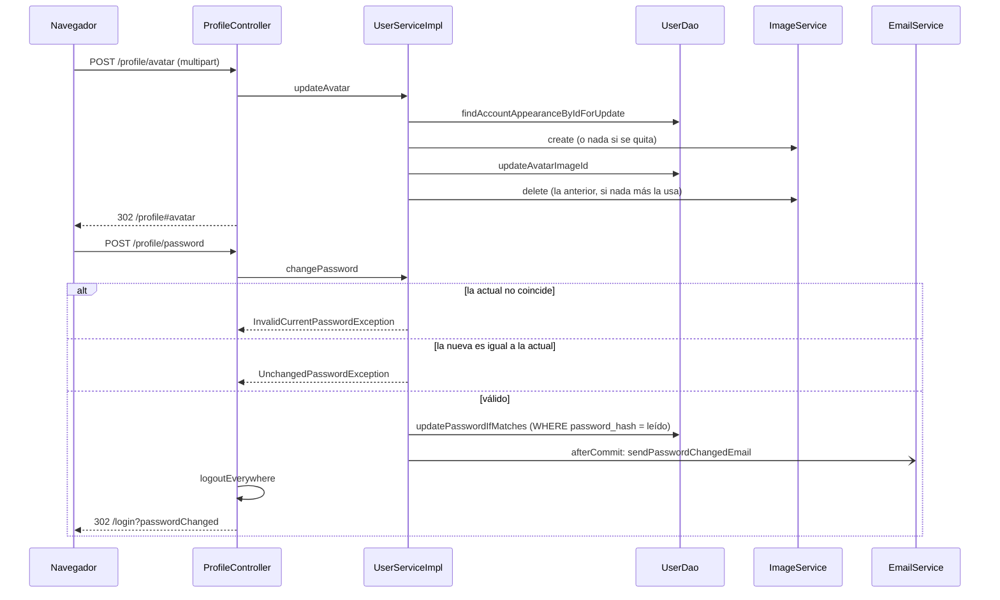

# Profile flow

> [!summary] En una frase
> `/profile` es la página privada de la Cuenta: nombre, foto, contraseña, datos de cobro, direcciones, sus publicaciones paginadas y filtrables por estado, y el botón de cerrar sesión; cada fila se edita en el lugar con su propio POST.

## Qué resuelve

Todo lo que una Cuenta administra de sí misma. Exige `VERIFIED` completo (`/profile/**`). Los datos de cobro y las direcciones tienen su nota: [[Addresses and payment flow]]. El perfil que ven los demás es [[Public profile flow]].

## Herramientas

| Herramienta | Para qué se usa acá |
|---|---|
| Spring MVC con varios `@ModelAttribute` | Una página con cinco formularios independientes |
| Bean Validation | [[ProfileForm]], [[ChangePasswordForm]], [[AvatarForm]], [[PaymentForm]], [[AddressForm]] |
| `PasswordHasher` (BCrypt) | Comprobar la clave actual y hashear la nueva |
| `UPDATE ... WHERE password_hash = ?` | Cambio de clave como comparar-y-reemplazar |
| `SessionRegistry` | Cerrar todas las sesiones al cambiar la clave |
| `AuthenticationSessions.refreshIfCurrent` | Que el nombre nuevo se vea en la cabecera sin volver a entrar |
| Commons FileUpload + [[ImageRules]] | Foto de perfil |
| `SELECT ... FOR UPDATE` | Serializar dos cambios de foto de la misma Cuenta |
| `account-edit.js` | Abrir y cerrar filas sin recargar; sin JavaScript todo sigue funcionando con enlaces |

## Recorrido paso a paso

### Ver: `GET /profile`

`profileView` junta: la Cuenta, su apariencia (nombre y foto), la página de sus publicaciones (15 por página; sin filtro, en cualquier estado), los chips para filtrarlas por estado con su cantidad, las direcciones activas y los formularios. `postStatus` (`AVAILABLE`, `RESERVED` o `SOLD`) filtra la lista y viaja en los enlaces de página y en los de cada publicación, para que volver desde la ficha conserve el filtro ([[Status filters flow]]). Parámetros de la URL abren secciones: `editAddress` precarga una dirección propia, `missingPayment` abre los datos de cobro (y `returnInquiryId`, si se llegó desde "Aceptar", hace que guardarlos vuelva a la venta: [[Addresses and payment flow]]), `addressLimit` y `avatarTooLarge` muestran avisos. El formulario de cobro se precarga con lo guardado, porque enviarlo vacío borraría los datos.

### Nombre: `POST /profile`

`updateUsername` recorta y actualiza. El controller llama a `refreshIfCurrent` para reemplazar el principal: el nombre que muestra la cabecera sale del principal de la sesión, no de la base.

### Foto: `POST /profile/avatar`

1. Formulario multipart en un diálogo. [[AvatarFormValidator]]: quitar no necesita archivo; cambiar exige una imagen que cumpla [[ImageRules]].
2. `UserServiceImpl.updateAvatar`:
   - Lee la apariencia con `FOR UPDATE` para saber cuál era la foto anterior.
   - Crea la imagen nueva (o ninguna si se quita).
   - Actualiza `users.avatar_image_id`.
   - Borra la anterior con `imageService.delete`, que solo elimina si nada más la referencia.
3. Un archivo que supera el límite del multipart no llega al controller: el filtro redirige a `/profile?avatarTooLarge#avatar`.

### Contraseña: `POST /profile/password`

1. [[ChangePasswordForm]]: clave actual obligatoria, nueva con [[ValidPassword]], confirmación igual. Este formulario **no** recorta espacios.
2. `UserServiceImpl.changePassword`:
   - Si la actual no coincide con el hash, `InvalidCurrentPasswordException`.
   - Si la nueva es igual a la actual, `UnchangedPasswordException`.
   - `updatePasswordIfMatches`: `UPDATE users SET password_hash = ? WHERE id = ? AND password_hash = <el leído>`. Si otra request cambió la clave en el medio, no afecta filas y se informa como clave actual inválida.
   - Correo de "tu contraseña cambió" después del commit.
3. `logoutEverywhere` expira las otras sesiones y cierra esta. Redirección a `/login?passwordChanged`.

### Cerrar sesión

Un `<form method="post" action="/logout">` con `sec:csrfInput`, al pie del perfil.


```mermaid
sequenceDiagram
    participant B as Navegador
    participant C as ProfileController
    participant U as UserServiceImpl
    participant D as UserDao
    participant I as ImageService
    participant M as EmailService
    B->>C: POST /profile/avatar (multipart)
    C->>U: updateAvatar
    U->>D: findAccountAppearanceByIdForUpdate
    U->>I: create (o nada si se quita)
    U->>D: updateAvatarImageId
    U->>I: delete (la anterior, si nada más la usa)
    C-->>B: 302 /profile#35;avatar
    B->>C: POST /profile/password
    C->>U: changePassword
    alt la actual no coincide
        U-->>C: InvalidCurrentPasswordException
    else la nueva es igual a la actual
        U-->>C: UnchangedPasswordException
    else válido
        U->>D: updatePasswordIfMatches (WHERE password_hash = leído)
        U-)M: afterCommit: sendPasswordChangedEmail
        C->>C: logoutEverywhere
        C-->>B: 302 /login?passwordChanged
    end
```

## Datos

`users.username`, `users.password_hash`, `users.avatar_image_id` (V9, FK a `images`), más lo de [[Addresses and payment flow]].

## Decisiones y por qué

| Decisión | Motivo | Fuente |
|---|---|---|
| El perfil entero exige Cuenta verificada | Una sesión abierta por quien registró un correo ajeno no tiene que ver ni cargar datos | Comentario en [[SecurityConfig]] |
| Cambiar la clave cierra todas las sesiones | Era deuda registrada en `TODO.md` y observación de la revisión del PR 33; se resolvió en el PR #43 | Commit `1350d001` |
| Comparar-y-reemplazar en el cambio de clave | Un formulario desactualizado no pisa una clave elegida después | Comentario en [[UserJdbcDao]] |
| No recortar los campos de contraseña | Recortar cambiaría la clave que se valida | Comentario en [[ProfileController]] |
| Refrescar el principal al cambiar el nombre | La cabecera lee el nombre del principal | Comentario en [[AuthenticationSessions]] |
| Bloquear la fila al cambiar la foto | Cada cambio borra la foto que leyó; sin orden quedaría una huérfana | Comentario en [[UserServiceImpl]] |
| La foto vieja se borra solo si nadie la referencia | La misma tabla `images` sirve a posts, álbumes y avatares. Alternativa descartada: borrado incondicional | SQL de [[ImageJdbcDao]] |
| El error de foto vuelve como aviso y reabre el diálogo | La foto se cambia desde un diálogo. Alternativa descartada: volver a dibujar el formulario | Comentario en [[ProfileController]] |
| El formulario de cobro siempre muestra lo guardado | Guardar sin tocarlo borraría los datos. Alternativa descartada: formulario vacío | Comentario en [[ProfileController]] |
| Un POST que vuelve a dibujar el perfil con un error muestra las publicaciones sin filtro | Solo `GET /profile` recibe el filtro; la sobrecarga de `profileView` sin estado pasa `null`. Alternativa descartada: conservar `postStatus` en cada formulario | Comentario en [[ProfileController]] |

## Concurrencia y casos borde

- Dos cambios de clave a la vez desde dos pestañas: gana uno; el otro ve "clave actual inválida".
- Dos cambios de foto a la vez: se ordenan por el bloqueo; no quedan imágenes sueltas.
- Página de publicaciones fuera de rango: 404.
- `postStatus` con un valor que no es un estado: 400, porque Spring no puede convertirlo al enum ([[Validation and errors]]).

## Límites conocidos

- El correo de la Cuenta no se puede cambiar.
- El aviso de cambio de clave usa el idioma del request.
- Sin tests de la capa web; [[UserServiceImplTest]] cubre el service.

## Preguntas de defensa

**¿Cómo se entera la cabecera de que cambié el nombre?**
El controller reemplaza el `Authentication` de la sesión por uno armado con la Cuenta actualizada.

**¿Qué pasa si cambio la clave con otra sesión abierta en el celular?**
Esa sesión queda expirada y en su próximo request va a `/login?sessionExpired`.

**¿Por qué el `UPDATE` de la clave lleva el hash viejo en el `WHERE`?**
Para detectar que nadie la cambió entre que la leí y que la escribo.

**¿Qué pasa con la foto anterior?**
Se borra de `images` si ningún post, álbum ni Cuenta la usa.

## Evidencia de código

Cambio de contraseña:

Fuente exacta en `c3e2a4c`: [webapp/src/main/java/ar/edu/itba/paw/webapp/controller/ProfileController.java](</Users/bautistapessagno/Desktop/proyectos_itba/PAW/paw2026b/webapp/src/main/java/ar/edu/itba/paw/webapp/controller/ProfileController.java>), líneas 153–178.

```java
    @RequestMapping(value = "/password", method = RequestMethod.POST)
    public ModelAndView changePassword(@AuthenticationPrincipal final AuthenticatedUser currentUser,
                                       @Valid @ModelAttribute("changePasswordForm") final ChangePasswordForm form,
                                       final BindingResult bindingResult,
                                       @ModelAttribute("profileForm") final ProfileForm profileForm,
                                       final HttpServletRequest request, final HttpServletResponse response,
                                       final Locale locale,
                                       @RequestParam(name = "page", defaultValue = "1") final int pageNumber) {
        profileForm.setUsername(currentUser.getDisplayName());
        if (bindingResult.hasErrors()) {
            return profileView(currentUser.getId(), OpenSection.PASSWORD, pageNumber, null);
        }
        final User updatedUser;
        try {
            updatedUser = userService.changePassword(currentUser.getId(), form.getCurrentPassword(),
                    form.getPassword(), locale);
        } catch (final InvalidCurrentPasswordException e) {
            bindingResult.rejectValue("currentPassword", "profile.password.current.invalid");
            return profileView(currentUser.getId(), OpenSection.PASSWORD, pageNumber, null);
        } catch (final UnchangedPasswordException e) {
            bindingResult.rejectValue("password", "profile.password.unchanged");
            return profileView(currentUser.getId(), OpenSection.PASSWORD, pageNumber, null);
        }
        AuthenticationSessions.logoutEverywhere(updatedUser, request, response, sessionRegistry);
        return new ModelAndView("redirect:/login?passwordChanged");
    }
```

Fuente exacta en `c3e2a4c`: [services/src/main/java/ar/edu/itba/paw/services/UserServiceImpl.java](</Users/bautistapessagno/Desktop/proyectos_itba/PAW/paw2026b/services/src/main/java/ar/edu/itba/paw/services/UserServiceImpl.java>), líneas 232–251.

```java
    @Override
    @Transactional
    public User changePassword(final long id, final String currentPassword, final String newPassword,
                               final Locale locale) {
        final User user = userDao.findById(id).orElseThrow(UserNotFoundException::new);
        if (!passwordHasher.matches(currentPassword, user.getPasswordHash())) {
            throw new InvalidCurrentPasswordException();
        }
        if (passwordHasher.matches(newPassword, user.getPasswordHash())) {
            throw new UnchangedPasswordException();
        }
        // Si otra request cambio la clave entre la lectura y el update, la actual ingresada ya no es la vigente.
        final User updated = userDao.updatePasswordIfMatches(id, user.getPasswordHash(),
                passwordHasher.hash(newPassword)).orElseThrow(InvalidCurrentPasswordException::new);
        TransactionCallbacks.afterCommit(() -> {
            LOGGER.info("Changed password userId={}", id);
            emailService.sendPasswordChangedEmail(updated, locale);
        });
        return updated;
    }
```

Foto de perfil:

Fuente exacta en `c3e2a4c`: [services/src/main/java/ar/edu/itba/paw/services/UserServiceImpl.java](</Users/bautistapessagno/Desktop/proyectos_itba/PAW/paw2026b/services/src/main/java/ar/edu/itba/paw/services/UserServiceImpl.java>), líneas 89–105.

```java
    @Override
    @Transactional
    public Optional<Long> updateAvatar(final long userId, final ImageUpload avatar) {
        // El lock serializa dos cambios de foto de la misma Cuenta: cada uno borra la que leyo.
        final Long previousId = userDao.findAccountAppearanceByIdForUpdate(userId)
                .orElseThrow(UserNotFoundException::new).getAvatarImageId();
        final Long newId = avatar == null ? null
                : imageService.create(avatar.getContentType(), avatar.getData()).getId();
        if (!userDao.updateAvatarImageId(userId, newId)) {
            throw new UserNotFoundException();
        }
        if (previousId != null) {
            imageService.delete(previousId);
        }
        LOGGER.info("Updated avatar userId={} removed={}", userId, newId == null);
        return Optional.ofNullable(newId);
    }
```

Armado de la vista:

Fuente exacta en `c3e2a4c`: [webapp/src/main/java/ar/edu/itba/paw/webapp/controller/ProfileController.java](</Users/bautistapessagno/Desktop/proyectos_itba/PAW/paw2026b/webapp/src/main/java/ar/edu/itba/paw/webapp/controller/ProfileController.java>), líneas 280–318.

```java
    // Los POST que re-renderizan el perfil con un error vuelven al listado sin filtro.
    private ModelAndView profileView(final long userId, final OpenSection openSection, final int pageNumber,
                                     final Long editingAddressId) {
        return profileView(userId, openSection, pageNumber, editingAddressId, null);
    }

    private ModelAndView profileView(final long userId, final OpenSection openSection, final int pageNumber,
                                     final Long editingAddressId, final PostStatus postStatus) {
        final User user = userService.findById(userId).orElseThrow(UserNotFoundException::new);
        final ShippingOptions shipping = addressService.findShippingOptions(userId);
        final ModelAndView modelAndView = new ModelAndView("profile/index");
        modelAndView.addObject("profileUser", user);
        modelAndView.addObject("accountAppearance", userService.findAccountAppearanceById(userId)
                .orElseThrow(UserNotFoundException::new));
        modelAndView.addObject("postPage", postService.findByPublisherId(userId, postStatus, pageNumber));
        modelAndView.addObject("postStatusFilter", postStatus);
        modelAndView.addObject("postStatusCounts", postService.countByStatusForPublisher(userId));
        modelAndView.addObject("postStatuses", PostStatus.values());
        modelAndView.addObject("postOrigin", PostOrigin.PRIVATE_PROFILE);
        modelAndView.addObject("acceptedImageTypes", ImageRules.ACCEPTED_CONTENT_TYPES);
        modelAndView.addObject("maxImageBytes", ImageRules.MAX_IMAGE_BYTES);
        modelAndView.addObject("addresses", shipping.getAddresses());
        modelAndView.addObject("provinces", Province.values());
        modelAndView.addObject("editingAddressId", editingAddressId);
        modelAndView.addObject("profileEditOpen", openSection == OpenSection.USERNAME);
        modelAndView.addObject("passwordEditOpen", openSection == OpenSection.PASSWORD);
        modelAndView.addObject("paymentEditOpen",
                openSection == OpenSection.PAYMENT || openSection == OpenSection.PAYMENT_MISSING);
        modelAndView.addObject("paymentMissing", openSection == OpenSection.PAYMENT_MISSING);
        modelAndView.addObject("addressesOpen", openSection == OpenSection.ADDRESSES);
        modelAndView.addObject("canAddAddress", shipping.isNewAddressAllowed());
        modelAndView.addObject("maxAddresses", AddressService.MAX_ACTIVE_ADDRESSES);
        // Salvo que se este corrigiendo, el formulario de cobro muestra lo guardado: vacio, guardar
        // sin tocarlo borraria los datos de cobro.
        if (openSection != OpenSection.PAYMENT) {
            modelAndView.addObject("paymentForm", paymentFormOf(user));
        }
        return modelAndView;
    }
```

Redirecciones del filtro multipart:

Fuente exacta en `c3e2a4c`: [webapp/src/main/java/ar/edu/itba/paw/webapp/security/MultipartExceptionHandlerFilter.java](</Users/bautistapessagno/Desktop/proyectos_itba/PAW/paw2026b/webapp/src/main/java/ar/edu/itba/paw/webapp/security/MultipartExceptionHandlerFilter.java>), líneas 18–49.

```java
    @Override
    protected void doFilterInternal(final HttpServletRequest request, final HttpServletResponse response,
                                    final FilterChain filterChain) throws ServletException, IOException {
        try {
            filterChain.doFilter(request, response);
        } catch (final ServletException | RuntimeException exception) {
            /*
             * El resolver multipart parsea de forma lazy, asi que el limite excedido puede
             * saltar dentro del DispatcherServlet y llegar aca envuelto en una
             * NestedServletException. Por eso tambien se mira la causa directa.
             */
            if (!(exception instanceof MaxUploadSizeExceededException)
                    && !(exception.getCause() instanceof MaxUploadSizeExceededException)) {
                throw exception;
            }
            LOGGER.warn("Rejected a multipart request over the size limit uri={}", request.getRequestURI());
            final String servletPath = request.getServletPath();
            // El comprobante vuelve a la pagina de la Venta, que muestra el aviso.
            if (servletPath.matches("/inquiries/[0-9]+/receipt")) {
                final String salePath = servletPath.substring(0, servletPath.length() - "/receipt".length());
                response.sendRedirect(request.getContextPath() + salePath + "?receiptTooLarge");
                return;
            }
            // La foto de perfil vuelve al perfil, que reabre el dialogo con el aviso.
            if ("/profile/avatar".equals(servletPath)) {
                response.sendRedirect(request.getContextPath() + "/profile?avatarTooLarge#avatar");
                return;
            }
            final String target = servletPath.matches("/post/[0-9]+/edit") ? servletPath : "/publish";
            response.sendRedirect(request.getContextPath() + target + "?coverTooLarge");
        }
    }
```

## Archivos para seguir el flujo

- [webapp/src/main/java/ar/edu/itba/paw/webapp/controller/ProfileController.java](</Users/bautistapessagno/Desktop/proyectos_itba/PAW/paw2026b/webapp/src/main/java/ar/edu/itba/paw/webapp/controller/ProfileController.java>) · [[ProfileController]]
- [webapp/src/main/java/ar/edu/itba/paw/webapp/form/ProfileForm.java](</Users/bautistapessagno/Desktop/proyectos_itba/PAW/paw2026b/webapp/src/main/java/ar/edu/itba/paw/webapp/form/ProfileForm.java>) · [[ProfileForm]]
- [webapp/src/main/java/ar/edu/itba/paw/webapp/form/ChangePasswordForm.java](</Users/bautistapessagno/Desktop/proyectos_itba/PAW/paw2026b/webapp/src/main/java/ar/edu/itba/paw/webapp/form/ChangePasswordForm.java>) · [[ChangePasswordForm]]
- [webapp/src/main/java/ar/edu/itba/paw/webapp/form/AvatarForm.java](</Users/bautistapessagno/Desktop/proyectos_itba/PAW/paw2026b/webapp/src/main/java/ar/edu/itba/paw/webapp/form/AvatarForm.java>) · [[AvatarForm]]
- [webapp/src/main/java/ar/edu/itba/paw/webapp/validation/AvatarFormValidator.java](</Users/bautistapessagno/Desktop/proyectos_itba/PAW/paw2026b/webapp/src/main/java/ar/edu/itba/paw/webapp/validation/AvatarFormValidator.java>) · [[AvatarFormValidator]]
- [services/src/main/java/ar/edu/itba/paw/services/UserServiceImpl.java](</Users/bautistapessagno/Desktop/proyectos_itba/PAW/paw2026b/services/src/main/java/ar/edu/itba/paw/services/UserServiceImpl.java>) · [[UserServiceImpl]]
- [webapp/src/main/java/ar/edu/itba/paw/webapp/security/AuthenticationSessions.java](</Users/bautistapessagno/Desktop/proyectos_itba/PAW/paw2026b/webapp/src/main/java/ar/edu/itba/paw/webapp/security/AuthenticationSessions.java>) · [[AuthenticationSessions]]
- [webapp/src/main/java/ar/edu/itba/paw/webapp/security/MultipartExceptionHandlerFilter.java](</Users/bautistapessagno/Desktop/proyectos_itba/PAW/paw2026b/webapp/src/main/java/ar/edu/itba/paw/webapp/security/MultipartExceptionHandlerFilter.java>) · [[MultipartExceptionHandlerFilter]]
- [persistence/src/main/java/ar/edu/itba/paw/persistence/UserJdbcDao.java](</Users/bautistapessagno/Desktop/proyectos_itba/PAW/paw2026b/persistence/src/main/java/ar/edu/itba/paw/persistence/UserJdbcDao.java>) · [[UserJdbcDao]]
- [persistence/src/main/resources/db/migration/V9__user_avatars.sql](</Users/bautistapessagno/Desktop/proyectos_itba/PAW/paw2026b/persistence/src/main/resources/db/migration/V9__user_avatars.sql>)
- [webapp/src/main/webapp/WEB-INF/views/profile/index.jsp](</Users/bautistapessagno/Desktop/proyectos_itba/PAW/paw2026b/webapp/src/main/webapp/WEB-INF/views/profile/index.jsp>)
- [webapp/src/main/webapp/js/account-edit.js](</Users/bautistapessagno/Desktop/proyectos_itba/PAW/paw2026b/webapp/src/main/webapp/js/account-edit.js>)

Fuente inspeccionada: `c3e2a4c`, 2026-10-05. Es evidencia estática; no implica ejecución de la aplicación. [[Source inventory]] · [[Roadmap de lectura]]
