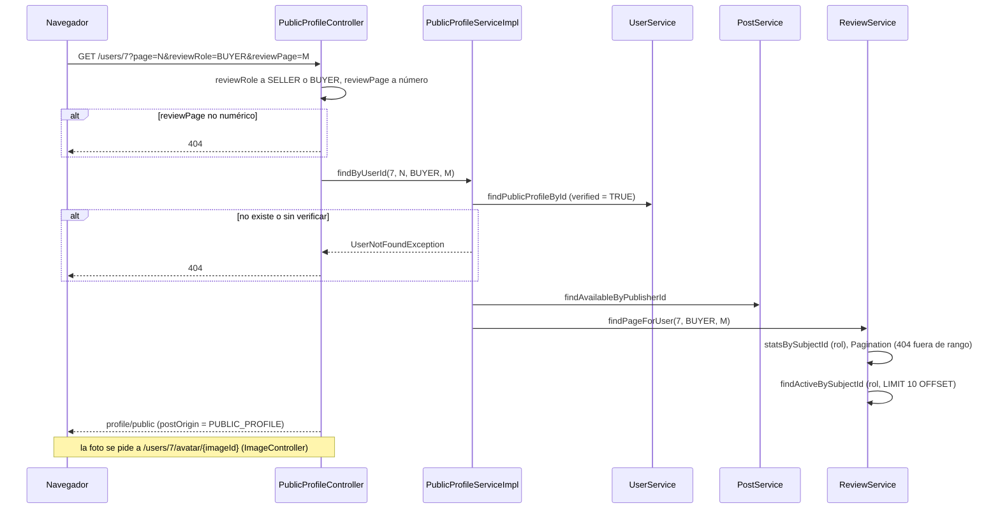

# Public profile flow

> [!summary] En una frase
> `/users/{id}` muestra, sin pedir sesión, el nombre y la foto de una Cuenta verificada, sus publicaciones a la venta y su reputación, separada en reseñas como vendedora y como compradora, cada una paginada.

## Qué resuelve

Saber a quién le estás comprando (PR #46). Se llega desde la ficha de una publicación, desde la página de una venta y desde el autor de una reseña, siempre con el mismo enlace de foto y nombre (`user-byline.tag`, PR #58). El PR #57 agregó el selector de rol y la paginación de reseñas.

## Herramientas

| Herramienta | Para qué se usa acá |
|---|---|
| Un service de composición | [[PublicProfileServiceImpl]] junta lo de tres dominios |
| Proyección [[PublicUserProfile]] | Solo id, nombre y foto: nunca correo, hash ni datos de cobro |
| `WHERE verified = TRUE` | El perfil público existe solo para Cuentas verificadas |
| `Pagination` | Publicaciones de a 15 y reseñas de a 10, cada lista con su propio parámetro (`page` y `reviewPage`) |
| `segmented-control.tag` + `catalog.js` | Selector de rol: radios dentro de un `<form method="get">` con botón "Aplicar"; con JavaScript se envía al cambiar (`data-auto-submit`) |
| `rating.tag` | Estrellas de solo lectura con relleno parcial para el promedio |
| [[ImageController]] | La foto se pide con el id de la Cuenta en la URL |

## Recorrido paso a paso

1. `GET /users/{id}?page=N&reviewRole=SELLER|BUYER&reviewPage=M`, ruta pública (`permitAll`).
2. El controller traduce los parámetros de reseñas:
   - `reviewRole`: `"BUYER"` es comprador; cualquier otro valor, o ninguno, es vendedor. Nunca falla.
   - `reviewPage` llega como texto; si no es un número, `PageNotFoundException` → 404.
3. `PublicProfileServiceImpl.findByUserId(id, page, role, reviewPage)`, en una transacción de solo lectura:
   - `userService.findPublicProfileById`: `SELECT id, username, avatar_image_id FROM users WHERE id = ? AND verified = TRUE`. Si no hay fila, `UserNotFoundException` → 404.
   - `postService.findAvailableByPublisherId`: solo publicaciones `AVAILABLE`, más nuevas primero.
   - `reviewService.findPageForUser(id, role, reviewPage)`: estadísticas del rol y la página de 10 reseñas ([[Reviews flow]]).
4. La vista:
   - Muestra el promedio con `rating.tag` y la cantidad, solo si el rol elegido tiene reseñas.
   - El selector de rol es un formulario `GET` a `/users/{id}#reviews` que conserva la página de publicaciones en un campo oculto.
   - Cada paginación conserva la otra: la de publicaciones arrastra `reviewRole` y `reviewPage`; la de reseñas arrastra `reviewRole` y `page` y usa `pageParam="reviewPage"`.
   - Sin reseñas en ese rol, un estado vacío propio de cada rol (`publicProfile.reviews.empty.SELLER` o `.BUYER`).
5. La vista recibe `postOrigin = PUBLIC_PROFILE`. Cada tarjeta lo pasa a la ficha, que así sabe ofrecer "volver al perfil" con la página correcta ([[Post detail flow]]).
6. La foto se pide a `/users/{id}/avatar/{imageId}`. El SQL exige que la imagen sea el avatar vigente de esa Cuenta y que la Cuenta esté verificada.



## Decisiones y por qué

| Decisión | Motivo | Fuente |
|---|---|---|
| Un service aparte para el perfil público | `PostService` ya depende de `UserService`; componer en uno de los dos crearía un ciclo | Comentario en [[PublicProfileServiceImpl]] |
| Una proyección mínima y no `User` | Que un dato privado no llegue a una vista pública por descuido | Estructura de [[PublicUserProfile]] |
| Solo Cuentas verificadas | Una Cuenta sin verificar puede ser un correo ajeno | Consulta de [[UserJdbcDao]] |
| Solo publicaciones disponibles | Es una vidriera; el historial queda en el perfil privado | Método `findAvailableByPublisherId` |
| Dos lecturas de apariencia: la del perfil privado no filtra por verificación, la pública sí | El perfil privado lee la Cuenta propia; la vista pública no muestra Cuentas sin verificar | Commit `e4babb17`; `findAccountAppearanceById` frente a `findPublicProfileById` en [[UserJdbcDao]] |
| Reseñas separadas por rol y paginadas | Hasta `8929aea` había un solo listado cortado en las 10 más recientes; ahora la reputación de vendedor y la de comprador se leen por separado y completas | Comentario en [[ReviewSubjectRole]]; commits `5d439ef4`, `f0e92d0b` |
| Un `reviewRole` desconocido cae en vendedor y un `reviewPage` inválido da 404 | Elegir un rol es una preferencia de vista; una página que no existe es un recurso inexistente | Inferencia a partir de [[PublicProfileController]] |
| Volver solo a un perfil conocido | La ficha construye la ruta de regreso a partir de un enum, no de un texto libre | Comentario en [[PostController]] |

## Límites conocidos

- El rol elegido no se recuerda: cada visita arranca en vendedor.
- `page` sigue siendo un `int` ligado por Spring: un valor no numérico da 400, mientras que `reviewPage` da 404.
- Las cuatro lecturas (Cuenta, publicaciones, estadísticas y reseñas) son consultas separadas dentro de una transacción de solo lectura; no hay caché.
- Un solo test de service ([[PublicProfileServiceImplTest]]).

## Preguntas de defensa

**¿Qué datos de una Cuenta son públicos?**
Nombre, foto, publicaciones a la venta y reseñas recibidas. Nada más.

**¿Qué pasa si pido el perfil de una Cuenta sin verificar?**
404, igual que si no existiera.

**¿Cómo se pasa de las reseñas como vendedor a las de comprador sin JavaScript?**
El selector es un formulario `GET` con radios y un botón "Aplicar". Con JavaScript, `catalog.js` lo envía al cambiar el radio. La página de publicaciones viaja en un campo oculto, así que no se pierde.

**¿Por qué existe `PublicProfileService`?**
Para componer Cuenta, publicaciones y reseñas sin que un service de dominio dependa de los otros dos.

## Evidencia de código

Fuente exacta en `c3e2a4c`: [services/src/main/java/ar/edu/itba/paw/services/PublicProfileServiceImpl.java](</Users/bautistapessagno/Desktop/proyectos_itba/PAW/paw2026b/services/src/main/java/ar/edu/itba/paw/services/PublicProfileServiceImpl.java>), líneas 10–38.

```java
/*
 * Arma el perfil publico con lo de cada dominio: la Cuenta, sus publicaciones a la venta y sus
 * Resenas. Vive aparte porque PostService ya depende de UserService.
 */
@Service
public class PublicProfileServiceImpl implements PublicProfileService {

    private final UserService userService;
    private final PostService postService;
    private final ReviewService reviewService;

    @Autowired
    public PublicProfileServiceImpl(final UserService userService, final PostService postService,
                                    final ReviewService reviewService) {
        this.userService = userService;
        this.postService = postService;
        this.reviewService = reviewService;
    }

    @Override
    @Transactional(readOnly = true)
    public PublicProfile findByUserId(final long userId, final int pageNumber,
                                     final ReviewSubjectRole reviewRole, final int reviewPageNumber) {
        final PublicUserProfile user = userService.findPublicProfileById(userId)
                .orElseThrow(UserNotFoundException::new);
        return new PublicProfile(user, postService.findAvailableByPublisherId(userId, pageNumber),
                reviewService.findPageForUser(userId, reviewRole, reviewPageNumber));
    }
}
```

Fuente exacta en `c3e2a4c`: [webapp/src/main/java/ar/edu/itba/paw/webapp/controller/PublicProfileController.java](</Users/bautistapessagno/Desktop/proyectos_itba/PAW/paw2026b/webapp/src/main/java/ar/edu/itba/paw/webapp/controller/PublicProfileController.java>), líneas 15–43.

```java
@Controller
public class PublicProfileController {
    private final PublicProfileService publicProfileService;

    @Autowired
    public PublicProfileController(final PublicProfileService publicProfileService) {
        this.publicProfileService = publicProfileService;
    }

    @RequestMapping(value = "/users/{id:[0-9]+}", method = RequestMethod.GET)
    public ModelAndView show(@PathVariable("id") final long id,
                             @RequestParam(name = "page", defaultValue = "1") final int pageNumber,
                             @RequestParam(name = "reviewRole", defaultValue = "SELLER") final String reviewRole,
                             @RequestParam(name = "reviewPage", defaultValue = "1") final String reviewPage) {
        final ModelAndView view = new ModelAndView("profile/public");
        final ReviewSubjectRole role = "BUYER".equals(reviewRole) ? ReviewSubjectRole.BUYER : ReviewSubjectRole.SELLER;
        final int reviewPageNumber;
        try {
            reviewPageNumber = Integer.parseInt(reviewPage);
        } catch (NumberFormatException exception) {
            throw new PageNotFoundException();
        }
        view.addObject("profile", publicProfileService.findByUserId(id, pageNumber, role, reviewPageNumber));
        view.addObject("postOrigin", PostOrigin.PUBLIC_PROFILE);
        view.addObject("maxRating", ReviewRules.MAX_RATING);
        view.addObject("reviewRoles", ReviewSubjectRole.values());
        return view;
    }
}
```

Fuente exacta en `c3e2a4c`: [persistence/src/main/java/ar/edu/itba/paw/persistence/UserJdbcDao.java](</Users/bautistapessagno/Desktop/proyectos_itba/PAW/paw2026b/persistence/src/main/java/ar/edu/itba/paw/persistence/UserJdbcDao.java>), líneas 64–81.

```java
    @Override
    public Optional<PublicUserProfile> findPublicProfileById(final long id) {
        return jdbcTemplate.query(PUBLIC_PROFILE_SELECT + "WHERE id = ? AND verified = TRUE",
                        PUBLIC_PROFILE_MAPPER, id)
                .stream().findAny();
    }

    @Override
    public Optional<PublicUserProfile> findAccountAppearanceById(final long id) {
        return jdbcTemplate.query(PUBLIC_PROFILE_SELECT + "WHERE id = ?",
                PUBLIC_PROFILE_MAPPER, id).stream().findAny();
    }

    @Override
    public Optional<PublicUserProfile> findAccountAppearanceByIdForUpdate(final long id) {
        return jdbcTemplate.query(PUBLIC_PROFILE_SELECT + "WHERE id = ? FOR UPDATE",
                PUBLIC_PROFILE_MAPPER, id).stream().findAny();
    }
```

Fuente exacta en `c3e2a4c`: [persistence/src/main/java/ar/edu/itba/paw/persistence/ImageJdbcDao.java](</Users/bautistapessagno/Desktop/proyectos_itba/PAW/paw2026b/persistence/src/main/java/ar/edu/itba/paw/persistence/ImageJdbcDao.java>), líneas 56–61.

```java
    @Override
    public Optional<Image> findUserAvatar(final long userId, final long imageId) {
        return jdbcTemplate.query(IMAGE_SELECT + "WHERE i.id = ? AND EXISTS ("
                        + "SELECT 1 FROM users u WHERE u.id = ? AND u.verified = TRUE AND u.avatar_image_id = i.id)",
                ROW_MAPPER, imageId, userId).stream().findFirst();
    }
```

## Archivos para seguir el flujo

- [webapp/src/main/java/ar/edu/itba/paw/webapp/controller/PublicProfileController.java](</Users/bautistapessagno/Desktop/proyectos_itba/PAW/paw2026b/webapp/src/main/java/ar/edu/itba/paw/webapp/controller/PublicProfileController.java>) · [[PublicProfileController]]
- [services/src/main/java/ar/edu/itba/paw/services/ReviewServiceImpl.java](</Users/bautistapessagno/Desktop/proyectos_itba/PAW/paw2026b/services/src/main/java/ar/edu/itba/paw/services/ReviewServiceImpl.java>) · [[ReviewServiceImpl]]
- [models/src/main/java/ar/edu/itba/paw/models/ReviewPage.java](</Users/bautistapessagno/Desktop/proyectos_itba/PAW/paw2026b/models/src/main/java/ar/edu/itba/paw/models/ReviewPage.java>) · [[ReviewPage]]
- [models/src/main/java/ar/edu/itba/paw/models/ReviewSubjectRole.java](</Users/bautistapessagno/Desktop/proyectos_itba/PAW/paw2026b/models/src/main/java/ar/edu/itba/paw/models/ReviewSubjectRole.java>) · [[ReviewSubjectRole]]
- [webapp/src/main/webapp/WEB-INF/tags/rating.tag](</Users/bautistapessagno/Desktop/proyectos_itba/PAW/paw2026b/webapp/src/main/webapp/WEB-INF/tags/rating.tag>)
- [webapp/src/main/webapp/WEB-INF/tags/review-content.tag](</Users/bautistapessagno/Desktop/proyectos_itba/PAW/paw2026b/webapp/src/main/webapp/WEB-INF/tags/review-content.tag>)
- [webapp/src/main/webapp/WEB-INF/tags/user-byline.tag](</Users/bautistapessagno/Desktop/proyectos_itba/PAW/paw2026b/webapp/src/main/webapp/WEB-INF/tags/user-byline.tag>)
- [webapp/src/main/webapp/js/catalog.js](</Users/bautistapessagno/Desktop/proyectos_itba/PAW/paw2026b/webapp/src/main/webapp/js/catalog.js>)
- [services/src/main/java/ar/edu/itba/paw/services/PublicProfileServiceImpl.java](</Users/bautistapessagno/Desktop/proyectos_itba/PAW/paw2026b/services/src/main/java/ar/edu/itba/paw/services/PublicProfileServiceImpl.java>) · [[PublicProfileServiceImpl]]
- [services-contracts/src/main/java/ar/edu/itba/paw/services/PublicProfileService.java](</Users/bautistapessagno/Desktop/proyectos_itba/PAW/paw2026b/services-contracts/src/main/java/ar/edu/itba/paw/services/PublicProfileService.java>) · [[PublicProfileService]]
- [models/src/main/java/ar/edu/itba/paw/models/PublicProfile.java](</Users/bautistapessagno/Desktop/proyectos_itba/PAW/paw2026b/models/src/main/java/ar/edu/itba/paw/models/PublicProfile.java>) · [[PublicProfile]]
- [models/src/main/java/ar/edu/itba/paw/models/PublicUserProfile.java](</Users/bautistapessagno/Desktop/proyectos_itba/PAW/paw2026b/models/src/main/java/ar/edu/itba/paw/models/PublicUserProfile.java>) · [[PublicUserProfile]]
- [models/src/main/java/ar/edu/itba/paw/models/ReviewStats.java](</Users/bautistapessagno/Desktop/proyectos_itba/PAW/paw2026b/models/src/main/java/ar/edu/itba/paw/models/ReviewStats.java>) · [[ReviewStats]]
- [persistence/src/main/java/ar/edu/itba/paw/persistence/UserJdbcDao.java](</Users/bautistapessagno/Desktop/proyectos_itba/PAW/paw2026b/persistence/src/main/java/ar/edu/itba/paw/persistence/UserJdbcDao.java>) · [[UserJdbcDao]]
- [persistence/src/main/java/ar/edu/itba/paw/persistence/ReviewJdbcDao.java](</Users/bautistapessagno/Desktop/proyectos_itba/PAW/paw2026b/persistence/src/main/java/ar/edu/itba/paw/persistence/ReviewJdbcDao.java>) · [[ReviewJdbcDao]]
- [webapp/src/main/java/ar/edu/itba/paw/webapp/controller/ImageController.java](</Users/bautistapessagno/Desktop/proyectos_itba/PAW/paw2026b/webapp/src/main/java/ar/edu/itba/paw/webapp/controller/ImageController.java>) · [[ImageController]]
- [webapp/src/main/java/ar/edu/itba/paw/webapp/controller/PostOrigin.java](</Users/bautistapessagno/Desktop/proyectos_itba/PAW/paw2026b/webapp/src/main/java/ar/edu/itba/paw/webapp/controller/PostOrigin.java>) · [[PostOrigin]]
- [webapp/src/main/webapp/WEB-INF/views/profile/public.jsp](</Users/bautistapessagno/Desktop/proyectos_itba/PAW/paw2026b/webapp/src/main/webapp/WEB-INF/views/profile/public.jsp>)
- [webapp/src/main/webapp/WEB-INF/tags/avatar.tag](</Users/bautistapessagno/Desktop/proyectos_itba/PAW/paw2026b/webapp/src/main/webapp/WEB-INF/tags/avatar.tag>)

Fuente inspeccionada: `c3e2a4c`, 2026-10-05. Es evidencia estática; no implica ejecución de la aplicación. [[Source inventory]] · [[Roadmap de lectura]]
