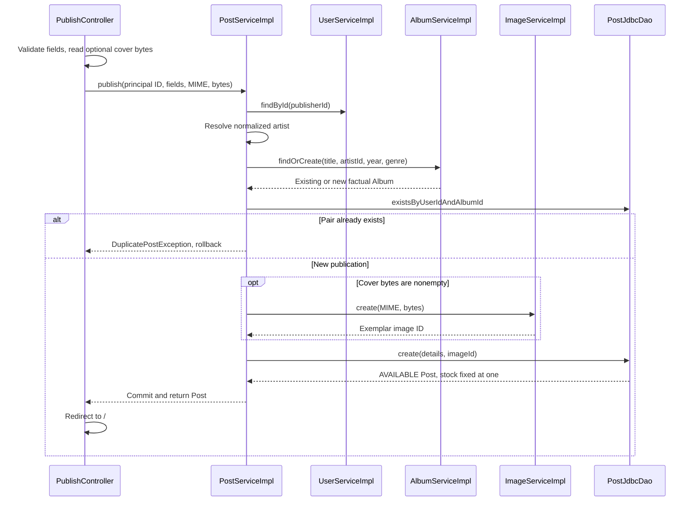

# Publish flow

GET /publish requires a session and renders the album and exemplar form. Publisher identity comes from [[AuthenticatedUser]], not posted username/email. The form requires title, artist, release year and price. Genre, physical condition, pressing year, zone, description and photo are optional; stock is absent.

## Flow diagram

The sequence follows the controller, service and DAO calls at 40328f0. Error handling and transaction limits are explained below; this is a source trace, not a runtime test.



## Behavior and limits

POST /publish passes multipart parsing and CSRF validation before MVC validation. The controller passes the principal ID and form data into one transaction in [[PostServiceImpl]]. It loads the account, resolves normalized artist/title/year, checks the user/album uniqueness rule, optionally stores a new Image, then inserts an AVAILABLE Post with stock=1. Existing albums retain their genre; each new publication can have its own image.

DuplicatePostException and ConcurrentPublishException become global form errors. InvalidImageException becomes a cover field error. The controller rebuilds enum options on redisplay; success redirects to /. Validation preserves ordinary values but a browser file input must be reselected. An oversized multipart request redirects to /publish?coverTooLarge and loses submitted values.

The uniqueness check includes sold publications, so the same account cannot publish another exemplar of the same album through this flow. Publishing does not create an account or send welcome mail. [[Authentication flow]] owns registration and welcome dispatch.

[[Cover image flow]] · [[Validation and errors]] · [[Transactions and concurrency]]

## Code snippets

### One publishing transaction

The order matters: the duplicate check precedes image creation, and the new image belongs to the Post. The linked class note includes dependencies and constants. See [[PostServiceImpl]] for the complete class.

[services/src/main/java/ar/edu/itba/paw/services/PostServiceImpl.java, lines 85–110](<file:///Users/bautistapessagno/Desktop/ITBA/PAW/paw2026b/services/src/main/java/ar/edu/itba/paw/services/PostServiceImpl.java>)

```java
    @Override
    @Transactional
    public Post publish(final long publisherId, final String title, final String artistName,
                        final int releaseYear, final Genre genre, final int price,
                        final String description, final Condition condition, final Integer pressingYear,
                        final String zone, final String coverContentType, final byte[] coverData) {
        try {
            final User publisher = userService.findById(publisherId).orElseThrow(UserNotFoundException::new);
            final Artist artist = artistService.findOrCreate(artistName);
            final Album album = albumService.findOrCreate(title, artist.getId(), releaseYear, genre);
            if (postDao.existsByUserIdAndAlbumId(publisher.getId(), album.getId())) {
                throw new DuplicatePostException();
            }
            final Long imageId = coverData == null || coverData.length == 0
                    ? null : imageService.create(coverContentType, coverData).getId();
            return postDao.create(publisher.getId(), album.getId(), price, blankToNull(description), condition,
                    pressingYear, blankToNull(zone), imageId);
        } catch (final DuplicatePostKeyException e) {
            throw new DuplicatePostException();
        } catch (final DataIntegrityViolationException e) {
            // Otra publicacion simultanea creo el mismo artista o album.
            // PostgreSQL ya aborto esta transaccion, asi que no se puede releer desde
            // aca: solo traducimos. Su transaccion ya commiteo, asi que reintentar anda.
            throw new ConcurrentPublishException();
        }
    }
```
