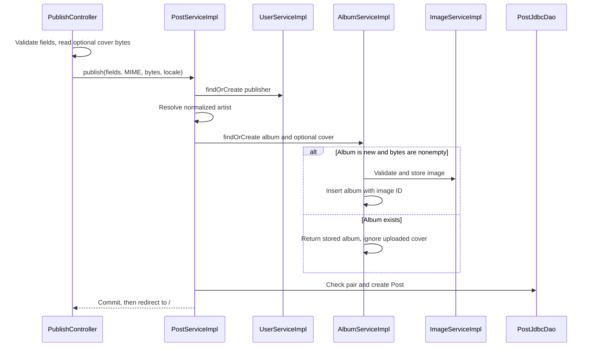

# Publish flow

GET /publish displays five ordinary fields and an optional cover. POST /publish uses multipart/form-data. [[PublishForm]] holds MultipartFile; [[PublishController]] converts it to content type and byte[] before crossing the service boundary.



User, Artist, Image, Album and Post writes participate in one transaction. A new user requests welcome mail before that transaction commits. Database rollback cannot undo an already sent email.

| Condition | Result |
|---|---|
| Field validation or year conversion fails | Same form with field errors; service is not called |
| Missing/empty cover | New album uses null coverImageId and placeholder |
| Existing album | Stored album and cover reused; incoming cover discarded without ImageService validation |
| Unsupported MIME or nonempty image over 5 MiB for a new album | InvalidImageException, rollback, localized cover error |
| Whole multipart request exceeds 6 MiB | MaxUploadSizeExceededException handler returns a new empty form and coverTooLarge flag |
| Duplicate publisher/album | DuplicatePostException mapped to publisherEmail |
| Other publish data-integrity failure | ConcurrentPublishException mapped to publisherEmail |
| Success | Commit then redirect to /; no publish success flash |

The resolver is lazy so the selected controller can handle upload-size exceptions. A file greater than 5 MiB may pass the 6 MiB transport limit and receive a field error from ImageService. That field validation is skipped for existing albums. IOException while reading bytes has no dedicated handler here. Browser file controls must be selected again when retrying; a redisplayed form does not restore the upload selection.

A ghost button labeled publish.back returns to / without submitting. See [[Views and assets]] for the exact JSP and [[Cover image flow]] for image retrieval.

## Business operation

[services/src/main/java/ar/edu/itba/paw/services/PostServiceImpl.java, lines 1–90](<file:///Users/bautistapessagno/Desktop/ITBA/PAW/paw2026b/services/src/main/java/ar/edu/itba/paw/services/PostServiceImpl.java>)

```java
package ar.edu.itba.paw.services;

import ar.edu.itba.paw.models.Album;
import ar.edu.itba.paw.models.Artist;
import ar.edu.itba.paw.models.Post;
import ar.edu.itba.paw.models.PostSummary;
import ar.edu.itba.paw.models.User;
import ar.edu.itba.paw.persistence.DuplicatePostKeyException;
import org.springframework.dao.DataIntegrityViolationException;
import ar.edu.itba.paw.persistence.PostDao;
import org.springframework.beans.factory.annotation.Autowired;
import org.springframework.stereotype.Service;
import org.springframework.transaction.annotation.Transactional;

import java.util.List;
import java.util.Locale;
import java.util.Optional;

@Service
public class PostServiceImpl implements PostService {

    private static final int FEATURED_LIMIT = 8;

    private final PostDao postDao;
    private final UserService userService;
    private final ArtistService artistService;
    private final AlbumService albumService;
    private final EmailService emailService;

    @Autowired
    public PostServiceImpl(final PostDao postDao, final UserService userService,
                           final ArtistService artistService, final AlbumService albumService,
                           final EmailService emailService) {
        this.postDao = postDao;
        this.userService = userService;
        this.artistService = artistService;
        this.albumService = albumService;
        this.emailService = emailService;
    }

    @Override
    @Transactional(readOnly = true)
    public List<PostSummary> getFeatured() {
        return postDao.findFeatured(FEATURED_LIMIT);
    }

    @Override
    @Transactional(readOnly = true)
    public Optional<PostSummary> findById(final long postId) {
        return postDao.findById(postId);
    }

    @Override
    @Transactional
    public Post publish(final String username, final String publisherEmail, final String title,
                        final String artistName, final int releaseYear, final String coverContentType,
                        final byte[] coverData, final Locale locale) {
        try {
            final User publisher = userService.findOrCreate(username, publisherEmail, locale);
            final Artist artist = artistService.findOrCreate(artistName);
            final Album album = albumService.findOrCreate(title, artist.getId(), releaseYear,
                    coverContentType, coverData);
            if (postDao.existsByUserIdAndAlbumId(publisher.getId(), album.getId())) {
                throw new DuplicatePostException();
            }
            return postDao.create(publisher.getId(), album.getId());
        } catch (final DuplicatePostKeyException e) {
            throw new DuplicatePostException();
        } catch (final DataIntegrityViolationException e) {
            // Otra publicacion simultanea creo el mismo artista, album o usuario.
            // PostgreSQL ya aborto esta transaccion, asi que no se puede releer desde
            // aca: solo traducimos. Su transaccion ya commiteo, asi que reintentar anda.
            throw new ConcurrentPublishException();
        }
    }

    // Sin @Transactional a proposito: solo lee el post y delega el envio, que ademas es @Async.
    // No hay razon para abrir una transaccion para una sola lectura.
    @Override
    public void notifyInterest(final long postId, final String contactName, final String contactEmail,
                               final Locale locale) {
        final PostSummary post = postDao.findById(postId).orElseThrow(PostNotFoundException::new);
        final PostInterestNotification notification = new PostInterestNotification(
                post.getId(), post.getPublisherEmail(), contactName.trim(),
                contactEmail.trim().toLowerCase(Locale.ROOT), post.getTitle(), post.getArtistName(),
                post.getReleaseYear());

        emailService.sendPostInterestEmail(notification, locale);
    }
}
```

[[Transactions and concurrency]] · [[Validation and errors]]
