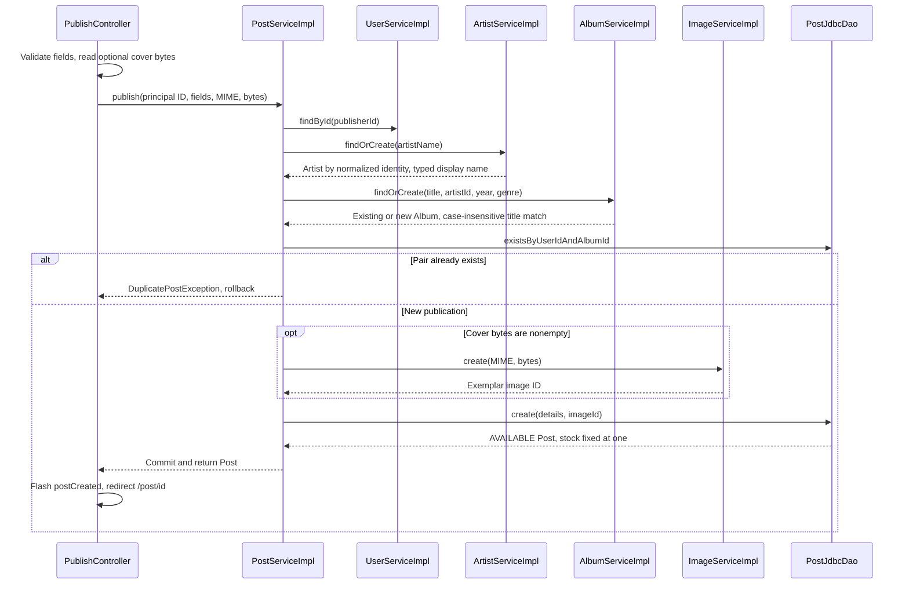

# Publish flow

GET /publish requires a session and renders the album and exemplar form next to a live card preview. Publisher identity comes from [[AuthenticatedUser]], not from posted fields. The form now requires title, artist, release year, genre, price and condition. Pressing year, zone, description and photo are optional; stock is absent. The same view and [[PublishForm]] also serve the owner's edit form, traced in [[Edit and delete flow]].

## Flow diagram

The sequence follows the controller, service and DAO calls at `f12af08`. Error handling and transaction limits are explained below; this is a source trace, not a runtime test.



## Behavior and limits

POST /publish passes multipart parsing and CSRF validation before MVC validation. The controller passes the principal ID and form data into one transaction in [[PostServiceImpl]]. The service loads the account and resolves the artist through [[ArtistServiceImpl]], whose identity ignores case, spaces and punctuation while the stored name keeps the typed form. [[AlbumServiceImpl]] then matches title, artist and year case-insensitively, keeping the first stored title casing and genre. The service checks the user/album uniqueness rule, optionally stores a new Image, then inserts an AVAILABLE Post with stock=1.

[[ArtistJdbcDao]] creates a missing artist inside a savepoint. If a concurrent request inserts the same normalized name first, it rolls back to the savepoint and rereads that row, so the outer transaction can continue. An album race still surfaces as DataIntegrityViolationException, which the service reports as ConcurrentPublishException.

DuplicatePostException and ConcurrentPublishException become global form errors. InvalidImageException becomes a cover field error. The controller rebuilds enum options on redisplay. Success now redirects to the new public detail page with a postCreated notice. Validation preserves ordinary values, but a browser file input must be reselected. An oversized multipart request redirects to /publish?coverTooLarge and loses submitted values.

The artist field uses the autocomplete from [[Search suggestions flow]] against /artists/suggestions. publish-preview.js mirrors title, artist, price and a selected image into the preview card without uploading anything. The genre select is enhanced into a custom listbox picker; the condition is a required segmented control whose errors are rendered through spring:bind.

The uniqueness check includes sold publications, so the same account cannot publish another exemplar of the same album through this flow. Publishing does not create an account or send mail. [[Authentication flow]] owns registration and welcome dispatch.

[[Cover image flow]] · [[Validation and errors]] · [[Transactions and concurrency]]

## Code snippets

### One publishing transaction

The order matters: artist and album resolution precede the duplicate check, and image creation comes last before the insert. See [[PostServiceImpl]] for the complete class.

[services/src/main/java/ar/edu/itba/paw/services/PostServiceImpl.java, lines 147–172](<file:///Users/bautistapessagno/Desktop/ITBA/PAW/paw2026b/services/src/main/java/ar/edu/itba/paw/services/PostServiceImpl.java>)

```java
    @Override
    @Transactional
    public Post publish(final long publisherId, final String title, final String artistName,
                        final int releaseYear, final Genre genre, final int price,
                        final String description, final Condition condition, final Integer pressingYear,
                        final String zone, final String coverContentType, final byte[] coverData) {
        try {
            final User publisher = userService.findById(publisherId).orElseThrow(UserNotFoundException::new);
            final Artist artist = artistService.findOrCreate(artistName);
            final Album album = albumService.findOrCreate(title, artist.getId(), releaseYear, genre);
            if (postDao.existsByUserIdAndAlbumId(publisher.getId(), album.getId())) {
                throw new DuplicatePostException();
            }
            final Long imageId = coverData == null || coverData.length == 0
                    ? null : imageService.create(coverContentType, coverData).getId();
            return postDao.create(publisher.getId(), album.getId(), price, blankToNull(description), condition,
                    pressingYear, blankToNull(zone), imageId);
        } catch (final DuplicatePostKeyException e) {
            throw new DuplicatePostException();
        } catch (final DataIntegrityViolationException e) {
            // Otra publicacion simultanea creo el mismo artista o album.
            // PostgreSQL ya aborto esta transaccion, asi que no se puede releer desde
            // aca: solo traducimos. Su transaccion ya commiteo, asi que reintentar anda.
            throw new ConcurrentPublishException();
        }
    }
```

### Artist identity and display name

The identity keeps only lowercase letters and digits, so separators and case do not create duplicate artists. The display name keeps the typed form. See [[ArtistServiceImpl]] for the complete class.

[services/src/main/java/ar/edu/itba/paw/services/ArtistServiceImpl.java, lines 57–63](<file:///Users/bautistapessagno/Desktop/ITBA/PAW/paw2026b/services/src/main/java/ar/edu/itba/paw/services/ArtistServiceImpl.java>)

```java
    private static String normalizeForIdentity(final String name) {
        final StringBuilder normalized = new StringBuilder();
        name.toLowerCase(Locale.ROOT).codePoints()
                .filter(Character::isLetterOrDigit)
                .forEach(normalized::appendCodePoint);
        return normalized.toString();
    }
```

### Race-safe artist creation

The savepoint lets PostgreSQL continue after a unique violation, so the losing request reuses the winning row. See [[ArtistJdbcDao]] for the complete class.

[persistence/src/main/java/ar/edu/itba/paw/persistence/ArtistJdbcDao.java, lines 72–95](<file:///Users/bautistapessagno/Desktop/ITBA/PAW/paw2026b/persistence/src/main/java/ar/edu/itba/paw/persistence/ArtistJdbcDao.java>)

```java
    @Override
    public Artist findOrCreate(final String displayName, final String normalizedName) {
        final Optional<Artist> existing = findByNormalizedName(normalizedName);
        if (existing.isPresent()) {
            return existing.get();
        }
        return jdbcTemplate.execute((ConnectionCallback<Artist>) connection -> {
            // PostgreSQL deja la transaccion inutilizable despues de una violacion
            // de unicidad. El savepoint permite releer la fila que gano la carrera.
            final Savepoint savepoint = connection.getAutoCommit() ? null : connection.setSavepoint();
            try {
                return create(displayName, normalizedName);
            } catch (final DuplicateKeyException e) {
                if (savepoint != null) {
                    connection.rollback(savepoint);
                }
                return findByNormalizedName(normalizedName).orElseThrow(() -> e);
            } finally {
                if (savepoint != null) {
                    connection.releaseSavepoint(savepoint);
                }
            }
        });
    }
```

### Controller success path

The redirect now lands on the new publication with a flash notice. See [[PublishController]] for the complete class.

[webapp/src/main/java/ar/edu/itba/paw/webapp/controller/PublishController.java, lines 67–96](<file:///Users/bautistapessagno/Desktop/ITBA/PAW/paw2026b/webapp/src/main/java/ar/edu/itba/paw/webapp/controller/PublishController.java>)

```java
    @RequestMapping(value = "/publish", method = RequestMethod.POST)
    public ModelAndView publish(@AuthenticationPrincipal final AuthenticatedUser currentUser,
                                @Valid @ModelAttribute("publishForm") final PublishForm form,
                                final BindingResult bindingResult,
                                final RedirectAttributes redirectAttributes) throws IOException {
        if (bindingResult.hasErrors()) {
            return publishForm(form, null);
        }

        final MultipartFile cover = form.getCover();
        final String coverContentType = cover == null ? null : cover.getContentType();
        final byte[] coverData = cover == null ? null : cover.getBytes();
        try {
            final Post post = postService.publish(currentUser.getId(), form.getTitle(), form.getArtistName(),
                    form.getReleaseYear(), form.getGenre(), form.getPrice(),
                    form.getDescription(), form.getCondition(), form.getPressingYear(), form.getZone(),
                    coverContentType, coverData);
            redirectAttributes.addFlashAttribute("postCreated", true);
            return new ModelAndView("redirect:/post/" + post.getId());
        } catch (final InvalidImageException e) {
            bindingResult.rejectValue("cover", "publish.cover.invalid");
            return publishForm(form, null);
        } catch (final DuplicatePostException e) {
            bindingResult.reject("publish.duplicate");
            return publishForm(form, null);
        } catch (final ConcurrentPublishException e) {
            bindingResult.reject("publish.concurrent");
            return publishForm(form, null);
        }
    }
```

## Evidencia local anterior, 2026-09-17

[[Audit local 2026-09-17]] ejecutó la rama `e5e926d`, anterior a `f12af08`. Sus resultados de ejecución no se repitieron para esta revisión; [[Known gaps and document drift]] indica qué hallazgos del audit quedaron resueltos en el código actual y cuáles siguen abiertos.
