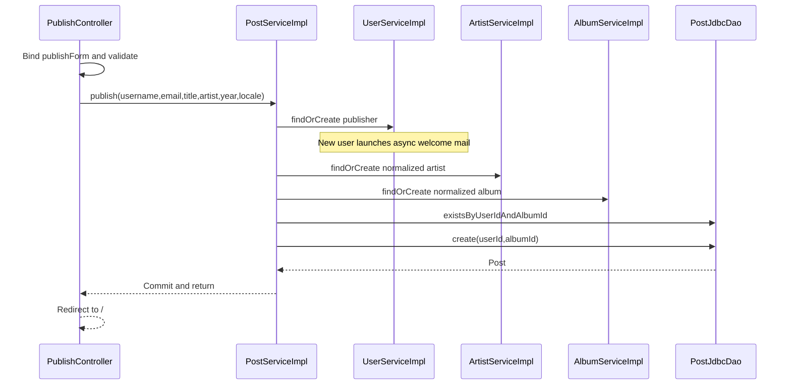

# Publish flow

Publishing begins at GET `/publish` and writes through one service transaction on POST `/publish`.



## Data and ownership at each step

| Step | Input | Output or side effect |
|---|---|---|
| [[PublishForm]] binding | Five submitted fields | Validated username, email, title, artist name, Integer year |
| [[PublishController]] | Valid form + request Locale | Calls [[PostService]] or redisplays field errors |
| [[UserServiceImpl]] | Username + normalized email | Existing User, or inserted User and asynchronous welcome invocation |
| [[ArtistServiceImpl]] | Trimmed lowercase name | Existing or inserted Artist |
| [[AlbumServiceImpl]] | Artist ID, trimmed lowercase title, year | Existing or inserted Album with default cover for new rows |
| [[PostJdbcDao]] | User ID, Album ID | Duplicate detection and generated Post ID |
| Controller result | Returned Post | Redirect to landing; returned ID is not used to navigate to detail |

The JDBC implementations do SELECT then INSERT rather than an atomic upsert. All participating service writes join publish's transaction under default REQUIRED propagation. A runtime exception leaving the proxied publish call causes database rollback. Welcome email is a separate asynchronous effect and is not coordinated with commit.

## Branches

| Condition | Observable result |
|---|---|
| Invalid form or year conversion | Same form view with field errors; publish is not called |
| Existing email | Reuse User; ignore submitted replacement username; no new welcome mail |
| Existing artist/album | Reuse IDs and preserve the stored album cover |
| Pair already exists | DuplicatePostException → publisherEmail field error `publish.duplicate` |
| Post insert loses uniqueness race | DuplicatePostKeyException → same duplicate business error |
| Other DataIntegrityViolationException inside publish | ConcurrentPublishException → `publish.concurrent`; user can resubmit |
| Success | Commit database changes and redirect to `/` |

There is no success flash for publishing. The welcome mail does not contain a post confirmation. No price, uploaded image, inventory record or authenticated owner is involved.

## Business operation

[services/src/main/java/ar/edu/itba/paw/services/PostServiceImpl.java, lines 53–73](<file:///Users/bautistapessagno/Desktop/ITBA/PAW/paw2026b/services/src/main/java/ar/edu/itba/paw/services/PostServiceImpl.java>)

```java
    @Override
    @Transactional
    public Post publish(final String username, final String publisherEmail, final String title,
                        final String artistName, final int releaseYear, final Locale locale) {
        try {
            final User publisher = userService.findOrCreate(username, publisherEmail, locale);
            final Artist artist = artistService.findOrCreate(artistName);
            final Album album = albumService.findOrCreate(title, artist.getId(), releaseYear);
            if (postDao.existsByUserIdAndAlbumId(publisher.getId(), album.getId())) {
                throw new DuplicatePostException();
            }
            return postDao.create(publisher.getId(), album.getId());
        } catch (final DuplicatePostKeyException e) {
            throw new DuplicatePostException();
        } catch (final DataIntegrityViolationException e) {
            // Otra publicacion simultanea creo el mismo artista, album o usuario.
            // PostgreSQL ya aborto esta transaccion, asi que no se puede releer desde
            // aca: solo traducimos. Su transaccion ya commiteo, asi que reintentar anda.
            throw new ConcurrentPublishException();
        }
    }
```

[[Transactions and concurrency]] · [[Validation and errors]] · [[UserServiceImplTest]] · [[PostServiceImplTest]]

## UI integration at the current commit

The JSP retains form:form with modelAttribute=publishForm. ui:text-input receives relative paths for its five fields and renders all binding errors. A ghost button labeled by publish.back returns to / without submitting. The controller, service transaction and redirect behavior are unchanged. Exact JSP and tag excerpts are in [[Views and assets]] and [[UI components]].
