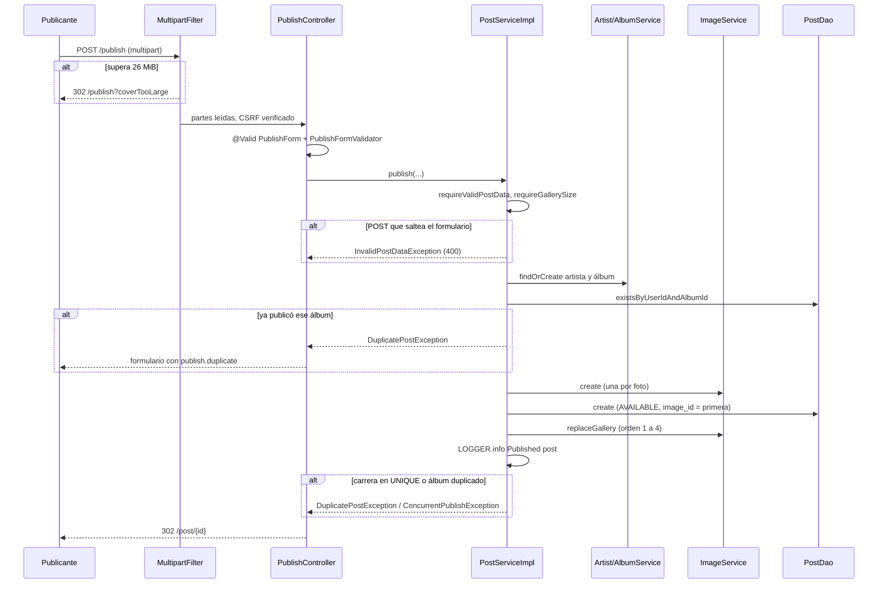

# Publish flow

> [!summary] En una frase
> Publicar es elegir o crear el artista y el álbum del catálogo compartido, guardar hasta cinco fotos y crear un Post propio con precio y estado; todo en una transacción y con un Post por álbum y por publicante.

## Qué resuelve

`GET` y `POST /publish`. Editar y eliminar están en [[Edit and delete flow]]; las fotos, en [[Gallery flow]] y [[Cover image flow]].

## Herramientas

| Herramienta | Para qué se usa acá |
|---|---|
| Spring MVC multipart (Commons FileUpload) | Formulario con archivos |
| Bean Validation + [[PublishFormValidator]] | Reglas de campo y reglas cruzadas (año de prensado no anterior al de lanzamiento) |
| [[VinylInputRules]] e [[ImageRules]] (en `models`) | Límites compartidos por formulario, vista, catálogo y service |
| Autocompletado de artista | `/artists/suggestions` en JSON ([[Search suggestions flow]]) |
| `publish-preview.js` | Vista previa de la tarjeta mientras se escribe |
| `@Transactional` | Artista, álbum, imágenes, post y galería juntos |
| Restricciones `UNIQUE` | Identidad de artista, de álbum y un Post por publicante y álbum |
| `Savepoint` JDBC | Recuperarse de una carrera al crear un artista sin perder la transacción |
| [[SearchText]] | Columna `search_phrase` para búsqueda sin tildes |

## Recorrido paso a paso

1. `GET /publish` exige `VERIFIED`. La vista recibe géneros, condiciones y los límites de año, precio y tipos de imagen.
2. `POST /publish` llega como multipart. `MultipartFilter` lo parsea antes de la seguridad para que el token CSRF sea legible. Si el request supera 26 MiB, [[MultipartExceptionHandlerFilter]] redirige a `/publish?coverTooLarge`.
3. Validación de [[PublishForm]]:
   - Título y artista obligatorios, hasta 255. Año de lanzamiento, género, precio y condición obligatorios. Zona hasta 100, descripción hasta 1000.
   - [[PublishFormValidator]]: años entre 1000 y 9999 y no futuros; precio entre 1 y 99.999.999; prensado no anterior al lanzamiento; hasta 5 fotos, cada una válida según [[ImageRules]].
4. `PostServiceImpl.publish`, en una transacción:
   - Repite las reglas numéricas (`requireValidPostData`) y el tope de fotos: un POST que saltee el formulario no entra. La regla numérica rota es `InvalidPostDataException`, que desde el PR #62 se responde con 400 en lugar de un 500.
   - `artistService.findOrCreate`: identidad = el nombre en minúsculas solo con letras y dígitos. "Soda Stereo" y "soda-stereo" son el mismo artista.
   - `albumService.findOrCreate`: identidad = artista, título en minúsculas y año.
   - Si el publicante ya tiene un Post de ese álbum, `DuplicatePostException`.
   - Crea las imágenes (cada una se valida de nuevo en `ImageService.create`).
   - Crea el Post con la primera foto como principal (`posts.image_id`) y estado `AVAILABLE`.
   - Si hay más fotos, `replaceGallery` las guarda en `post_images` con orden 1 a 4.
   - Loguea `Published post postId=... publisherId=... albumId=... images=...` (PR #62). El log sale antes del commit ([[Logging]]).
5. Errores traducidos:
   - `DuplicatePostKeyException` (la restricción `UNIQUE (user_id, album_id)` detectó una carrera) → `DuplicatePostException` → error global `publish.duplicate`.
   - Otra `DataIntegrityViolationException` (dos publicaciones simultáneas crearon el mismo álbum) → `ConcurrentPublishException` → `publish.concurrent`, que invita a reintentar.
6. Éxito: aviso flash `postCreated` y redirección a la ficha `/post/{id}`.


```mermaid
sequenceDiagram
    participant V as Publicante
    participant F as MultipartFilter
    participant C as PublishController
    participant S as PostServiceImpl
    participant A as Artist/AlbumService
    participant I as ImageService
    participant P as PostDao
    V->>F: POST /publish (multipart)
    alt supera 26 MiB
        F-->>V: 302 /publish?coverTooLarge
    end
    F->>C: partes leídas, CSRF verificado
    C->>C: @Valid PublishForm + PublishFormValidator
    C->>S: publish(...)
    S->>S: requireValidPostData, requireGallerySize
    alt POST que saltea el formulario
        S-->>C: InvalidPostDataException (400)
    end
    S->>A: findOrCreate artista y álbum
    S->>P: existsByUserIdAndAlbumId
    alt ya publicó ese álbum
        S-->>C: DuplicatePostException
        C-->>V: formulario con publish.duplicate
    end
    S->>I: create (una por foto)
    S->>P: create (AVAILABLE, image_id = primera)
    S->>I: replaceGallery (orden 1 a 4)
    S->>S: LOGGER.info Published post
    alt carrera en UNIQUE o álbum duplicado
        S-->>C: DuplicatePostException / ConcurrentPublishException
    end
    C-->>V: 302 /post/{id}
```

## Datos

| Tabla | Qué se escribe | Unicidad |
|---|---|---|
| `artists` | `name`, `normalized_name`, `search_phrase` | `normalized_name` |
| `albums` | `title`, `normalized_title`, `artist_id`, `release_year`, `genre`, `search_phrase` | `(artist_id, normalized_title, release_year)` (V4) |
| `images` | `content_type`, `data` | — |
| `posts` | Publicante, álbum, precio, descripción, condición, prensado, zona, `image_id`, `status` | `(user_id, album_id)` |
| `post_images` | Fotos adicionales con `display_order` | `(post_id, display_order)`, `image_id` |

## Decisiones y por qué

| Decisión | Alternativa | Motivo | Fuente |
|---|---|---|---|
| Catálogo propio de artistas y álbumes | Consumir un catálogo externo | La aplicación se despliega sola y PostgreSQL es la fuente de verdad | ADR 0002 |
| Artista como entidad con identidad normalizada | Texto libre en cada Post | Reutilizar entre publicaciones y poder filtrar y sugerir | Issue `publicacion-albumes/01` |
| Un Post por publicante y álbum | Varios | Regla del glosario: "un mismo publicante no puede duplicarlo" | `CONTEXT.md` |
| Las fotos son del Post, no del álbum | Portada compartida en el álbum | "El álbum conserva solo datos factuales compartidos; las fotos del ejemplar pertenecen a la publicación" | Comentario en [[AlbumServiceImpl]] |
| Savepoint al crear el artista | Dejar fallar | PostgreSQL deja la transacción inutilizable tras una violación de unicidad; el savepoint permite releer al ganador | Comentario en [[ArtistJdbcDao]] |
| Sin savepoint para el álbum: se traduce a "reintentá" | Repetir el patrón | La transacción del otro ya hizo commit, así que reintentar funciona | Comentario en [[PostServiceImpl]] |
| Reglas en `models`, usadas en formulario y service | Solo en el formulario | Un POST armado a mano no puede saltearlas | Comentario en [[VinylInputRules]] |
| `created_at` lo pone la base | Enviarlo desde Java | "El `DEFAULT` de la base es el único reloj de publicación" | Comentario en [[PostJdbcDao]] |
| Título normalizado como columna | Índice sobre `LOWER(title)` | HSQLDB, que usan los tests, no admite índices sobre expresiones | Migración V4 |
| Listas de los `<select>` en la vista y no como `@ModelAttribute` de clase | Declararlas una vez | El redirect posterior arrastraría el modelo como query string | Comentario en [[PublishController]] |

## Concurrencia y casos borde

- Dos publicaciones simultáneas del mismo artista nuevo: una inserta; la otra recibe la violación, vuelve al savepoint y relee.
- Dos publicaciones simultáneas del mismo álbum nuevo: una recibe "reintentá"; al reintentar encuentra el álbum.
- Doble clic en "Publicar": la segunda choca contra `UNIQUE (user_id, album_id)` y ve "ya publicaste este álbum".
- Sin fotos: el Post queda sin imagen propia y la ficha usa la portada heredada del álbum si existe, o el placeholder.

## Límites conocidos

- La unicidad por publicante y álbum incluye los Posts vendidos: no se puede publicar un segundo ejemplar del mismo álbum.
- `stock` existe en la tabla y siempre vale 1.
- Las imágenes se guardan en la base como `BYTEA`, sin redimensionar.
- [[PostServiceImplTest]] y [[PostJdbcDaoTest]] cubren reglas y SQL; la ruta del savepoint contra PostgreSQL no tiene test automático.

## Preguntas de defensa

**¿Qué pasa si dos personas publican a la vez el mismo artista nuevo?**
La segunda recibe la violación de unicidad dentro de un savepoint, vuelve atrás solo hasta ahí y relee el artista que creó la primera.

**¿Por qué la validación está en el formulario y también en el service?**
El formulario da el error junto al campo. El service es la garantía: no asume que quien lo llama validó.

**¿Cómo deciden si dos artistas son el mismo?**
Por el nombre normalizado: minúsculas y solo letras y dígitos. El nombre que se muestra conserva lo que escribió quien lo cargó.

**¿Dónde quedan las fotos?**
En la tabla `images`. La primera va referenciada desde el Post; las demás, desde `post_images` con su orden.

## Evidencia de código

Controller:

Fuente exacta en `c3e2a4c`: [webapp/src/main/java/ar/edu/itba/paw/webapp/controller/PublishController.java](</Users/bautistapessagno/Desktop/proyectos_itba/PAW/paw2026b/webapp/src/main/java/ar/edu/itba/paw/webapp/controller/PublishController.java>), líneas 76–100.

```java
    // Las fotos ya llegan validadas por PublishFormValidator.
    @RequestMapping(value = "/publish", method = RequestMethod.POST)
    public ModelAndView publish(@AuthenticationPrincipal final AuthenticatedUser currentUser,
                                @Valid @ModelAttribute("publishForm") final PublishForm form,
                                final BindingResult bindingResult,
                                final RedirectAttributes redirectAttributes) throws IOException {
        if (bindingResult.hasErrors()) {
            return publishForm(form, null);
        }

        try {
            final Post post = postService.publish(currentUser.getId(), form.getTitle(), form.getArtistName(),
                    form.getReleaseYear(), form.getGenre(), form.getPrice(),
                    form.getDescription(), form.getCondition(), form.getPressingYear(), form.getZone(),
                    form.toImageUploads());
            redirectAttributes.addFlashAttribute("postCreated", true);
            return new ModelAndView("redirect:/post/" + post.getId());
        } catch (final DuplicatePostException e) {
            bindingResult.reject("publish.duplicate");
            return publishForm(form, null);
        } catch (final ConcurrentPublishException e) {
            bindingResult.reject("publish.concurrent");
            return publishForm(form, null);
        }
    }
```

Service:

Fuente exacta en `c3e2a4c`: [services/src/main/java/ar/edu/itba/paw/services/PostServiceImpl.java](</Users/bautistapessagno/Desktop/proyectos_itba/PAW/paw2026b/services/src/main/java/ar/edu/itba/paw/services/PostServiceImpl.java>), líneas 248–281.

```java
    @Override
    @Transactional
    public Post publish(final long publisherId, final String title, final String artistName,
                        final int releaseYear, final Genre genre, final int price,
                        final String description, final Condition condition, final Integer pressingYear,
                        final String zone, final List<ImageUpload> images) {
        requireValidPostData(releaseYear, price, pressingYear);
        requireGallerySize(images == null ? 0 : images.size());
        try {
            final User publisher = userService.findById(publisherId).orElseThrow(UserNotFoundException::new);
            final Artist artist = artistService.findOrCreate(artistName);
            final Album album = albumService.findOrCreate(title, artist.getId(), releaseYear, genre);
            if (postDao.existsByUserIdAndAlbumId(publisher.getId(), album.getId())) {
                throw new DuplicatePostException();
            }
            final List<Long> imageIds = createImages(images);
            final Long imageId = imageIds.isEmpty() ? null : imageIds.get(0);
            final Post post = postDao.create(publisher.getId(), album.getId(), price, blankToNull(description), condition,
                    pressingYear, blankToNull(zone), imageId);
            if (imageIds.size() > 1) {
                imageService.replaceGallery(post.getId(), extrasOf(imageIds));
            }
            LOGGER.info("Published post postId={} publisherId={} albumId={} images={}",
                    post.getId(), publisher.getId(), album.getId(), imageIds.size());
            return post;
        } catch (final DuplicatePostKeyException e) {
            throw new DuplicatePostException();
        } catch (final DataIntegrityViolationException e) {
            // Otra publicacion simultanea creo el mismo artista o album.
            // PostgreSQL ya aborto esta transaccion, asi que no se puede releer desde
            // aca: solo traducimos. Su transaccion ya commiteo, asi que reintentar anda.
            throw new ConcurrentPublishException();
        }
    }
```

Reglas repetidas en el service:

Fuente exacta en `c3e2a4c`: [services/src/main/java/ar/edu/itba/paw/services/PostServiceImpl.java](</Users/bautistapessagno/Desktop/proyectos_itba/PAW/paw2026b/services/src/main/java/ar/edu/itba/paw/services/PostServiceImpl.java>), líneas 364–402.

```java
    // La primera foto es la principal y va en el post; el resto es la galeria.
    private static List<Long> extrasOf(final List<Long> imageIds) {
        return imageIds.isEmpty() ? List.of() : imageIds.subList(1, imageIds.size());
    }

    private static void requireGallerySize(final int size) {
        if (size > ImageRules.MAX_GALLERY_IMAGES) {
            throw new InvalidImageException();
        }
    }

    private PostSummary requireEditable(final PostSummary post, final long actorId) {
        if (post.getUserId() != actorId && userService.findById(actorId)
                .filter(user -> user.getRole() == UserRole.ADMIN).isEmpty()) {
            throw new ForbiddenOperationException();
        }
        return requireAvailable(post);
    }

    private static PostSummary requireAvailable(final PostSummary post) {
        if (post.getStatus() != PostStatus.AVAILABLE) {
            throw new PostUnavailableException();
        }
        return post;
    }

    private static void requireValidPostData(final int releaseYear, final int price,
                                             final Integer pressingYear) {
        final boolean invalidReleaseYear = VinylInputRules.classifyYear(releaseYear)
                != VinylInputRules.YearValidity.VALID;
        final boolean invalidPrice = VinylInputRules.classifyPrice(price)
                != VinylInputRules.PriceValidity.VALID;
        final boolean invalidPressingYear = pressingYear != null
                && VinylInputRules.classifyYear(pressingYear) != VinylInputRules.YearValidity.VALID;
        if (invalidReleaseYear || invalidPrice || invalidPressingYear
                || !VinylInputRules.isPressingYearOrdered(releaseYear, pressingYear)) {
            throw new InvalidPostDataException();
        }
    }
```

Savepoint del artista:

Fuente exacta en `c3e2a4c`: [persistence/src/main/java/ar/edu/itba/paw/persistence/ArtistJdbcDao.java](</Users/bautistapessagno/Desktop/proyectos_itba/PAW/paw2026b/persistence/src/main/java/ar/edu/itba/paw/persistence/ArtistJdbcDao.java>), líneas 72–95.

```java
    @Override
    public Artist findOrCreate(final String displayName, final String normalizedName) {
        final Optional<Artist> existing = findByNormalizedName(normalizedName);
        if (existing.isPresent()) {
            return existing.get();
        }
        return jdbcTemplate.execute((ConnectionCallback<Artist>) connection -> {
            // PostgreSQL deja la transaccion inutilizable despues de una violacion
            // de unicidad. El savepoint permite releer la fila que gano la carrera.
            final Savepoint savepoint = connection.getAutoCommit() ? null : connection.setSavepoint();
            try {
                return create(displayName, normalizedName);
            } catch (final DuplicateKeyException e) {
                if (savepoint != null) {
                    connection.rollback(savepoint);
                }
                return findByNormalizedName(normalizedName).orElseThrow(() -> e);
            } finally {
                if (savepoint != null) {
                    connection.releaseSavepoint(savepoint);
                }
            }
        });
    }
```

Identidad del artista:

Fuente exacta en `c3e2a4c`: [services/src/main/java/ar/edu/itba/paw/services/ArtistServiceImpl.java](</Users/bautistapessagno/Desktop/proyectos_itba/PAW/paw2026b/services/src/main/java/ar/edu/itba/paw/services/ArtistServiceImpl.java>), líneas 26–31.

```java
    @Override
    @Transactional
    public Artist findOrCreate(final String name) {
        final String displayName = name.trim();
        return artistDao.findOrCreate(displayName, normalizeForIdentity(displayName));
    }
```

Fuente exacta en `c3e2a4c`: [services/src/main/java/ar/edu/itba/paw/services/ArtistServiceImpl.java](</Users/bautistapessagno/Desktop/proyectos_itba/PAW/paw2026b/services/src/main/java/ar/edu/itba/paw/services/ArtistServiceImpl.java>), líneas 57–63.

```java
    private static String normalizeForIdentity(final String name) {
        final StringBuilder normalized = new StringBuilder();
        name.toLowerCase(Locale.ROOT).codePoints()
                .filter(Character::isLetterOrDigit)
                .forEach(normalized::appendCodePoint);
        return normalized.toString();
    }
```

Validador del formulario:

Fuente exacta en `c3e2a4c`: [webapp/src/main/java/ar/edu/itba/paw/webapp/validation/PublishFormValidator.java](</Users/bautistapessagno/Desktop/proyectos_itba/PAW/paw2026b/webapp/src/main/java/ar/edu/itba/paw/webapp/validation/PublishFormValidator.java>), líneas 14–50.

```java
public class PublishFormValidator implements ConstraintValidator<ValidPublishForm, PublishForm> {

    @Override
    public boolean isValid(final PublishForm form, final ConstraintValidatorContext context) {
        if (form == null) {
            return true;
        }

        boolean valid = true;
        context.disableDefaultConstraintViolation();

        valid = validateYear(context, "releaseYear", form.getReleaseYear(),
                "{publish.releaseYear.future}") && valid;
        valid = validatePrice(context, form.getPrice()) && valid;
        final boolean pressingYearValid = validateYear(context, "pressingYear", form.getPressingYear(),
                "{publish.pressingYear.future}");
        valid = pressingYearValid && valid;

        if (pressingYearValid && form.getReleaseYear() != null
                && VinylInputRules.classifyYear(form.getReleaseYear()) == VinylInputRules.YearValidity.VALID
                && !VinylInputRules.isPressingYearOrdered(form.getReleaseYear(), form.getPressingYear())) {
            violation(context, "pressingYear", "{publish.pressingYear.order}");
            valid = false;
        }
        return validateCovers(context, form.getCovers()) && valid;
    }

    // Al editar, el tope cuenta tambien las fotos que se conservan: eso lo chequea PostService.
    private static boolean validateCovers(final ConstraintValidatorContext context, final MultipartFile[] covers) {
        final List<MultipartFile> chosen = covers == null ? List.of()
                : Arrays.stream(covers).filter(ImageFiles::isPresent).toList();
        if (chosen.size() > ImageRules.MAX_GALLERY_IMAGES || !chosen.stream().allMatch(ImageFiles::isValid)) {
            violation(context, "covers", "{publish.cover.invalid}");
            return false;
        }
        return true;
    }
```

## Archivos para seguir el flujo

- [webapp/src/main/java/ar/edu/itba/paw/webapp/controller/PublishController.java](</Users/bautistapessagno/Desktop/proyectos_itba/PAW/paw2026b/webapp/src/main/java/ar/edu/itba/paw/webapp/controller/PublishController.java>) · [[PublishController]]
- [webapp/src/main/java/ar/edu/itba/paw/webapp/form/PublishForm.java](</Users/bautistapessagno/Desktop/proyectos_itba/PAW/paw2026b/webapp/src/main/java/ar/edu/itba/paw/webapp/form/PublishForm.java>) · [[PublishForm]]
- [webapp/src/main/java/ar/edu/itba/paw/webapp/validation/PublishFormValidator.java](</Users/bautistapessagno/Desktop/proyectos_itba/PAW/paw2026b/webapp/src/main/java/ar/edu/itba/paw/webapp/validation/PublishFormValidator.java>) · [[PublishFormValidator]]
- [webapp/src/main/java/ar/edu/itba/paw/webapp/form/ImageFiles.java](</Users/bautistapessagno/Desktop/proyectos_itba/PAW/paw2026b/webapp/src/main/java/ar/edu/itba/paw/webapp/form/ImageFiles.java>) · [[ImageFiles]]
- [models/src/main/java/ar/edu/itba/paw/models/VinylInputRules.java](</Users/bautistapessagno/Desktop/proyectos_itba/PAW/paw2026b/models/src/main/java/ar/edu/itba/paw/models/VinylInputRules.java>) · [[VinylInputRules]]
- [models/src/main/java/ar/edu/itba/paw/models/ImageRules.java](</Users/bautistapessagno/Desktop/proyectos_itba/PAW/paw2026b/models/src/main/java/ar/edu/itba/paw/models/ImageRules.java>) · [[ImageRules]]
- [services/src/main/java/ar/edu/itba/paw/services/PostServiceImpl.java](</Users/bautistapessagno/Desktop/proyectos_itba/PAW/paw2026b/services/src/main/java/ar/edu/itba/paw/services/PostServiceImpl.java>) · [[PostServiceImpl]]
- [services/src/main/java/ar/edu/itba/paw/services/ArtistServiceImpl.java](</Users/bautistapessagno/Desktop/proyectos_itba/PAW/paw2026b/services/src/main/java/ar/edu/itba/paw/services/ArtistServiceImpl.java>) · [[ArtistServiceImpl]]
- [services/src/main/java/ar/edu/itba/paw/services/AlbumServiceImpl.java](</Users/bautistapessagno/Desktop/proyectos_itba/PAW/paw2026b/services/src/main/java/ar/edu/itba/paw/services/AlbumServiceImpl.java>) · [[AlbumServiceImpl]]
- [services/src/main/java/ar/edu/itba/paw/services/ImageServiceImpl.java](</Users/bautistapessagno/Desktop/proyectos_itba/PAW/paw2026b/services/src/main/java/ar/edu/itba/paw/services/ImageServiceImpl.java>) · [[ImageServiceImpl]]
- [persistence/src/main/java/ar/edu/itba/paw/persistence/ArtistJdbcDao.java](</Users/bautistapessagno/Desktop/proyectos_itba/PAW/paw2026b/persistence/src/main/java/ar/edu/itba/paw/persistence/ArtistJdbcDao.java>) · [[ArtistJdbcDao]]
- [persistence/src/main/java/ar/edu/itba/paw/persistence/AlbumJdbcDao.java](</Users/bautistapessagno/Desktop/proyectos_itba/PAW/paw2026b/persistence/src/main/java/ar/edu/itba/paw/persistence/AlbumJdbcDao.java>) · [[AlbumJdbcDao]]
- [persistence/src/main/java/ar/edu/itba/paw/persistence/PostJdbcDao.java](</Users/bautistapessagno/Desktop/proyectos_itba/PAW/paw2026b/persistence/src/main/java/ar/edu/itba/paw/persistence/PostJdbcDao.java>) · [[PostJdbcDao]]
- [webapp/src/main/webapp/WEB-INF/views/publish/index.jsp](</Users/bautistapessagno/Desktop/proyectos_itba/PAW/paw2026b/webapp/src/main/webapp/WEB-INF/views/publish/index.jsp>)
- [webapp/src/main/webapp/js/publish-preview.js](</Users/bautistapessagno/Desktop/proyectos_itba/PAW/paw2026b/webapp/src/main/webapp/js/publish-preview.js>)

Fuente inspeccionada: `c3e2a4c`, 2026-10-05. Es evidencia estática; no implica ejecución de la aplicación. [[Source inventory]] · [[Roadmap de lectura]]
