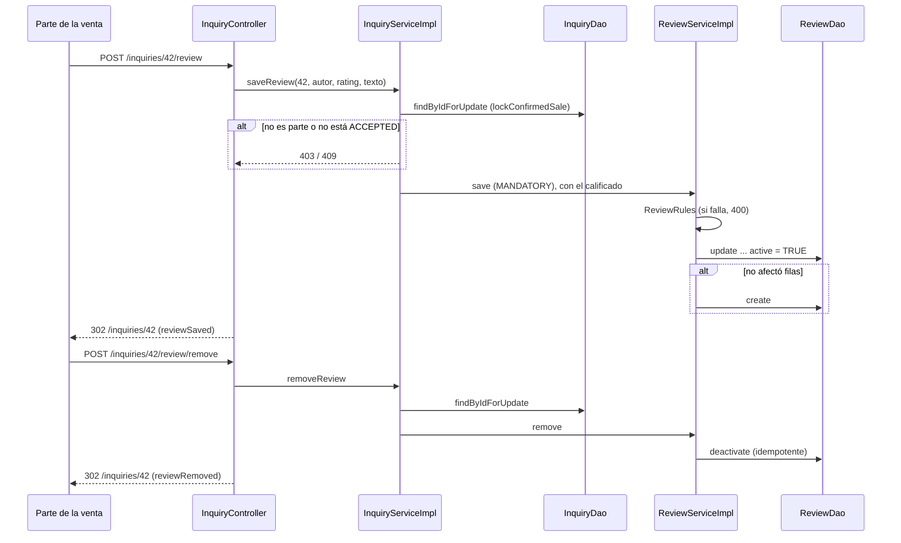

# Reviews flow

> [!summary] En una frase
> Después de una venta confirmada, comprador y publicante se califican entre sí de 1 a 5 con un comentario opcional; hay una reseña por persona y por venta, editable y removible, y el perfil público muestra el promedio y las reseñas separadas según si la persona era vendedora o compradora.

## Qué resuelve

Reputación entre Cuentas (PR #46). Se escribe desde la página de la venta y se lee en [[Public profile flow]]. El PR #57 separó la lectura por rol y la paginó; el #54 compactó el formulario en la página de la venta.

## Herramientas

| Herramienta | Para qué se usa acá |
|---|---|
| Bean Validation | [[ReviewForm]]: calificación obligatoria entre 1 y 5, comentario hasta 500 |
| [[ReviewRules]] (en `models`) | Las mismas reglas para formulario, vista y service |
| `@PreAuthorize("@inquiryAccess.isParty")` | Solo las partes de la consulta |
| `SELECT ... FOR UPDATE` sobre la consulta | Ordenar dos guardados o quitados de la misma parte |
| `Propagation.MANDATORY` | Que `ReviewService` no se pueda llamar fuera de la transacción de `InquiryService` |
| `UNIQUE (inquiry_id, author_id)` y dos `CHECK` | Una reseña por autor y venta, calificación válida, nadie se califica a sí mismo |
| Borrado lógico (`active`) | Quitar sin perder la fila |
| `AVG` y `COUNT` en SQL | Estadísticas del perfil público, por rol |
| `LIMIT ? OFFSET ?` y `Pagination` | Páginas de 10 reseñas |
| `<details>` de HTML | El formulario de la reseña se despliega sin JavaScript |

## Recorrido paso a paso

### Guardar: `POST /inquiries/{id}/review`

1. `VERIFIED`, `isParty` y CSRF.
2. El formulario vive dentro de un `<details>` que se abre con "Calificar" o "Editar". Con errores, la página se vuelve a dibujar con el `<details>` abierto y lo que se envió. "Cancelar" es un enlace a la propia venta: sin JavaScript recarga la página; con `sale-detail.js` resetea el formulario, cierra el `<details>` y devuelve el foco al botón.
3. `InquiryServiceImpl.saveReview` → `lockConfirmedSale`:
   - `findByIdForUpdate` bloquea la fila de la consulta.
   - Exige ser una de las partes (403) y que el estado sea `ACCEPTED`, es decir venta confirmada (409).
   - Devuelve a quién se califica: si el autor es el comprador, al publicante; si no, al comprador.
4. `ReviewServiceImpl.save` (propagación `MANDATORY`):
   - Normaliza el comentario y valida con [[ReviewRules]]; si no cumple, `InvalidReviewException` (400).
   - Primero intenta `UPDATE reviews SET rating, body, active = TRUE WHERE inquiry_id AND author_id`. Si afectó una fila, era una edición o una reseña quitada que vuelve.
   - Si no, inserta.
5. Redirección a la venta con el aviso `reviewSaved`.

### Quitar: `POST /inquiries/{id}/review/remove`

Mismo bloqueo y mismas reglas. `deactivate` es `UPDATE ... SET active = FALSE WHERE ... AND active = TRUE`: un segundo POST no encuentra nada y no es un error (idempotente).

### Leer

- En la venta: `findDetail` agrega la reseña vigente de quien mira para precargar el formulario.
- En el perfil público: `ReviewServiceImpl.findPageForUser(userId, role, page)` arma una [[ReviewPage]] para el rol pedido ([[ReviewSubjectRole]]):
  1. `statsBySubjectId(userId, role)`: cantidad y promedio de las activas **de ese rol**.
  2. `Pagination.pagesFor` con páginas de 10 y `offsetFor`, que da 404 si la página no existe.
  3. `findActiveBySubjectId(userId, role, 10, offset)`, las más nuevas primero, con el nombre y la foto del autor.
  4. Si se pidió una página mayor que 1 y volvió vacía (las reseñas cambiaron entre las dos lecturas), `PageNotFoundException`.
- El rol no se guarda en `reviews`: se deduce uniendo con la consulta. La persona calificada fue compradora si `i.buyer_id = r.subject_id`, y vendedora si `COALESCE(p.user_id, i.seller_id) = r.subject_id` (el `COALESCE` cubre ventas cuyo post se eliminó).



## Datos

Fuente exacta en `c3e2a4c`: [persistence/src/main/resources/db/migration/V10__sale_reviews.sql](</Users/bautistapessagno/Desktop/proyectos_itba/PAW/paw2026b/persistence/src/main/resources/db/migration/V10__sale_reviews.sql>), líneas 1–17.

```sql
CREATE TABLE reviews (
    id SERIAL PRIMARY KEY,
    inquiry_id INTEGER NOT NULL,
    author_id INTEGER NOT NULL,
    subject_id INTEGER NOT NULL,
    rating INTEGER NOT NULL,
    body VARCHAR(500),
    active BOOLEAN DEFAULT TRUE NOT NULL,
    created_at TIMESTAMP DEFAULT NOW() NOT NULL,
    CONSTRAINT reviews_inquiry_fk FOREIGN KEY (inquiry_id) REFERENCES inquiries(id),
    CONSTRAINT reviews_author_fk FOREIGN KEY (author_id) REFERENCES users(id),
    CONSTRAINT reviews_subject_fk FOREIGN KEY (subject_id) REFERENCES users(id),
    CONSTRAINT reviews_once_per_party_key UNIQUE (inquiry_id, author_id),
    CONSTRAINT reviews_rating_check CHECK (rating BETWEEN 1 AND 5),
    CONSTRAINT reviews_not_self_check CHECK (author_id <> subject_id)
);
CREATE INDEX reviews_subject_active_idx ON reviews (subject_id, active, created_at);
```

## Decisiones y por qué

| Decisión | Alternativa | Motivo | Fuente |
|---|---|---|---|
| Solo se califica una venta confirmada | Calificar cualquier consulta | La reseña habla de una transacción que ocurrió | Comentario en [[InquiryDetail]] |
| El punto de entrada es `InquiryService` | Exponer `ReviewService` al controller | La pertenencia y el estado son de la venta; `ReviewService` no valida permisos | Comentario en [[ReviewService]] |
| `MANDATORY` en `save` y `remove` | `REQUIRED` | Sin la transacción de afuera, el bloqueo de la consulta no protegería nada | Comentario en [[ReviewServiceImpl]] |
| Borrado lógico | `DELETE` | Una reseña quitada vuelve a ser la misma fila: el autor califica una sola vez por venta | Comentario en [[ReviewServiceImpl]] |
| Quitar es idempotente | Error si no había reseña | Un doble clic no tiene que fallar | Commit `896130f9`; comentario en [[InquiryServiceImpl]] |
| Actualizar primero, insertar después | Insertar y capturar la violación de unicidad | En PostgreSQL una violación deja la transacción inutilizable | Inferencia; mismo criterio que comenta [[ArtistJdbcDao]] |
| `CHECK (author_id <> subject_id)` | Solo validarlo en Java | La regla queda en el dato | Migración V10 |
| Promedio calculado en la consulta | Guardar un acumulado en `users` | Con el volumen actual alcanza, y no hay un dato duplicado que mantener | Inferencia |
| Reputación separada por rol | Un único promedio | Ser buen vendedor y ser buen comprador son cosas distintas. `ReviewSubjectRole` aclara que es el rol en la venta, no un permiso | Comentario en [[ReviewSubjectRole]]; commit `5d439ef4` |
| El rol se deduce con un `JOIN` | Una columna `role` en `reviews` | Sin migración: el dato ya está en la consulta | Inferencia; el PR #57 no agrega migraciones |

## Concurrencia y casos borde

- Dos guardados simultáneos del mismo autor: el bloqueo de la consulta los ordena; el segundo actualiza la fila que creó el primero.
- Guardar y quitar a la vez: quedan en el orden en que tomaron el bloqueo.
- Sin reseñas: `COALESCE(AVG(...), 0)` devuelve 0 y cantidad 0.
- Un `POST` que saltee el formulario con una calificación fuera de rango: 400 por el service, y además el `CHECK` de la base.

## Límites conocidos

- La reseña no dispara correo.
- No hay moderación ni respuesta a una reseña.
- [[ReviewServiceImplTest]] y [[ReviewJdbcDaoTest]] cubren reglas y SQL; el bloqueo real no tiene test.

## Preguntas de defensa

**¿Quién puede calificar a quién?**
Las dos partes de una venta confirmada, cada una a la otra, una vez por venta.

**¿Qué pasa si quito la reseña y vuelvo a calificar?**
Se reactiva la misma fila con los valores nuevos.

**¿Por qué `ReviewService` tiene `MANDATORY`?**
Porque depende del bloqueo que tomó `InquiryService`. Llamarlo sin transacción lanza una excepción en vez de correr sin protección.

**¿Cómo se calcula el promedio?**
`AVG(CAST(r.rating AS DECIMAL(10,2)))` sobre las reseñas activas de esa Cuenta en el rol elegido, en cada visita al perfil.

**¿Cómo saben si una reseña es como vendedor o como comprador si la tabla no lo guarda?**
Por la consulta de la venta: si la persona calificada es `i.buyer_id`, fue compradora; si es el dueño del post (o el `seller_id` copiado si el post se eliminó), vendedora.

## Evidencia de código

Entrada y bloqueo:

Fuente exacta en `c3e2a4c`: [services/src/main/java/ar/edu/itba/paw/services/InquiryServiceImpl.java](</Users/bautistapessagno/Desktop/proyectos_itba/PAW/paw2026b/services/src/main/java/ar/edu/itba/paw/services/InquiryServiceImpl.java>), líneas 413–444.

```java
    @Override
    @Transactional
    public Review saveReview(final long inquiryId, final long authorId, final int rating, final String body) {
        final long subjectId = lockConfirmedSale(inquiryId, authorId);
        return reviewService.save(inquiryId, authorId, subjectId, rating, body);
    }

    // Un segundo POST (doble clic) no encuentra nada que quitar: no es un error.
    @Override
    @Transactional
    public boolean removeReview(final long inquiryId, final long authorId) {
        lockConfirmedSale(inquiryId, authorId);
        return reviewService.remove(inquiryId, authorId);
    }

    /*
     * Bloquea la consulta para que dos guardados o quitados de la misma parte se ordenen entre si.
     * Solo las partes de una venta confirmada se califican, y cada una a la otra: devuelve a
     * quien califica el autor.
     */
    private long lockConfirmedSale(final long inquiryId, final long authorId) {
        final Inquiry inquiry = inquiryDao.findByIdForUpdate(inquiryId).orElseThrow(InquiryNotFoundException::new);
        final InquiryParties parties = inquiryDao.findPartiesById(inquiryId)
                .orElseThrow(InquiryNotFoundException::new);
        if (!parties.isParty(authorId)) {
            throw new ForbiddenOperationException();
        }
        if (inquiry.getStatus() != InquiryStatus.ACCEPTED) {
            throw new InvalidInquiryStateException();
        }
        return parties.isBuyer(authorId) ? parties.getSellerId() : parties.getBuyerId();
    }
```

Guardar y quitar:

Fuente exacta en `c3e2a4c`: [services/src/main/java/ar/edu/itba/paw/services/ReviewServiceImpl.java](</Users/bautistapessagno/Desktop/proyectos_itba/PAW/paw2026b/services/src/main/java/ar/edu/itba/paw/services/ReviewServiceImpl.java>), líneas 31–60.

```java
    // MANDATORY: sin la transaccion de InquiryService, el lock de la consulta no protegeria nada.
    @Override
    @Transactional(propagation = Propagation.MANDATORY)
    public Review save(final long inquiryId, final long authorId, final long subjectId, final int rating,
                       final String body) {
        final String normalizedBody = ReviewRules.normalize(body);
        if (!ReviewRules.isValid(rating, normalizedBody)) {
            LOGGER.warn("Rejected review inquiryId={} authorId={} rating={}", inquiryId, authorId, rating);
            throw new InvalidReviewException();
        }
        // Una Resena quitada vuelve a ser la misma fila: el autor califica una sola vez por venta.
        final Optional<Review> updated = reviewDao.update(inquiryId, authorId, rating, normalizedBody);
        if (updated.isPresent()) {
            LOGGER.info("Updated review inquiryId={} authorId={}", inquiryId, authorId);
            return updated.get();
        }
        final Review created = reviewDao.create(inquiryId, authorId, subjectId, rating, normalizedBody);
        LOGGER.info("Created review inquiryId={} authorId={}", inquiryId, authorId);
        return created;
    }

    @Override
    @Transactional(propagation = Propagation.MANDATORY)
    public boolean remove(final long inquiryId, final long authorId) {
        final boolean removed = reviewDao.deactivate(inquiryId, authorId);
        if (removed) {
            LOGGER.info("Removed review inquiryId={} authorId={}", inquiryId, authorId);
        }
        return removed;
    }
```

Página por rol:

Fuente exacta en `c3e2a4c`: [services/src/main/java/ar/edu/itba/paw/services/ReviewServiceImpl.java](</Users/bautistapessagno/Desktop/proyectos_itba/PAW/paw2026b/services/src/main/java/ar/edu/itba/paw/services/ReviewServiceImpl.java>), líneas 68–79.

```java
    @Override
    @Transactional(readOnly = true)
    public ReviewPage findPageForUser(final long userId, final ReviewSubjectRole role, final int pageNumber) {
        final ReviewStats stats = reviewDao.statsBySubjectId(userId, role);
        final int totalPages = Pagination.pagesFor(stats.getCount(), PAGE_SIZE);
        final int offset = Pagination.offsetFor(pageNumber, PAGE_SIZE, totalPages);
        final List<Review> reviews = reviewDao.findActiveBySubjectId(userId, role, PAGE_SIZE, offset);
        if (pageNumber > 1 && reviews.isEmpty()) {
            throw new PageNotFoundException();
        }
        return new ReviewPage(reviews, role, stats, pageNumber, totalPages);
    }
```

SQL:

Fuente exacta en `c3e2a4c`: [persistence/src/main/java/ar/edu/itba/paw/persistence/ReviewJdbcDao.java](</Users/bautistapessagno/Desktop/proyectos_itba/PAW/paw2026b/persistence/src/main/java/ar/edu/itba/paw/persistence/ReviewJdbcDao.java>), líneas 47–108.

```java
    @Override
    public Optional<Review> findByInquiryAndAuthor(final long inquiryId, final long authorId) {
        return jdbcTemplate.query(REVIEW_SELECT + "WHERE r.inquiry_id = ? AND r.author_id = ?",
                REVIEW_MAPPER, inquiryId, authorId).stream().findFirst();
    }

    @Override
    public List<Review> findActiveBySubjectId(final long subjectId, final ReviewSubjectRole role,
                                            final int limit, final int offset) {
        return List.copyOf(jdbcTemplate.query(REVIEW_SELECT + ROLE_FROM + roleWhere(role)
                + " ORDER BY r.created_at DESC, r.id DESC LIMIT ? OFFSET ?",
                REVIEW_MAPPER, subjectId, limit, offset));
    }

    private static String roleWhere(final ReviewSubjectRole role) {
        return "WHERE r.subject_id = ? AND r.active = TRUE AND "
                + (role == ReviewSubjectRole.BUYER ? "i.buyer_id = r.subject_id"
                : "COALESCE(p.user_id, i.seller_id) = r.subject_id");
    }

    @Override
    public ReviewStats statsBySubjectId(final long subjectId, final ReviewSubjectRole role) {
        return jdbcTemplate.queryForObject("SELECT COUNT(*) AS review_count, "
                        + "COALESCE(AVG(CAST(r.rating AS DECIMAL(10, 2))), 0) AS average_rating "
                        + "FROM reviews r " + ROLE_FROM + roleWhere(role),
                STATS_MAPPER, subjectId);
    }

    @Override
    public Review create(final long inquiryId, final long authorId, final long subjectId,
                         final int rating, final String body) {
        final Map<String, Object> values = new HashMap<>();
        values.put("inquiry_id", inquiryId);
        values.put("author_id", authorId);
        values.put("subject_id", subjectId);
        values.put("rating", rating);
        values.put("body", body);
        final long id = jdbcInsert.executeAndReturnKey(values).longValue();
        return jdbcTemplate.query(REVIEW_SELECT + "WHERE r.id = ?", REVIEW_MAPPER, id).get(0);
    }

    @Override
    public Optional<Review> update(final long inquiryId, final long authorId, final int rating, final String body) {
        if (jdbcTemplate.update("UPDATE reviews SET rating = ?, body = ?, active = TRUE "
                + "WHERE inquiry_id = ? AND author_id = ?", rating, body, inquiryId, authorId) != 1) {
            return Optional.empty();
        }
        return findByInquiryAndAuthor(inquiryId, authorId);
    }

    @Override
    public boolean deactivate(final long inquiryId, final long authorId) {
        return jdbcTemplate.update("UPDATE reviews SET active = FALSE "
                + "WHERE inquiry_id = ? AND author_id = ? AND active = TRUE", inquiryId, authorId) == 1;
    }

    // Las Cuentas sin foto quedan en NULL: getLong devuelve 0, hay que consultar wasNull.
    private static Long readNullableLong(final ResultSet resultSet, final String column) throws SQLException {
        final long value = resultSet.getLong(column);
        return resultSet.wasNull() ? null : value;
    }
}
```

Endpoints:

Fuente exacta en `c3e2a4c`: [webapp/src/main/java/ar/edu/itba/paw/webapp/controller/InquiryController.java](</Users/bautistapessagno/Desktop/proyectos_itba/PAW/paw2026b/webapp/src/main/java/ar/edu/itba/paw/webapp/controller/InquiryController.java>), líneas 191–214.

```java
    @PreAuthorize("@inquiryAccess.isParty(authentication, #inquiryId)")
    @RequestMapping(value = "/{inquiryId:[0-9]+}/review", method = RequestMethod.POST)
    public ModelAndView saveReview(@PathVariable("inquiryId") final long inquiryId,
                                   @AuthenticationPrincipal final AuthenticatedUser currentUser,
                                   @Valid @ModelAttribute("reviewForm") final ReviewForm form,
                                   final BindingResult bindingResult,
                                   final RedirectAttributes redirectAttributes) {
        if (bindingResult.hasErrors()) {
            return detailView(inquiryId, currentUser.getId(), new ReceiptForm(), new MessageForm(), form);
        }
        inquiryService.saveReview(inquiryId, currentUser.getId(), form.getRating(), form.getBody());
        redirectAttributes.addFlashAttribute("reviewSaved", true);
        return new ModelAndView("redirect:/inquiries/" + inquiryId);
    }

    @PreAuthorize("@inquiryAccess.isParty(authentication, #inquiryId)")
    @RequestMapping(value = "/{inquiryId:[0-9]+}/review/remove", method = RequestMethod.POST)
    public ModelAndView removeReview(@PathVariable("inquiryId") final long inquiryId,
                                     @AuthenticationPrincipal final AuthenticatedUser currentUser,
                                     final RedirectAttributes redirectAttributes) {
        inquiryService.removeReview(inquiryId, currentUser.getId());
        redirectAttributes.addFlashAttribute("reviewRemoved", true);
        return new ModelAndView("redirect:/inquiries/" + inquiryId);
    }
```

## Archivos para seguir el flujo

- [webapp/src/main/java/ar/edu/itba/paw/webapp/controller/InquiryController.java](</Users/bautistapessagno/Desktop/proyectos_itba/PAW/paw2026b/webapp/src/main/java/ar/edu/itba/paw/webapp/controller/InquiryController.java>) · [[InquiryController]]
- [models/src/main/java/ar/edu/itba/paw/models/ReviewPage.java](</Users/bautistapessagno/Desktop/proyectos_itba/PAW/paw2026b/models/src/main/java/ar/edu/itba/paw/models/ReviewPage.java>) · [[ReviewPage]]
- [models/src/main/java/ar/edu/itba/paw/models/ReviewSubjectRole.java](</Users/bautistapessagno/Desktop/proyectos_itba/PAW/paw2026b/models/src/main/java/ar/edu/itba/paw/models/ReviewSubjectRole.java>) · [[ReviewSubjectRole]]
- [webapp/src/main/webapp/WEB-INF/tags/review-content.tag](</Users/bautistapessagno/Desktop/proyectos_itba/PAW/paw2026b/webapp/src/main/webapp/WEB-INF/tags/review-content.tag>)
- [webapp/src/main/webapp/WEB-INF/tags/rating.tag](</Users/bautistapessagno/Desktop/proyectos_itba/PAW/paw2026b/webapp/src/main/webapp/WEB-INF/tags/rating.tag>)
- [webapp/src/main/webapp/js/sale-detail.js](</Users/bautistapessagno/Desktop/proyectos_itba/PAW/paw2026b/webapp/src/main/webapp/js/sale-detail.js>)
- [webapp/src/main/java/ar/edu/itba/paw/webapp/form/ReviewForm.java](</Users/bautistapessagno/Desktop/proyectos_itba/PAW/paw2026b/webapp/src/main/java/ar/edu/itba/paw/webapp/form/ReviewForm.java>) · [[ReviewForm]]
- [services/src/main/java/ar/edu/itba/paw/services/InquiryServiceImpl.java](</Users/bautistapessagno/Desktop/proyectos_itba/PAW/paw2026b/services/src/main/java/ar/edu/itba/paw/services/InquiryServiceImpl.java>) · [[InquiryServiceImpl]]
- [services/src/main/java/ar/edu/itba/paw/services/ReviewServiceImpl.java](</Users/bautistapessagno/Desktop/proyectos_itba/PAW/paw2026b/services/src/main/java/ar/edu/itba/paw/services/ReviewServiceImpl.java>) · [[ReviewServiceImpl]]
- [services-contracts/src/main/java/ar/edu/itba/paw/services/ReviewService.java](</Users/bautistapessagno/Desktop/proyectos_itba/PAW/paw2026b/services-contracts/src/main/java/ar/edu/itba/paw/services/ReviewService.java>) · [[ReviewService]]
- [models/src/main/java/ar/edu/itba/paw/models/Review.java](</Users/bautistapessagno/Desktop/proyectos_itba/PAW/paw2026b/models/src/main/java/ar/edu/itba/paw/models/Review.java>) · [[Review]]
- [models/src/main/java/ar/edu/itba/paw/models/ReviewRules.java](</Users/bautistapessagno/Desktop/proyectos_itba/PAW/paw2026b/models/src/main/java/ar/edu/itba/paw/models/ReviewRules.java>) · [[ReviewRules]]
- [models/src/main/java/ar/edu/itba/paw/models/ReviewStats.java](</Users/bautistapessagno/Desktop/proyectos_itba/PAW/paw2026b/models/src/main/java/ar/edu/itba/paw/models/ReviewStats.java>) · [[ReviewStats]]
- [persistence-contracts/src/main/java/ar/edu/itba/paw/persistence/ReviewDao.java](</Users/bautistapessagno/Desktop/proyectos_itba/PAW/paw2026b/persistence-contracts/src/main/java/ar/edu/itba/paw/persistence/ReviewDao.java>) · [[ReviewDao]]
- [persistence/src/main/java/ar/edu/itba/paw/persistence/ReviewJdbcDao.java](</Users/bautistapessagno/Desktop/proyectos_itba/PAW/paw2026b/persistence/src/main/java/ar/edu/itba/paw/persistence/ReviewJdbcDao.java>) · [[ReviewJdbcDao]]
- [persistence/src/main/resources/db/migration/V10__sale_reviews.sql](</Users/bautistapessagno/Desktop/proyectos_itba/PAW/paw2026b/persistence/src/main/resources/db/migration/V10__sale_reviews.sql>)
- [webapp/src/main/webapp/WEB-INF/tags/star-rating-input.tag](</Users/bautistapessagno/Desktop/proyectos_itba/PAW/paw2026b/webapp/src/main/webapp/WEB-INF/tags/star-rating-input.tag>)

Fuente inspeccionada: `c3e2a4c`, 2026-10-05. Es evidencia estática; no implica ejecución de la aplicación. [[Source inventory]] · [[Roadmap de lectura]]
