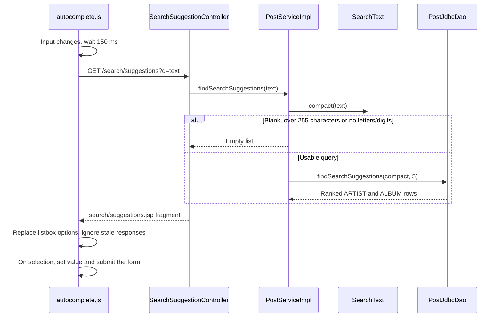

# Search suggestions flow

Two text fields offer server-rendered suggestions while the user types. The global search in the site header asks /search/suggestions for artists and albums of available publications, and selecting one submits the catalog search. The artist field of the publish/edit form asks /artists/suggestions for existing catalog artists and only fills the field. Both endpoints are public GET routes that return an HTML fragment of listbox options, not JSON.

## Flow diagram

The sequence follows the header search at `f12af08`. The artist field uses the same script with ArtistSuggestionController, ArtistServiceImpl and ArtistJdbcDao. This is a source trace, not a runtime test.



## Normalization and ranking

[[SearchText]] defines the shared rule: lowercase, strip diacritics, collapse runs of non-alphanumeric characters into one space (phrase), then remove the spaces (compact). Writes store phrase() in artists.search_phrase and albums.search_phrase; schema.sql backfills older rows with an SQL approximation using TRANSLATE over common Spanish and French accented letters.

Queries are compared against REPLACE(search_phrase, ' ', ''), so `sodastereo`, `Soda-Stereo` and `soda stereo` search the same text, and a query without accents matches an accented name. The WHERE clause keeps any substring match; the ORDER BY ranks exact match first, then prefix of the whole text, then prefix of any word, then any other substring, with alphabetical tie-breakers and LIMIT 5. The ranking runs in SQL instead of loading every artist into memory.

[[PostJdbcDao]] unions distinct artist names and album titles (with their artist) from AVAILABLE posts only, so suggestions never point to sold or unpublished catalog entries. [[ArtistJdbcDao]] ranks all catalog artists, because the publish form should reuse an existing artist even if nothing by them is currently for sale.

Selecting a header suggestion submits the plain catalog search with the chosen display value. That search still uses case-insensitive LIKE over title and artist, not search_phrase, so accent-insensitive matching applies to suggestions but not to a typed query submitted without choosing one. [[Known gaps and document drift]] records this difference.

## Browser behavior

autocomplete.js enhances every element marked `data-autocomplete`. It debounces input by 150 ms, requests the source URL with `X-Requested-With`, discards responses that arrive after a newer request, and supports ArrowUp/ArrowDown, Enter and Escape, marking the active option with aria-selected and aria-activedescendant. The fragment's values were escaped by c:out on the server before being inserted. Without JavaScript both fields are ordinary inputs and the search still submits normally. The same script turns `select[data-select-picker]` elements into custom listbox pickers.

[[Landing flow]] · [[Publish flow]] · [[Views and assets]]

## Code snippets

### Service guard

Oversized or empty normalized queries never reach SQL. See [[PostServiceImpl]] for the complete class.

[services/src/main/java/ar/edu/itba/paw/services/PostServiceImpl.java, lines 94–105](<file:///Users/bautistapessagno/Desktop/ITBA/PAW/paw2026b/services/src/main/java/ar/edu/itba/paw/services/PostServiceImpl.java>)

```java
    @Override
    @Transactional(readOnly = true)
    public List<SearchSuggestion> findSearchSuggestions(final String query) {
        if (query != null && query.length() > MAX_QUERY_LENGTH) {
            return List.of();
        }
        final String normalizedQuery = SearchText.compact(query);
        if (normalizedQuery.isEmpty()) {
            return List.of();
        }
        return postDao.findSearchSuggestions(normalizedQuery, SUGGESTION_LIMIT);
    }
```

### Ranked suggestion query

The outer WHERE is the broadest of the four ranking cases, so it never drops a row the ranking could score. See [[PostJdbcDao]] for the complete class.

[persistence/src/main/java/ar/edu/itba/paw/persistence/PostJdbcDao.java, lines 60–81](<file:///Users/bautistapessagno/Desktop/ITBA/PAW/paw2026b/persistence/src/main/java/ar/edu/itba/paw/persistence/PostJdbcDao.java>)

```java
    private static final String SUGGESTION_RANK =
            "CASE WHEN REPLACE(search_phrase, ' ', '') = ? THEN 0 "
                    + "WHEN REPLACE(search_phrase, ' ', '') LIKE ? THEN 1 "
                    + "WHEN ' ' || search_phrase LIKE ? THEN 2 ELSE 3 END";

    // El WHERE de afuera es el caso mas amplio de los cuatro, asi que no descarta
    // ninguna fila que el ranking pudiera puntuar.
    private static final String FIND_SUGGESTIONS_QUERY =
            "SELECT suggestion_type, suggestion_value, artist_name FROM ("
                    + "SELECT DISTINCT 'ARTIST' AS suggestion_type, ar.name AS suggestion_value, "
                    + "CAST(NULL AS VARCHAR(255)) AS artist_name, ar.search_phrase AS search_phrase "
                    + "FROM posts p JOIN albums a ON a.id = p.album_id "
                    + "JOIN artists ar ON ar.id = a.artist_id WHERE p.status = ? "
                    + "UNION "
                    + "SELECT DISTINCT 'ALBUM' AS suggestion_type, a.title AS suggestion_value, "
                    + "ar.name AS artist_name, a.search_phrase AS search_phrase "
                    + "FROM posts p JOIN albums a ON a.id = p.album_id "
                    + "JOIN artists ar ON ar.id = a.artist_id WHERE p.status = ?"
                    + ") suggestions WHERE REPLACE(search_phrase, ' ', '') LIKE ? "
                    + "ORDER BY " + SUGGESTION_RANK
                    + ", search_phrase, LOWER(suggestion_value), suggestion_type, LOWER(artist_name) "
                    + "LIMIT ?";
```

### Shared normalizer

The same rule serves persisted columns and incoming queries. See [[SearchText]] for the complete class.

[models/src/main/java/ar/edu/itba/paw/models/SearchText.java, lines 22–29](<file:///Users/bautistapessagno/Desktop/ITBA/PAW/paw2026b/models/src/main/java/ar/edu/itba/paw/models/SearchText.java>)

```java
    public static String phrase(final String value) {
        if (value == null) {
            return "";
        }
        final String withoutDiacritics = DIACRITICS.matcher(
                Normalizer.normalize(value, Normalizer.Form.NFD)).replaceAll("");
        return SEPARATORS.matcher(withoutDiacritics.toLowerCase(Locale.ROOT)).replaceAll(" ").trim();
    }
```
