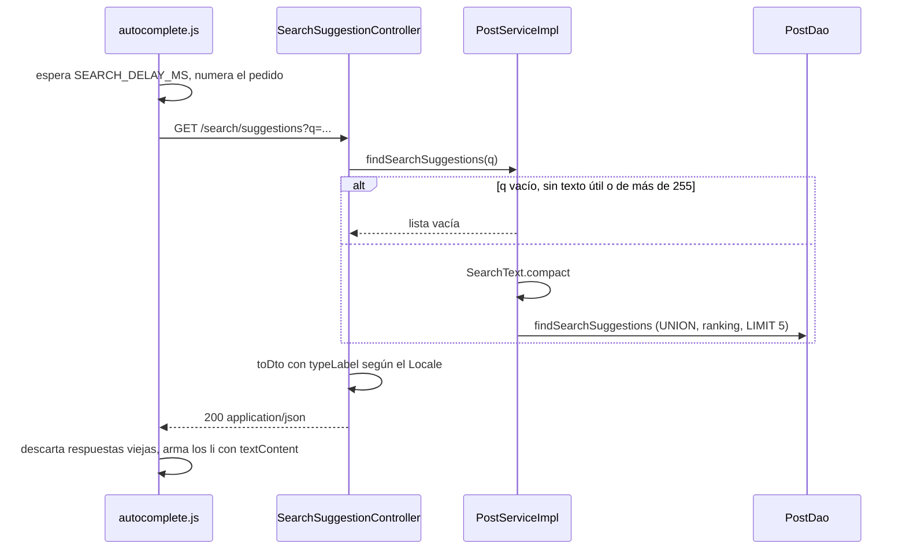

# Search suggestions flow

> [!summary] En una frase
> Dos endpoints devuelven JSON con hasta cinco sugerencias ordenadas por relevancia, y el navegador arma la lista con `textContent`, sin interpretar HTML.

## Qué resuelve

El autocompletado del buscador (álbumes y artistas) y el del campo "artista" al publicar. Es la observación 3 del sprint 2: antes el servidor devolvía HTML armado y el cliente lo inyectaba con `innerHTML`.

## Herramientas

| Herramienta | Para qué se usa acá |
|---|---|
| `@ResponseBody` + `produces = application/json` | El método devuelve datos, no una vista |
| Jackson (`jackson-databind` 2.15.2) | Con Jackson en el classpath, Spring MVC registra solo el conversor a JSON |
| DTOs en `webapp` | Los modelos de dominio no se serializan directo |
| `MessageSource` | La etiqueta "Álbum" o "Artista" traducida en el servidor |
| SQL con `UNION` y `CASE` | Ranking en la base |
| `fetch` + `createElement` + `textContent` | Cliente sin `innerHTML` |
| Atributos ARIA (`listbox`, `aria-activedescendant`) | Navegación con teclado y lector de pantalla |

## Contrato

```
GET /search/suggestions?q=...
[ { "value": "Kind of Blue", "type": "ALBUM",  "typeLabel": "Álbum",   "detail": "Miles Davis" },
  { "value": "Miles Davis",  "type": "ARTIST", "typeLabel": "Artista", "detail": null } ]

GET /artists/suggestions?q=...
[ { "value": "Miles Davis" } ]
```

Siempre `200 application/json`. Sin `q`, con `q` vacío o de más de 255 caracteres: `[]`. El ejemplo sale del issue del sprint 2; los campos coinciden con [[SearchSuggestionDto]] y [[ArtistSuggestionDto]].

## Recorrido paso a paso

1. La persona escribe. `autocomplete.js` espera un instante (`SEARCH_DELAY_MS`) antes de pedir y numera cada pedido: si llega la respuesta de uno viejo, la descarta.
2. `fetch(sourceUrl + '?q=' + encodeURIComponent(texto))`.
3. Controller → `PostService.findSearchSuggestions` o `ArtistService.findSuggestions`: normalizan con `SearchText.compact` y devuelven vacío si no queda nada.
4. DAO, una sola sentencia:
   - Buscador: `UNION` de artistas y álbumes que tengan al menos una publicación `AVAILABLE`.
   - Campo artista: todos los artistas del catálogo.
   - Filtro: `REPLACE(search_phrase, ' ', '') LIKE '%texto%'`.
   - Orden: 0 coincidencia exacta, 1 prefijo del texto completo, 2 prefijo de alguna palabra, 3 aparición en cualquier parte; después alfabético. `LIMIT 5`.
5. El controller convierte a DTO. `typeLabel` se resuelve con el `Locale` del request; `detail` es el artista cuando la sugerencia es un álbum.
6. El cliente lee `response.json()` y crea cada `<li>` con `createElement`, `textContent` y `setAttribute`. Un título con `<` o `&` se ve tal cual.
7. En el buscador, elegir una sugerencia envía el formulario (`submitOnSelect`).


```mermaid
sequenceDiagram
    participant J as autocomplete.js
    participant C as SearchSuggestionController
    participant S as PostServiceImpl
    participant D as PostDao
    J->>J: espera SEARCH_DELAY_MS, numera el pedido
    J->>C: GET /search/suggestions?q=...
    C->>S: findSearchSuggestions(q)
    alt q vacío, sin texto útil o de más de 255
        S-->>C: lista vacía
    else
        S->>S: SearchText.compact
        S->>D: findSearchSuggestions (UNION, ranking, LIMIT 5)
    end
    C->>C: toDto con typeLabel según el Locale
    C-->>J: 200 application/json
    J->>J: descarta respuestas viejas, arma los li con textContent
```

## Decisiones y por qué

| Decisión | Alternativa | Motivo | Fuente |
|---|---|---|---|
| JSON y no fragmentos HTML | JSP parcial + `innerHTML` (versión anterior) | Observación de la cátedra: el servidor devuelve datos y la interfaz los presenta | Issue del sprint 2 |
| DTO separado del modelo | Serializar `SearchSuggestion` | El contrato JSON no queda atado al dominio | Issue del sprint 2 |
| `typeLabel` en el servidor | Traducir en JavaScript | La traducción sigue en los bundles | Issue del sprint 2 |
| Ranking en SQL | Traer todo y ordenar en memoria (versión anterior) | No cargar la tabla entera por cada tecla | Comentario en [[PostJdbcDao]] |
| El `WHERE` es el caso más amplio del ranking | Un filtro por nivel | No descarta ninguna fila que el ranking pudiera puntuar | Comentario en [[PostJdbcDao]] |
| Buscador solo sugiere lo que tiene publicaciones disponibles | Todo el catálogo | Que la sugerencia lleve a resultados | SQL de [[PostJdbcDao]] |
| Límite de 255 en la query | Sin límite | Nada más largo puede coincidir | Comentario en [[PostServiceImpl]] |
| Jackson agregado solo en `webapp` | En todos los módulos | Es un detalle de presentación | `webapp/pom.xml` |

## Límites conocidos

- Las rutas son públicas y sin límite de frecuencia.
- El `LIKE` con comodín inicial no usa índice.
- `autocomplete.js` no tiene tests automáticos.

## Preguntas de defensa

**¿Qué devuelve el endpoint y por qué JSON?**
Una lista de objetos. Se cambió desde HTML porque así el servidor entrega datos reutilizables y el cliente no interpreta markup ajeno.

**¿Cómo se convierte la lista de Java a JSON?**
Con `@ResponseBody`, Spring busca un conversor para `application/json`; al estar Jackson en el classpath, lo registra automáticamente.

**¿Cómo evitan XSS en el desplegable?**
El cliente nunca usa `innerHTML`: todo texto entra por `textContent`.

**¿Cómo ordenan las sugerencias?**
Con un `CASE` en SQL: exacta, prefijo, prefijo de palabra, contiene.

## Evidencia de código

Fuente exacta en `c3e2a4c`: [webapp/src/main/java/ar/edu/itba/paw/webapp/controller/SearchSuggestionController.java](</Users/bautistapessagno/Desktop/proyectos_itba/PAW/paw2026b/webapp/src/main/java/ar/edu/itba/paw/webapp/controller/SearchSuggestionController.java>), líneas 20–49.

```java
@Controller
public class SearchSuggestionController {

    private final PostService postService;
    private final MessageSource messageSource;

    @Autowired
    public SearchSuggestionController(final PostService postService, final MessageSource messageSource) {
        this.postService = postService;
        this.messageSource = messageSource;
    }

    // Devuelve datos y no HTML: el componente de autocompletado arma las opciones en el navegador.
    @RequestMapping(value = "/search/suggestions", method = RequestMethod.GET,
            produces = MediaType.APPLICATION_JSON_VALUE)
    @ResponseBody
    public List<SearchSuggestionDto> suggestions(@RequestParam(value = "q", required = false) final String query,
                                                 final Locale locale) {
        return postService.findSearchSuggestions(query).stream()
                .map(suggestion -> toDto(suggestion, locale))
                .collect(Collectors.toList());
    }

    private SearchSuggestionDto toDto(final SearchSuggestion suggestion, final Locale locale) {
        final SearchSuggestionType type = suggestion.getType();
        final String typeLabel = messageSource.getMessage("search.suggestion." + type.name(), null, locale);
        final String detail = type == SearchSuggestionType.ALBUM ? suggestion.getArtistName() : null;
        return new SearchSuggestionDto(suggestion.getValue(), type.name(), typeLabel, detail);
    }
}
```

Fuente exacta en `c3e2a4c`: [webapp/src/main/java/ar/edu/itba/paw/webapp/controller/ArtistSuggestionController.java](</Users/bautistapessagno/Desktop/proyectos_itba/PAW/paw2026b/webapp/src/main/java/ar/edu/itba/paw/webapp/controller/ArtistSuggestionController.java>), líneas 16–34.

```java
@Controller
public class ArtistSuggestionController {

    private final ArtistService artistService;

    @Autowired
    public ArtistSuggestionController(final ArtistService artistService) {
        this.artistService = artistService;
    }

    @RequestMapping(value = "/artists/suggestions", method = RequestMethod.GET,
            produces = MediaType.APPLICATION_JSON_VALUE)
    @ResponseBody
    public List<ArtistSuggestionDto> suggestions(@RequestParam(value = "q", required = false) final String query) {
        return artistService.findSuggestions(query).stream()
                .map(artist -> new ArtistSuggestionDto(artist.getName()))
                .collect(Collectors.toList());
    }
}
```

Fuente exacta en `c3e2a4c`: [persistence/src/main/java/ar/edu/itba/paw/persistence/PostJdbcDao.java](</Users/bautistapessagno/Desktop/proyectos_itba/PAW/paw2026b/persistence/src/main/java/ar/edu/itba/paw/persistence/PostJdbcDao.java>), líneas 60–84.

```java
    // Reproduce en SQL el ranking que antes se calculaba en memoria sobre la tabla
    // entera: coincidencia exacta, prefijo del texto completo, prefijo de alguna
    // palabra y, por ultimo, aparicion en cualquier posicion.
    private static final String SUGGESTION_RANK =
            "CASE WHEN REPLACE(search_phrase, ' ', '') = ? THEN 0 "
                    + "WHEN REPLACE(search_phrase, ' ', '') LIKE ? THEN 1 "
                    + "WHEN ' ' || search_phrase LIKE ? THEN 2 ELSE 3 END";

    // El WHERE de afuera es el caso mas amplio de los cuatro, asi que no descarta
    // ninguna fila que el ranking pudiera puntuar.
    private static final String FIND_SUGGESTIONS_QUERY =
            "SELECT suggestion_type, suggestion_value, artist_name FROM ("
                    + "SELECT DISTINCT 'ARTIST' AS suggestion_type, ar.name AS suggestion_value, "
                    + "CAST(NULL AS VARCHAR(255)) AS artist_name, ar.search_phrase AS search_phrase "
                    + "FROM posts p JOIN albums a ON a.id = p.album_id "
                    + "JOIN artists ar ON ar.id = a.artist_id WHERE p.status = ? "
                    + "UNION "
                    + "SELECT DISTINCT 'ALBUM' AS suggestion_type, a.title AS suggestion_value, "
                    + "ar.name AS artist_name, a.search_phrase AS search_phrase "
                    + "FROM posts p JOIN albums a ON a.id = p.album_id "
                    + "JOIN artists ar ON ar.id = a.artist_id WHERE p.status = ?"
                    + ") suggestions WHERE REPLACE(search_phrase, ' ', '') LIKE ? "
                    + "ORDER BY " + SUGGESTION_RANK
                    + ", search_phrase, LOWER(suggestion_value), suggestion_type, LOWER(artist_name) "
                    + "LIMIT ?";
```

Fuente exacta en `c3e2a4c`: [persistence/src/main/java/ar/edu/itba/paw/persistence/PostJdbcDao.java](</Users/bautistapessagno/Desktop/proyectos_itba/PAW/paw2026b/persistence/src/main/java/ar/edu/itba/paw/persistence/PostJdbcDao.java>), líneas 199–205.

```java
    @Override
    public List<SearchSuggestion> findSearchSuggestions(final String normalizedQuery, final int limit) {
        return List.copyOf(jdbcTemplate.query(FIND_SUGGESTIONS_QUERY, SEARCH_SUGGESTION_ROW_MAPPER,
                PostStatus.AVAILABLE.name(), PostStatus.AVAILABLE.name(),
                "%" + normalizedQuery + "%", normalizedQuery, normalizedQuery + "%",
                "% " + normalizedQuery + "%", limit));
    }
```

Fuente exacta en `c3e2a4c`: [services/src/main/java/ar/edu/itba/paw/services/PostServiceImpl.java](</Users/bautistapessagno/Desktop/proyectos_itba/PAW/paw2026b/services/src/main/java/ar/edu/itba/paw/services/PostServiceImpl.java>), líneas 179–190.

```java
    @Override
    @Transactional(readOnly = true)
    public List<SearchSuggestion> findSearchSuggestions(final String query) {
        if (query != null && query.length() > MAX_QUERY_LENGTH) {
            return List.of();
        }
        final String normalizedQuery = SearchText.compact(query);
        if (normalizedQuery.isEmpty()) {
            return List.of();
        }
        return postDao.findSearchSuggestions(normalizedQuery, SUGGESTION_LIMIT);
    }
```

## Archivos para seguir el flujo

- [webapp/src/main/java/ar/edu/itba/paw/webapp/controller/SearchSuggestionController.java](</Users/bautistapessagno/Desktop/proyectos_itba/PAW/paw2026b/webapp/src/main/java/ar/edu/itba/paw/webapp/controller/SearchSuggestionController.java>) · [[SearchSuggestionController]]
- [webapp/src/main/java/ar/edu/itba/paw/webapp/controller/ArtistSuggestionController.java](</Users/bautistapessagno/Desktop/proyectos_itba/PAW/paw2026b/webapp/src/main/java/ar/edu/itba/paw/webapp/controller/ArtistSuggestionController.java>) · [[ArtistSuggestionController]]
- [webapp/src/main/java/ar/edu/itba/paw/webapp/dto/SearchSuggestionDto.java](</Users/bautistapessagno/Desktop/proyectos_itba/PAW/paw2026b/webapp/src/main/java/ar/edu/itba/paw/webapp/dto/SearchSuggestionDto.java>) · [[SearchSuggestionDto]]
- [webapp/src/main/java/ar/edu/itba/paw/webapp/dto/ArtistSuggestionDto.java](</Users/bautistapessagno/Desktop/proyectos_itba/PAW/paw2026b/webapp/src/main/java/ar/edu/itba/paw/webapp/dto/ArtistSuggestionDto.java>) · [[ArtistSuggestionDto]]
- [services/src/main/java/ar/edu/itba/paw/services/PostServiceImpl.java](</Users/bautistapessagno/Desktop/proyectos_itba/PAW/paw2026b/services/src/main/java/ar/edu/itba/paw/services/PostServiceImpl.java>) · [[PostServiceImpl]]
- [services/src/main/java/ar/edu/itba/paw/services/ArtistServiceImpl.java](</Users/bautistapessagno/Desktop/proyectos_itba/PAW/paw2026b/services/src/main/java/ar/edu/itba/paw/services/ArtistServiceImpl.java>) · [[ArtistServiceImpl]]
- [models/src/main/java/ar/edu/itba/paw/models/SearchSuggestion.java](</Users/bautistapessagno/Desktop/proyectos_itba/PAW/paw2026b/models/src/main/java/ar/edu/itba/paw/models/SearchSuggestion.java>) · [[SearchSuggestion]]
- [models/src/main/java/ar/edu/itba/paw/models/SearchSuggestionType.java](</Users/bautistapessagno/Desktop/proyectos_itba/PAW/paw2026b/models/src/main/java/ar/edu/itba/paw/models/SearchSuggestionType.java>) · [[SearchSuggestionType]]
- [persistence/src/main/java/ar/edu/itba/paw/persistence/PostJdbcDao.java](</Users/bautistapessagno/Desktop/proyectos_itba/PAW/paw2026b/persistence/src/main/java/ar/edu/itba/paw/persistence/PostJdbcDao.java>) · [[PostJdbcDao]]
- [persistence/src/main/java/ar/edu/itba/paw/persistence/ArtistJdbcDao.java](</Users/bautistapessagno/Desktop/proyectos_itba/PAW/paw2026b/persistence/src/main/java/ar/edu/itba/paw/persistence/ArtistJdbcDao.java>) · [[ArtistJdbcDao]]
- [webapp/src/main/webapp/js/autocomplete.js](</Users/bautistapessagno/Desktop/proyectos_itba/PAW/paw2026b/webapp/src/main/webapp/js/autocomplete.js>)
- [webapp/src/main/webapp/WEB-INF/tags/input-control.tag](</Users/bautistapessagno/Desktop/proyectos_itba/PAW/paw2026b/webapp/src/main/webapp/WEB-INF/tags/input-control.tag>)
- [pom.xml](</Users/bautistapessagno/Desktop/proyectos_itba/PAW/paw2026b/pom.xml>)

Fuente inspeccionada: `c3e2a4c`, 2026-10-05. Es evidencia estática; no implica ejecución de la aplicación. [[Source inventory]] · [[Roadmap de lectura]]
