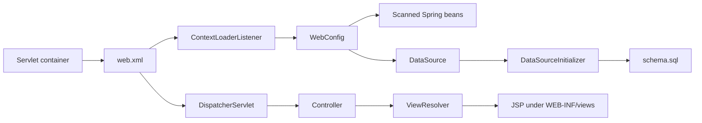

# Startup and dependency injection

The servlet container reads `WEB-INF/web.xml`. Its ContextLoaderListener creates an AnnotationConfigWebApplicationContext configured with [[WebConfig]]. The DispatcherServlet handles `/` and uses the web context to resolve controller mappings. There is no `main` method starting the app.



## Bean connections

| Configuration | Result | Consumers |
|---|---|---|
| ComponentScan | Discovers @Repository, @Service and @Controller classes in the three configured packages | Constructor injection resolves interfaces to discovered implementations |
| dataSource | SimpleDriverDataSource using required db properties | All JDBC DAOs, schema initializer, transaction manager |
| transactionManager | DataSourceTransactionManager | Service @Transactional proxies |
| dataSourceInitializer | Executes classpath schema.sql | Startup table creation |
| viewResolver | JstlView, `/WEB-INF/views/` prefix, `.jsp` suffix | Logical controller view names |
| mailSender | JavaMailSenderImpl, SMTP auth/TLS/timeouts | [[EmailServiceImpl]] |
| mailTemplateEngine | Classpath `mail/` + name + `.html`, UTF-8 HTML | Welcome/contact rendering |
| messageSource | ReloadableResourceBundleMessageSource, `i18n/messages`, UTF-8 | JSP, validation, mail subjects and templates |
| validator/getValidator | LocalValidatorFactoryBean using that message source | @Valid form arguments |
| addResourceHandlers | `/css/**`, `/js/**`, `/images/**` to matching web directories | Styles and cover image |

@EnableTransactionManagement and @EnableAsync add proxy behavior. Direct `new` in tests does not activate them. No custom async executor, connection pool or scheduler is defined in WebConfig. Configuration uses required classpath @PropertySource declarations; read [[Configuration and running]] for why environment-only deployment is not established by the README claim.

A logical `landing/index` view becomes `/WEB-INF/views/landing/index.jsp`. A `redirect:/` result initiates another HTTP request rather than resolving a JSP. See [[Views and assets]].

## Servlet descriptor

[webapp/src/main/webapp/WEB-INF/web.xml, lines 1–41](<file:///Users/bautistapessagno/Desktop/ITBA/PAW/paw2026b/webapp/src/main/webapp/WEB-INF/web.xml>)

```xml
<?xml version="1.0" encoding="UTF-8"?>
<web-app id="PAW" version="2.4"
  xmlns="http://java.sun.com/xml/ns/j2ee"
  xmlns:xsi="http://www.w3.org/2001/XMLSchema-instance"
  xsi:schemaLocation="http://java.sun.com/xml/ns/j2ee http://java.sun.com/xml/ns/j2ee/web-app_2_4.xsd">
  <display-name>PAW test application</display-name>

  <context-param>
    <param-name>contextClass</param-name>
    <param-value>
      org.springframework.web.context.support.AnnotationConfigWebApplicationContext
</param-value>
  </context-param>
  <context-param>
    <param-name>contextConfigLocation</param-name>
    <param-value>
      ar.edu.itba.paw.webapp.config.WebConfig,
</param-value>
  </context-param>
  <listener>
    <listener-class>
      org.springframework.web.context.ContextLoaderListener
</listener-class>
  </listener>

  <servlet>
    <servlet-name>dispatcher</servlet-name>
    <servlet-class>org.springframework.web.servlet.DispatcherServlet</servlet-class>
    <init-param>
      <param-name>contextClass</param-name>
      <param-value>
        org.springframework.web.context.support.AnnotationConfigWebApplicationContext
</param-value>
    </init-param>
    <load-on-startup>1</load-on-startup>
  </servlet>
  <servlet-mapping>
    <servlet-name>dispatcher</servlet-name>
    <url-pattern>/</url-pattern>
  </servlet-mapping>
</web-app>
```

[[WebConfig]] · [[Architecture]]
