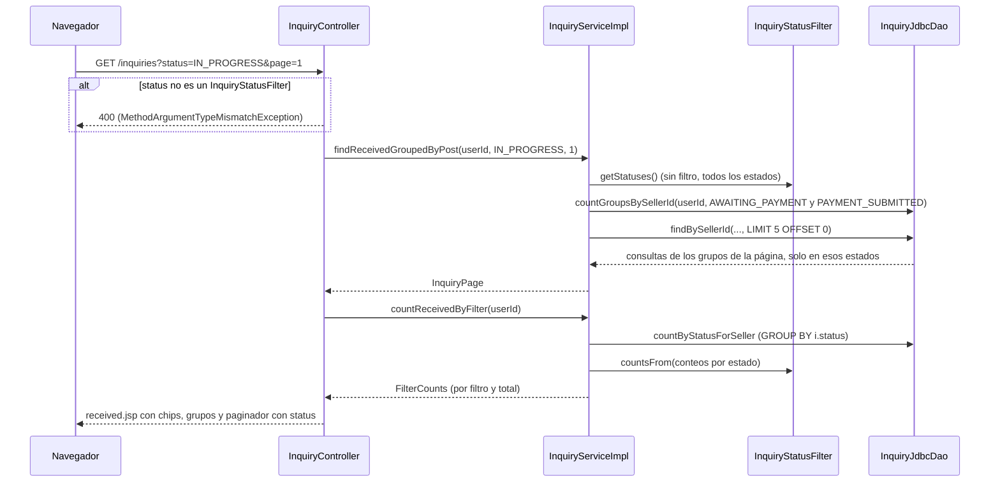
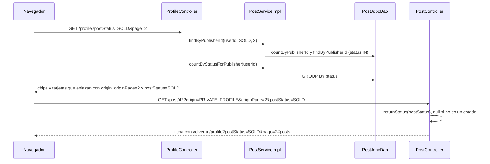

# Status filters flow

> [!summary] En una frase
> Las dos bandejas de consultas y "Mis publicaciones" se filtran por estado con una fila de chips que muestra cuántos elementos hay en cada uno; el filtro viaja como parámetro de la URL, se aplica en el SQL y se conserva al pasar de página y al volver desde una ficha.

## Qué resuelve

Con varias ventas en marcha, una bandeja mezcla consultas pendientes, pagos por revisar y ventas cerradas. Los PR #60 y #61 (5 de octubre) agregaron un filtro por estado en `/inquiries`, `/inquiries/sent` y en la sección de publicaciones de `/profile`. Lo usa cualquier Cuenta verificada sobre sus propios datos: no hay reglas de acceso nuevas.

## Herramientas

| Herramienta | Para qué se usa acá |
|---|---|
| `@RequestParam` ligado a un enum | `status` (bandejas) y `postStatus` (perfil) llegan ya convertidos; sin el parámetro, `null` es "sin filtro" |
| [[InquiryStatusFilter]] | Agrupa los seis estados de la Consulta en cuatro filtros que una persona entiende |
| [[PostStatus]] | En "Mis publicaciones" cada filtro es un estado: `AVAILABLE`, `RESERVED`, `SOLD` |
| `status IN (?, ?, ...)` | Filtrar en la base, con un placeholder por estado |
| `GROUP BY status` + `RowCallbackHandler` | Contar por estado en una sola sentencia y llenar un `EnumMap` |
| [[FilterCounts]] | Llevar a la vista los conteos como un mapa, porque EL no llama métodos con argumentos |
| `filter-chips.tag` | Dibujar los chips, marcar el activo con `aria-current` y armar sus enlaces |
| `extraParams` de `pagination.tag` | Que los enlaces de página repitan el filtro |
| `back-link.tag` con `postStatus` | Volver de la ficha al perfil con el mismo filtro |

## Recorrido paso a paso

### Bandejas: `GET /inquiries?status=...` y `GET /inquiries/sent?status=...`

1. [[InquiryController]] recibe `status` como `InquiryStatusFilter` y `page` como `int`. Un valor que no es un filtro no llega al método: Spring no puede convertirlo y [[ErrorResponseAdvice]] responde 400.
2. `filteredView` deja en el modelo el filtro activo y la lista de filtros posibles.
3. `InquiryServiceImpl.findReceivedGroupedByPost(userId, status, page)` (o `findSent...`) traduce el filtro a estados con `statusesOf`: sin filtro, todos; con filtro, los de ese grupo.

   | Filtro | Estados | Chip |
   |---|---|---|
   | `PENDING` | `PENDING` | Pendientes |
   | `IN_PROGRESS` | `AWAITING_PAYMENT`, `PAYMENT_SUBMITTED` | En curso |
   | `CONFIRMED` | `ACCEPTED` | Confirmadas |
   | `CLOSED` | `REJECTED`, `CANCELLED` | Cerradas |

4. El service cuenta los **grupos** con esos estados, calcula páginas con [[Pagination]] y pide la página. [[InquiryJdbcDao]] agrega `AND i.status IN (...)` a las tres sentencias (contar grupos, claves de la página, consultas de esas claves). Un grupo sin consultas que coincidan no ocupa lugar, y un grupo mixto muestra solo las consultas que coinciden. En recibidas, cada fila pasa además por `withAddressForSeller`.
5. Para los chips, `countReceivedByFilter` (o `countSentByFilter`) pide `countByStatusForSeller`: `SELECT i.status, COUNT(*) ... GROUP BY i.status`. `InquiryStatusFilter.countsFrom` suma esos conteos por filtro; un filtro sin consultas no entra en el mapa.
6. El total de [[FilterCounts]] es también el número de la sub-nav de la bandeja abierta: como cada estado cae en un solo filtro, la suma es el total de consultas y no hace falta otro `COUNT`. El de la otra bandeja sigue saliendo de `countSentBy` o `countReceivedBy`.
7. La vista dibuja los chips solo si el total es mayor que cero. Cada chip enlaza a la bandeja con `?status=VALOR`; el activo enlaza a la bandeja sin filtro, así tocarlo de nuevo lo quita. Ningún enlace de chip lleva `page`: cambiar de filtro vuelve a la página 1. El paginador recibe `status` en `extraParams`. Si el filtro no deja nada, el estado vacío dice "No tenés consultas en este estado".

### Mis publicaciones: `GET /profile?postStatus=...`

1. [[ProfileController]] recibe `postStatus` como [[PostStatus]] y lo pasa a `profileView`.
2. `PostServiceImpl.findByPublisherId(userId, postStatus, page)`: sin filtro, los tres estados; con filtro, solo ese. [[PostJdbcDao]] cuenta y lista con `p.status IN (...)`.
3. `countByStatusForPublisher` cuenta con `GROUP BY status` y lo envuelve en [[FilterCounts]].
4. Los chips usan `fragment="posts"` para volver a la sección. Cada tarjeta enlaza a su ficha con `origin`, `originPage` y, si hay filtro, `postStatus`.
5. En la ficha, [[PostController]] trata `postStatus` como contexto de regreso: lo convierte con `returnStatus`, que devuelve `null` si no es un estado, y `back-link.tag` lo agrega al enlace de volver. Ver [[Post detail flow]].
6. Los POST del perfil que vuelven a dibujar la página con un error (nombre, clave, datos de cobro, direcciones) usan la sobrecarga de `profileView` sin estado: muestran las publicaciones sin filtro.





## Datos

Solo lecturas: `inquiries.status` (con el `JOIN` de la bandeja a `posts`) y `posts.status`. No hay migración: los estados ya existían. Ver [[Database schema]].

## Decisiones y por qué

| Decisión | Motivo | Fuente |
|---|---|---|
| Cuatro filtros en lugar de los seis estados | La bandeja agrupa los estados "como los lee una persona"; cada estado cae en exactamente un filtro y un estado nuevo tiene que sumarse ahí | Comentario en [[InquiryStatusFilter]]; [[InquiryStatusFilterTest]] lo comprueba |
| Filtrar en el SQL, en todas las sentencias de la bandeja | Un grupo sin consultas que coincidan no ocupa lugar en la página. Filtrar en memoria rompería la paginación por grupo | Comentario en [[InquiryJdbcDao]] |
| Sin chip "Todas" y el chip activo quita el filtro | Sin filtro ya se ve todo; un chip menos | Comentario en `filter-chips.tag` |
| Cambiar de filtro vuelve a la página 1 | La página 3 de un filtro puede no existir en otro | Comentario en `filter-chips.tag` |
| Conteos en un mapa ([[FilterCounts]]) | EL no llama métodos con argumentos: la vista lee `counts[valor]` y un valor ausente se ve como 0 | Comentario en [[FilterCounts]] |
| El número de la sub-nav de la bandeja abierta es el total de sus chips | No contar dos veces lo mismo | Comentario en [[InquiryController]] |
| `aria-current="true"` en el chip activo | El chip marca el elemento actual de un conjunto, no la página en la que se está | Commit `91d98f88` |
| Filtro inválido: 400 en el listado, ignorado en la ficha | En el listado es el parámetro principal; en la ficha es contexto de regreso opcional, con el mismo criterio que `originPage` | Comentario en [[PostController]] |
| El atributo del tag se llama `paramName` | `param` es el nombre implícito de EL para los parámetros del request | Comentario en `filter-chips.tag` |

## Concurrencia y casos borde

- La página y los chips salen de dos transacciones de lectura distintas: si una consulta cambia de estado entre las dos, un chip puede mostrar un número que no coincide con la lista por una unidad. Son lecturas; no afecta datos.
- Página fuera de rango dentro de un filtro: 404, igual que sin filtro ([[Paginated listings]]).
- Los chips cuentan **consultas** y la paginación cuenta **grupos**: "Pendientes 3" puede ser una sola publicación con tres consultas.
- Una consulta de un post eliminado sigue contando: el `JOIN` de la bandeja la cubre ([[InquiryJdbcDaoTest]] tiene un caso para eso).
- Una Cuenta sin consultas o sin publicaciones no ve los chips.

## Límites conocidos

- No se puede combinar más de un filtro a la vez.
- El perfil público no tiene chips: muestra solo publicaciones disponibles ([[Public profile flow]]).
- Volver desde la ficha conserva el filtro de "Mis publicaciones", pero las bandejas no tienen ese regreso: la página de la venta vuelve a la bandeja sin filtro.
- Sin tests de la capa web: el 400 ante un filtro inválido y el armado de los enlaces no están cubiertos.

## Preguntas de defensa

**¿Dónde se filtra, en Java o en la base?**
En la base, con `status IN (...)` y un placeholder por estado. Si se filtrara en memoria, la paginación por grupo contaría grupos que después quedan vacíos.

**¿Por qué "En curso" junta dos estados?**
Porque para quien mira la bandeja la venta está igual de abierta esperando el pago o con el pago informado. El enum [[InquiryStatusFilter]] asigna cada estado a un único filtro.

**¿Cómo llegan los números de los chips a la JSP?**
Un `GROUP BY status` devuelve un conteo por estado, `countsFrom` los suma por filtro y [[FilterCounts]] los expone como un mapa que la vista indexa con `counts[valor]`.

**¿Qué pasa si escribo `?status=CUALQUIERA`?**
Spring no lo puede convertir al enum, lanza `MethodArgumentTypeMismatchException` y [[ErrorResponseAdvice]] responde 400.

**¿Cómo se conserva el filtro al pasar de página o al volver de una publicación?**
El paginador lo recibe en `extraParams`; los enlaces a cada ficha lo llevan como `postStatus` y el enlace de volver lo repite.

## Evidencia de código

### Los filtros de la bandeja

Fuente exacta en `c3e2a4c`: [models/src/main/java/ar/edu/itba/paw/models/InquiryStatusFilter.java](</Users/bautistapessagno/Desktop/proyectos_itba/PAW/paw2026b/models/src/main/java/ar/edu/itba/paw/models/InquiryStatusFilter.java>), líneas 1–36.

```java
package ar.edu.itba.paw.models;

import java.util.EnumMap;
import java.util.List;
import java.util.Map;

// Filtro de las bandejas de Consultas: agrupa los estados como los lee una persona. Cada estado
// cae en exactamente un filtro; un estado nuevo tiene que sumarse aca.
public enum InquiryStatusFilter {
    PENDING(InquiryStatus.PENDING),
    IN_PROGRESS(InquiryStatus.AWAITING_PAYMENT, InquiryStatus.PAYMENT_SUBMITTED),
    CONFIRMED(InquiryStatus.ACCEPTED),
    CLOSED(InquiryStatus.REJECTED, InquiryStatus.CANCELLED);

    private final List<InquiryStatus> statuses;

    InquiryStatusFilter(final InquiryStatus... statuses) {
        this.statuses = List.of(statuses);
    }

    public List<InquiryStatus> getStatuses() { return statuses; }

    // Pasa los conteos por estado a conteos por filtro. Un filtro sin Consultas no aparece.
    public static FilterCounts<InquiryStatusFilter> countsFrom(final Map<InquiryStatus, Integer> byStatus) {
        final Map<InquiryStatusFilter, Integer> byFilter = new EnumMap<>(InquiryStatusFilter.class);
        for (final InquiryStatusFilter filter : values()) {
            for (final InquiryStatus status : filter.statuses) {
                final Integer count = byStatus.get(status);
                if (count != null) {
                    byFilter.merge(filter, count, Integer::sum);
                }
            }
        }
        return new FilterCounts<>(byFilter);
    }
}
```

Fuente exacta en `c3e2a4c`: [models/src/main/java/ar/edu/itba/paw/models/FilterCounts.java](</Users/bautistapessagno/Desktop/proyectos_itba/PAW/paw2026b/models/src/main/java/ar/edu/itba/paw/models/FilterCounts.java>), líneas 1–18.

```java
package ar.edu.itba.paw.models;

import java.util.Map;

// Conteos de los chips de filtro de un listado. EL no llama metodos con argumentos: la vista
// lee counts[valor]. Un valor sin elementos no esta en el mapa y la vista lo muestra como 0.
public final class FilterCounts<K> {
    private final Map<K, Integer> counts;
    private final int total;

    public FilterCounts(final Map<K, Integer> counts) {
        this.counts = Map.copyOf(counts);
        this.total = counts.values().stream().mapToInt(Integer::intValue).sum();
    }

    public Map<K, Integer> getCounts() { return counts; }
    public int getTotal() { return total; }
}
```

### Controller

Fuente exacta en `c3e2a4c`: [webapp/src/main/java/ar/edu/itba/paw/webapp/controller/InquiryController.java](</Users/bautistapessagno/Desktop/proyectos_itba/PAW/paw2026b/webapp/src/main/java/ar/edu/itba/paw/webapp/controller/InquiryController.java>), líneas 71–107.

```java
    // Cada vista trae su propia pagina, y los dos totales de la sub-nav salen del service: el de la
    // bandeja abierta es el total de sus chips, asi no se cuenta dos veces.
    // Sin status, la bandeja muestra todas las consultas.
    @RequestMapping(method = RequestMethod.GET)
    public ModelAndView received(@AuthenticationPrincipal final AuthenticatedUser currentUser,
                                 @RequestParam(name = "status", required = false) final InquiryStatusFilter status,
                                 @RequestParam(name = "page", defaultValue = "1") final int pageNumber) {
        final long userId = currentUser.getId();
        final ModelAndView modelAndView = filteredView("inquiry/received", status);
        modelAndView.addObject("receivedPage", inquiryService.findReceivedGroupedByPost(userId, status, pageNumber));
        final FilterCounts<InquiryStatusFilter> filterCounts = inquiryService.countReceivedByFilter(userId);
        modelAndView.addObject("filterCounts", filterCounts);
        modelAndView.addObject("receivedCount", filterCounts.getTotal());
        modelAndView.addObject("sentCount", inquiryService.countSentBy(userId));
        return modelAndView;
    }

    @RequestMapping(value = "/sent", method = RequestMethod.GET)
    public ModelAndView sent(@AuthenticationPrincipal final AuthenticatedUser currentUser,
                             @RequestParam(name = "status", required = false) final InquiryStatusFilter status,
                             @RequestParam(name = "page", defaultValue = "1") final int pageNumber) {
        final long userId = currentUser.getId();
        final ModelAndView modelAndView = filteredView("inquiry/sent", status);
        modelAndView.addObject("sentPage", inquiryService.findSentGroupedByPost(userId, status, pageNumber));
        final FilterCounts<InquiryStatusFilter> filterCounts = inquiryService.countSentByFilter(userId);
        modelAndView.addObject("filterCounts", filterCounts);
        modelAndView.addObject("sentCount", filterCounts.getTotal());
        modelAndView.addObject("receivedCount", inquiryService.countReceivedBy(userId));
        return modelAndView;
    }

    private static ModelAndView filteredView(final String viewName, final InquiryStatusFilter status) {
        final ModelAndView modelAndView = new ModelAndView(viewName);
        modelAndView.addObject("statusFilter", status);
        modelAndView.addObject("statusFilters", InquiryStatusFilter.values());
        return modelAndView;
    }
```

### Service

Fuente exacta en `c3e2a4c`: [services/src/main/java/ar/edu/itba/paw/services/InquiryServiceImpl.java](</Users/bautistapessagno/Desktop/proyectos_itba/PAW/paw2026b/services/src/main/java/ar/edu/itba/paw/services/InquiryServiceImpl.java>), líneas 186–216.

```java
    @Override
    @Transactional(readOnly = true)
    public InquiryPage findSentGroupedByPost(final long buyerId, final InquiryStatusFilter filter,
                                             final int pageNumber) {
        final List<InquiryStatus> statuses = statusesOf(filter);
        final int totalPages = Pagination.pagesFor(inquiryDao.countGroupsByBuyerId(buyerId, statuses),
                INBOX_PAGE_SIZE);
        final int offset = Pagination.offsetFor(pageNumber, INBOX_PAGE_SIZE, totalPages);
        return new InquiryPage(groupByPost(inquiryDao.findByBuyerId(buyerId, statuses, INBOX_PAGE_SIZE, offset)),
                pageNumber, totalPages);
    }

    @Override
    @Transactional(readOnly = true)
    public InquiryPage findReceivedGroupedByPost(final long sellerId, final InquiryStatusFilter filter,
                                                 final int pageNumber) {
        final List<InquiryStatus> statuses = statusesOf(filter);
        final int totalPages = Pagination.pagesFor(inquiryDao.countGroupsBySellerId(sellerId, statuses),
                INBOX_PAGE_SIZE);
        final int offset = Pagination.offsetFor(pageNumber, INBOX_PAGE_SIZE, totalPages);
        final List<InquirySummary> inquiries = inquiryDao.findBySellerId(sellerId, statuses, INBOX_PAGE_SIZE, offset)
                .stream()
                .map(InquiryServiceImpl::withAddressForSeller)
                .toList();
        return new InquiryPage(groupByPost(inquiries), pageNumber, totalPages);
    }

    // Sin filtro, la bandeja muestra las consultas en cualquier estado.
    private static List<InquiryStatus> statusesOf(final InquiryStatusFilter filter) {
        return filter == null ? List.of(InquiryStatus.values()) : filter.getStatuses();
    }
```

Fuente exacta en `c3e2a4c`: [services/src/main/java/ar/edu/itba/paw/services/InquiryServiceImpl.java](</Users/bautistapessagno/Desktop/proyectos_itba/PAW/paw2026b/services/src/main/java/ar/edu/itba/paw/services/InquiryServiceImpl.java>), líneas 269–279.

```java
    @Override
    @Transactional(readOnly = true)
    public FilterCounts<InquiryStatusFilter> countSentByFilter(final long buyerId) {
        return InquiryStatusFilter.countsFrom(inquiryDao.countByStatusForBuyer(buyerId));
    }

    @Override
    @Transactional(readOnly = true)
    public FilterCounts<InquiryStatusFilter> countReceivedByFilter(final long sellerId) {
        return InquiryStatusFilter.countsFrom(inquiryDao.countByStatusForSeller(sellerId));
    }
```

Fuente exacta en `c3e2a4c`: [services/src/main/java/ar/edu/itba/paw/services/PostServiceImpl.java](</Users/bautistapessagno/Desktop/proyectos_itba/PAW/paw2026b/services/src/main/java/ar/edu/itba/paw/services/PostServiceImpl.java>), líneas 192–208.

```java
    @Override
    @Transactional(readOnly = true)
    public PostPage findByPublisherId(final long publisherId, final PostStatus status, final int pageNumber) {
        // Sin filtro, "Mis publicaciones" muestra los Posts en cualquier estado.
        final List<PostStatus> statuses = status == null ? List.of(PostStatus.values()) : List.of(status);
        final int totalPages = Pagination.pagesFor(postDao.countByPublisherId(publisherId, statuses),
                PROFILE_PAGE_SIZE);
        final int offset = Pagination.offsetFor(pageNumber, PROFILE_PAGE_SIZE, totalPages);
        final List<PostSummary> posts = postDao.findByPublisherId(publisherId, statuses, PROFILE_PAGE_SIZE, offset);
        return new PostPage(posts, pageNumber, totalPages);
    }

    @Override
    @Transactional(readOnly = true)
    public FilterCounts<PostStatus> countByStatusForPublisher(final long publisherId) {
        return new FilterCounts<>(postDao.countByStatusForPublisher(publisherId));
    }
```

### SQL

Fuente exacta en `c3e2a4c`: [persistence/src/main/java/ar/edu/itba/paw/persistence/InquiryJdbcDao.java](</Users/bautistapessagno/Desktop/proyectos_itba/PAW/paw2026b/persistence/src/main/java/ar/edu/itba/paw/persistence/InquiryJdbcDao.java>), líneas 282–306.

```java
    // where termina en el filtro de la Cuenta; esto le suma el de estados con un placeholder por estado.
    private static String statusFilter(final Collection<InquiryStatus> statuses) {
        return "AND i.status IN (" + placeholders(statuses.size()) + ") ";
    }

    private static List<Object> parameters(final long userId, final Collection<InquiryStatus> statuses) {
        final List<Object> parameters = new ArrayList<>();
        parameters.add(userId);
        statuses.forEach(status -> parameters.add(status.name()));
        return parameters;
    }

    private int countGroups(final String where, final long userId, final Collection<InquiryStatus> statuses) {
        return jdbcTemplate.queryForObject("SELECT COUNT(DISTINCT " + GROUP_KEY + ") " + GROUP_FROM + where
                + statusFilter(statuses), Integer.class, parameters(userId, statuses).toArray());
    }

    private Map<InquiryStatus, Integer> countByStatus(final String where, final long userId) {
        final Map<InquiryStatus, Integer> counts = new EnumMap<>(InquiryStatus.class);
        jdbcTemplate.query("SELECT i.status, COUNT(*) AS total " + GROUP_FROM + where + "GROUP BY i.status",
                (RowCallbackHandler) resultSet -> counts.put(InquiryStatus.valueOf(resultSet.getString("status")),
                        resultSet.getInt("total")),
                userId);
        return Collections.unmodifiableMap(counts);
    }
```

Fuente exacta en `c3e2a4c`: [persistence/src/main/java/ar/edu/itba/paw/persistence/PostJdbcDao.java](</Users/bautistapessagno/Desktop/proyectos_itba/PAW/paw2026b/persistence/src/main/java/ar/edu/itba/paw/persistence/PostJdbcDao.java>), líneas 231–245.

```java
    @Override
    public int countByPublisherId(final long publisherId, final Collection<PostStatus> statuses) {
        return jdbcTemplate.queryForObject("SELECT COUNT(*) FROM posts WHERE user_id = ? AND status IN ("
                + placeholders(statuses.size()) + ")", Integer.class, publisherParameters(publisherId, statuses).toArray());
    }

    @Override
    public Map<PostStatus, Integer> countByStatusForPublisher(final long publisherId) {
        final Map<PostStatus, Integer> counts = new EnumMap<>(PostStatus.class);
        jdbcTemplate.query("SELECT status, COUNT(*) AS total FROM posts WHERE user_id = ? GROUP BY status",
                (RowCallbackHandler) resultSet -> counts.put(PostStatus.valueOf(resultSet.getString("status")),
                        resultSet.getInt("total")),
                publisherId);
        return Collections.unmodifiableMap(counts);
    }
```

### Vista

Fuente exacta en `c3e2a4c`: [webapp/src/main/webapp/WEB-INF/tags/filter-chips.tag](</Users/bautistapessagno/Desktop/proyectos_itba/PAW/paw2026b/webapp/src/main/webapp/WEB-INF/tags/filter-chips.tag>), líneas 1–39.

```jsp
<%@ tag language="java" pageEncoding="UTF-8" body-content="empty" %>
<%-- Ruta del listado sin context path, ej. /inquiries. --%>
<%@ attribute name="baseUrl" required="true" %>
<%-- Query param del filtro. No puede llamarse param: en EL ese nombre es el de los parametros del request. --%>
<%@ attribute name="paramName" required="true" %>
<%@ attribute name="values" required="true" type="java.lang.Object[]" %>
<%@ attribute name="active" required="false" type="java.lang.Object" %>
<%-- Valor -> cantidad. Un valor que no esta en el mapa se muestra como 0. --%>
<%@ attribute name="counts" required="true" type="java.util.Map" %>
<%-- Usa <prefix>.<VALOR> para el texto de cada chip. --%>
<%@ attribute name="messagePrefix" required="true" %>
<%@ attribute name="label" required="true" %>
<%@ attribute name="fragment" required="false" %>
<%@ taglib prefix="c" uri="http://java.sun.com/jsp/jstl/core" %>
<%@ taglib prefix="spring" uri="http://www.springframework.org/tags" %>

<%-- Sin filtro se ve todo: no hay chip "Todas". El chip activo lleva a la URL sin filtro, asi
     tocarlo de nuevo lo quita. Cambiar de filtro vuelve a la pagina 1: los links no llevan page. --%>
<c:set var="anchor" value="${empty fragment ? '' : '#'.concat(fragment)}"/>
<c:url value="${baseUrl}" var="clearUrl"/>
<spring:message code="filterChips.clear" var="clearLabel"/>
<nav class="filter-chips" aria-label="<c:out value="${label}"/>">
    <c:forEach items="${values}" var="value">
        <c:set var="valueName">${value}</c:set>
        <c:set var="selected" value="${not empty active and active eq value}"/>
        <c:url value="${baseUrl}" var="valueUrl">
            <c:param name="${paramName}" value="${valueName}"/>
        </c:url>
        <a class="filter-chips__chip${selected ? ' filter-chips__chip--active' : ''}"
           href="<c:out value="${selected ? clearUrl : valueUrl}${anchor}"/>"
           <c:if test="${selected}">aria-current="true"</c:if>>
            <spring:message code="${messagePrefix}.${valueName}"/>
            <span class="filter-chips__count"><c:out value="${counts[value]}" default="0"/></span>
            <c:if test="${selected}">
                <span class="visually-hidden"><c:out value="${clearLabel}"/></span>
            </c:if>
        </a>
    </c:forEach>
</nav>
```

Fuente exacta en `c3e2a4c`: [webapp/src/main/webapp/WEB-INF/views/inquiry/received.jsp](</Users/bautistapessagno/Desktop/proyectos_itba/PAW/paw2026b/webapp/src/main/webapp/WEB-INF/views/inquiry/received.jsp>), líneas 9–23.

```jsp
<spring:message code="inquiry.filter.label" var="filterLabel"/>
<jsp:useBean id="paginationParams" class="java.util.LinkedHashMap" scope="page"/>
<c:set target="${paginationParams}" property="status" value="${statusFilter}"/>
<!DOCTYPE html>
<html lang="${pageContext.response.locale}">
<ui:head titleCode="inquiry.received.pageTitle"/>
<body>
<ui:site-header/>
<main class="page-shell">
    <ui:h1 text="${heading}"/>
    <ui:inquiry-nav active="received" receivedCount="${receivedCount}" sentCount="${sentCount}"/>
    <c:if test="${filterCounts.total gt 0}">
        <ui:filter-chips baseUrl="/inquiries" paramName="status" values="${statusFilters}" active="${statusFilter}"
                         counts="${filterCounts.counts}" messagePrefix="inquiry.filter" label="${filterLabel}"/>
    </c:if>
```

Fuente exacta en `c3e2a4c`: [webapp/src/main/webapp/WEB-INF/views/profile/index.jsp](</Users/bautistapessagno/Desktop/proyectos_itba/PAW/paw2026b/webapp/src/main/webapp/WEB-INF/views/profile/index.jsp>), líneas 28–36.

```jsp
<spring:message code="profile.posts.filter.label" var="postFilterLabel" />
<jsp:useBean id="postPaginationParams" class="java.util.LinkedHashMap" scope="page" />
<c:set target="${postPaginationParams}" property="postStatus" value="${postStatusFilter}" />
<jsp:useBean id="postLinkParams" class="java.util.LinkedHashMap" scope="page" />
<c:set target="${postLinkParams}" property="origin" value="${postOrigin}" />
<c:set target="${postLinkParams}" property="originPage" value="${postPage.pageNumber}" />
<c:if test="${not empty postStatusFilter}">
    <c:set target="${postLinkParams}" property="postStatus" value="${postStatusFilter}" />
</c:if>
```

## Archivos para seguir el flujo

- [models/src/main/java/ar/edu/itba/paw/models/InquiryStatusFilter.java](</Users/bautistapessagno/Desktop/proyectos_itba/PAW/paw2026b/models/src/main/java/ar/edu/itba/paw/models/InquiryStatusFilter.java>) · [[InquiryStatusFilter]]
- [models/src/main/java/ar/edu/itba/paw/models/FilterCounts.java](</Users/bautistapessagno/Desktop/proyectos_itba/PAW/paw2026b/models/src/main/java/ar/edu/itba/paw/models/FilterCounts.java>) · [[FilterCounts]]
- [webapp/src/main/java/ar/edu/itba/paw/webapp/controller/InquiryController.java](</Users/bautistapessagno/Desktop/proyectos_itba/PAW/paw2026b/webapp/src/main/java/ar/edu/itba/paw/webapp/controller/InquiryController.java>) · [[InquiryController]]
- [webapp/src/main/java/ar/edu/itba/paw/webapp/controller/ProfileController.java](</Users/bautistapessagno/Desktop/proyectos_itba/PAW/paw2026b/webapp/src/main/java/ar/edu/itba/paw/webapp/controller/ProfileController.java>) · [[ProfileController]]
- [webapp/src/main/java/ar/edu/itba/paw/webapp/controller/PostController.java](</Users/bautistapessagno/Desktop/proyectos_itba/PAW/paw2026b/webapp/src/main/java/ar/edu/itba/paw/webapp/controller/PostController.java>) · [[PostController]]
- [services/src/main/java/ar/edu/itba/paw/services/InquiryServiceImpl.java](</Users/bautistapessagno/Desktop/proyectos_itba/PAW/paw2026b/services/src/main/java/ar/edu/itba/paw/services/InquiryServiceImpl.java>) · [[InquiryServiceImpl]]
- [services/src/main/java/ar/edu/itba/paw/services/PostServiceImpl.java](</Users/bautistapessagno/Desktop/proyectos_itba/PAW/paw2026b/services/src/main/java/ar/edu/itba/paw/services/PostServiceImpl.java>) · [[PostServiceImpl]]
- [persistence/src/main/java/ar/edu/itba/paw/persistence/InquiryJdbcDao.java](</Users/bautistapessagno/Desktop/proyectos_itba/PAW/paw2026b/persistence/src/main/java/ar/edu/itba/paw/persistence/InquiryJdbcDao.java>) · [[InquiryJdbcDao]]
- [persistence/src/main/java/ar/edu/itba/paw/persistence/PostJdbcDao.java](</Users/bautistapessagno/Desktop/proyectos_itba/PAW/paw2026b/persistence/src/main/java/ar/edu/itba/paw/persistence/PostJdbcDao.java>) · [[PostJdbcDao]]
- [webapp/src/main/webapp/WEB-INF/tags/filter-chips.tag](</Users/bautistapessagno/Desktop/proyectos_itba/PAW/paw2026b/webapp/src/main/webapp/WEB-INF/tags/filter-chips.tag>)
- [webapp/src/main/webapp/WEB-INF/tags/back-link.tag](</Users/bautistapessagno/Desktop/proyectos_itba/PAW/paw2026b/webapp/src/main/webapp/WEB-INF/tags/back-link.tag>)
- [webapp/src/main/webapp/WEB-INF/views/inquiry/received.jsp](</Users/bautistapessagno/Desktop/proyectos_itba/PAW/paw2026b/webapp/src/main/webapp/WEB-INF/views/inquiry/received.jsp>)
- [webapp/src/main/webapp/WEB-INF/views/inquiry/sent.jsp](</Users/bautistapessagno/Desktop/proyectos_itba/PAW/paw2026b/webapp/src/main/webapp/WEB-INF/views/inquiry/sent.jsp>)
- [webapp/src/main/webapp/WEB-INF/views/profile/index.jsp](</Users/bautistapessagno/Desktop/proyectos_itba/PAW/paw2026b/webapp/src/main/webapp/WEB-INF/views/profile/index.jsp>)
- [services/src/test/java/ar/edu/itba/paw/services/InquiryStatusFilterTest.java](</Users/bautistapessagno/Desktop/proyectos_itba/PAW/paw2026b/services/src/test/java/ar/edu/itba/paw/services/InquiryStatusFilterTest.java>) · [[InquiryStatusFilterTest]]

Fuente inspeccionada: `c3e2a4c`, 2026-10-05. Es evidencia estática; no implica ejecución de la aplicación. [[Source inventory]] · [[Roadmap de lectura]]
